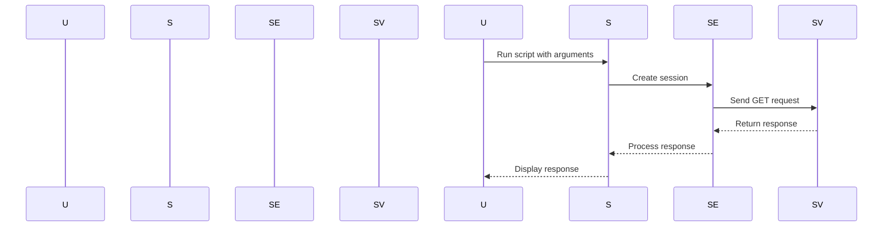

## Main Method Implementation

### Command Line Argument Handling

The main method is responsible for handling command-line arguments and ensuring that the program is executed correctly. Let’s break down the implementation step-by-step.

#### Step 1: Define the Main Method

The main method is defined to handle the execution of the program based on the provided command-line arguments.

```python
def main(argv):
    if len(argv) != 2:
        print_usage_instructions()
        sys.exit(1)
    else:
        url = argv[1]
        # Further processing of the URL
```

#### Step 2: Print Usage Instructions

If the number of command-line arguments is incorrect, the program should print usage instructions and exit.

```python
def print_usage_instructions():
    print(f"Usage: {sys.argv[0]} <URL>")
    print("Example: python3 script.py http://www.example.com")
```

### Explanation of the Code

- **`if len(argv) != 2`**: This condition checks if exactly two arguments are provided. The first argument (`argv[0]`) is the name of the script itself, and the second argument (`argv[1]`) is the URL.
- **`print_usage_instructions()`**: This function prints the usage instructions and an example of how to run the script.
- **`sys.exit(1)`**: This exits the program with a non-zero status code, indicating an error.

### Complete Example

Here’s the complete example including the main method and usage instructions:

```python
import sys
import requests

def print_usage_instructions():
    print(f"Usage: {sys.argv[0]} <URL>")
    print("Example: python3 script.py http://www.example.com")

def main(argv):
    if len(argv) != 2:
        print_usage_instructions()
        sys.exit(1)
    else:
        url = argv[1]
        # Further processing of the URL
        session = requests.Session()
        response = session.get(url)
        print(response.text)

if __name__ == "__main__":
    main(sys.argv)
```

### Explanation of the Complete Example

- **`if __name__ == "__main__":`**: This ensures that the `main` function is called only when the script is executed directly, not when it is imported as a module.
- **`main(sys.argv)`**: This calls the `main` function with the command-line arguments.

### Mermaid Diagram: Program Execution Flow



---
<!-- nav -->
[[04-How to Prevent  Defend Against Business Logic Vulnerabilities|How to Prevent  Defend Against Business Logic Vulnerabilities]] | [[Web Security (PortSwigger)/15-Business Logic Vulnerabilities/11-Lab 10 Infinite money logic flaw/00-Overview|Overview]] | [[06-Setting Up the Proxy for Burp Suite|Setting Up the Proxy for Burp Suite]]
