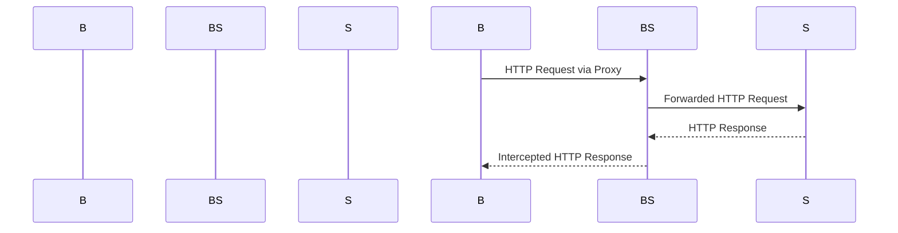

## Setting Up the Proxy for Burp Suite

### Introduction to Burp Suite

Burp Suite is an integrated platform used for performing security testing of web applications. It includes tools for mapping and analyzing web applications, attacking them, and finding vulnerabilities that can be exploited. One of the key features of Burp Suite is its ability to intercept and manipulate HTTP(S) traffic between the client and the server. This allows security testers to inspect and modify requests and responses, which is crucial for identifying and exploiting business logic vulnerabilities.

### Configuring the Proxy Settings

To ensure that all HTTP and HTTPS requests are intercepted by Burp Suite, you need to configure your proxy settings correctly. Here’s how you can do it:

#### HTTP Proxy Configuration

1. **Set the HTTP Proxy**: You need to direct all HTTP traffic through Burp Suite. This is typically done by configuring your browser or application to use a proxy server at `127.0.0.1` on port `8080`.

```plaintext
HTTP Proxy: 127.0.0.1:8080
```

#### HTTPS Proxy Configuration

1. **Set the HTTPS Proxy**: Similarly, you need to direct all HTTPS traffic through Burp Suite. This is also done by configuring your browser or application to use a proxy server at `127.0.0.1` on port `8080`.

```plaintext
HTTPS Proxy: 127.0.0.1:8080
```

### Example Configuration in Python

Here’s an example of how you might configure a Python script to use these proxy settings:

```python
import requests

proxies = {
    'http': 'http://127.0.0.1:8080',
    'https': 'http://127.0.0.1:8080'
}

response = requests.get('http://example.com', proxies=proxies)
print(response.text)
```

### Explanation of the Code

- **`proxies` Dictionary**: This dictionary specifies the proxy settings for both HTTP and HTTPS. The keys `'http'` and `'https'` correspond to the protocols, and the values are the proxy URLs.
- **`requests.get()`**: This function sends an HTTP GET request to the specified URL using the configured proxy settings.

### Mermaid Diagram: Proxy Configuration Flow



---
<!-- nav -->
[[05-Main Method Implementation|Main Method Implementation]] | [[Web Security (PortSwigger)/15-Business Logic Vulnerabilities/11-Lab 10 Infinite money logic flaw/00-Overview|Overview]] | [[Web Security (PortSwigger)/15-Business Logic Vulnerabilities/11-Lab 10 Infinite money logic flaw/07-Understanding the Lab Environment|Understanding the Lab Environment]]
