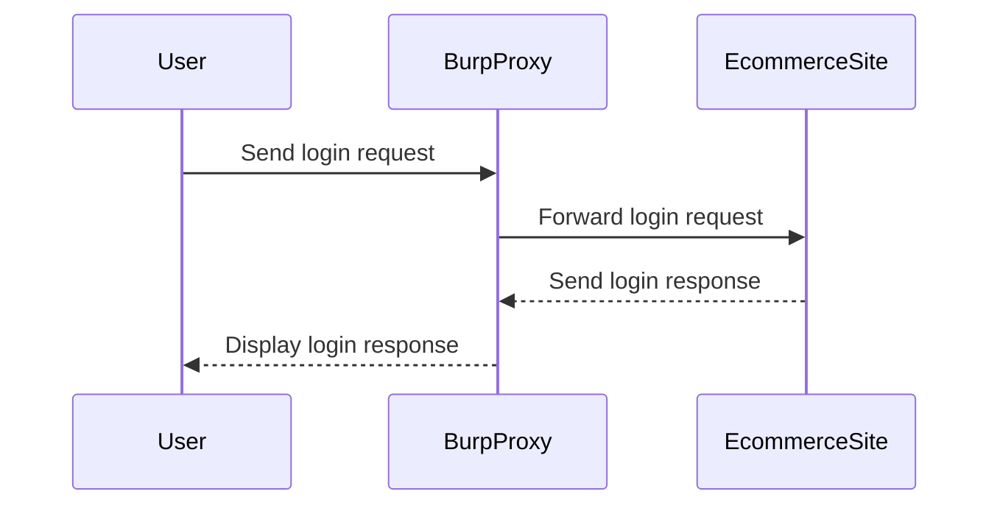
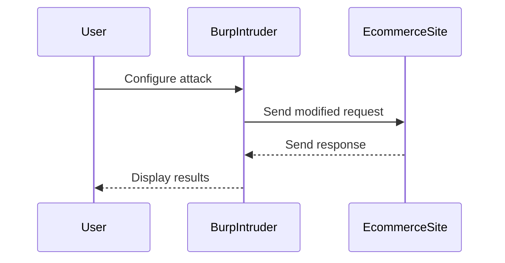

## Understanding the Lab Environment

The lab environment for the "Infinite Money Logic Flaw" is set up within the PortSwigger Web Security Academy. This environment provides a controlled setting to practice and understand the vulnerability.

### Accessing the Lab

To access the lab, follow these steps:

1. Visit the URL `https://portswigger.net/web-security`.
2. Click on the sign-up button to create an account if you don't already have one.
3. Log in to your account.
4. Navigate to the Academy section.
5. Select "All Labs".
6. Search for "business logic vulnerabilities".
7. Go to lab number 10 titled "Infinite Money Logic Flaw".

### Lab Setup

The lab environment includes an e-commerce site with a purchasing workflow. The goal is to exploit the logic flaw in the purchasing process to purchase a lightweight lead leather jacket without making a valid payment.

### Tools Required

For this lab, you will need the professional version of Burp Suite. The professional version is required because it includes features such as macros and the Intruder functionality, which are necessary to complete the exercise.

#### Using Burp Suite

Burp Suite is a comprehensive toolkit for web application security testing. It includes various tools such as Proxy, Repeater, Intruder, and Scanner. For this lab, you will primarily use the Proxy and Intruder tools.

### Setting Up Burp Suite

1. **Start Burp Suite**: Launch Burp Suite and ensure it is running in professional mode.
2. **Configure Proxy**: Set up the Burp Proxy to intercept and modify HTTP requests.
3. **Log In**: Use the provided credentials to log in to the e-commerce site through Burp Proxy.



### Exploring the Purchasing Workflow

Once logged in, explore the purchasing workflow to identify potential flaws. The goal is to find a way to purchase the lightweight lead leather jacket without making a valid payment.

#### Identifying the Flaw

To identify the flaw, you need to analyze the HTTP requests and responses during the purchasing process. Use Burp Proxy to intercept and inspect the requests.

### Exploiting the Flaw

To exploit the flaw, you need to manipulate the HTTP requests to bypass the payment process. This can be done using Burp Intruder to automate the process.

#### Using Burp Intruder

1. **Capture Request**: Capture the HTTP request for the purchase process using Burp Proxy.
2. **Set Up Intruder**: Configure Burp Intruder to send the captured request with modified parameters.
3. **Run Attack**: Run the attack to exploit the flaw and purchase the item without paying.



### Full HTTP Request and Response

Here is an example of the full HTTP request and response during the purchasing process:

#### HTTP Request

```http
POST /checkout HTTP/1.1
Host: ecommerce.example.com
Content-Type: application/x-www-form-urlencoded
Content-Length: 123

item_id=1&quantity=1&payment_method=credit_card&card_number=1234567890123456&cvv=123
```

#### HTTP Response

```http
HTTP/1.1 200 OK
Date: Mon, 20 Mar 2023 12:00:00 GMT
Content-Type: text/html; charset=UTF-8
Content-Length: 1234

<!DOCTYPE html>
<html>
<head>
    <title>Purchase Successful</title>
</head>
<body>
    <h1>Your purchase was successful!</h1>
    <p>You have successfully purchased the lightweight lead leather jacket.</p>
</body>
</html>
```

### Common Pitfalls

When exploiting business logic vulnerabilities, it is important to avoid common pitfalls such as:

- **Incomplete Validation**: Ensure that all input data is thoroughly validated.
- **Improper Error Handling**: Properly handle errors to prevent information leakage.
- **Insufficient Logging**: Maintain detailed logs to detect and investigate suspicious activities.

### How to Prevent / Defend

To prevent business logic vulnerabilities, implement the following measures:

#### Secure Coding Practices

1. **Validate Input Data**: Thoroughly validate all input data to ensure it meets the expected criteria.
2. **Implement Business Rules**: Clearly define and enforce business rules to prevent unauthorized actions.
3. **Use Secure Libraries**: Utilize secure libraries and frameworks to reduce the risk of vulnerabilities.

#### Configuration Hardening

1. **Enable Security Features**: Enable security features such as input validation and error handling in the application.
2. **Monitor Logs**: Regularly monitor logs to detect and investigate suspicious activities.
3. **Apply Security Policies**: Implement security policies to restrict access and enforce proper usage.

#### Detection and Mitigation

1. **Regular Audits**: Conduct regular security audits to identify and address vulnerabilities.
2. **Penetration Testing**: Perform penetration testing to simulate attacks and identify weaknesses.
3. **Update Dependencies**: Keep all dependencies up-to-date to mitigate known vulnerabilities.

### Secure Code Fix

Here is an example of a vulnerable code snippet and its secure counterpart:

#### Vulnerable Code

```python
def purchase_item(item_id, quantity, payment_method, card_number, cvv):
    # Process purchase
    if payment_method == "credit_card":
        # Validate card number and CVV
        if len(card_number) == 16 and len(cvv) == 3:
            # Complete purchase
            return "Purchase successful"
        else:
            return "Invalid payment details"
    else:
        return "Unsupported payment method"
```

#### Secure Code

```python
def purchase_item(item_id, quantity, payment_method, card_number, cvv):
    # Validate input data
    if not isinstance(item_id, int) or not isinstance(quantity, int):
        return "Invalid input data"
    
    if payment_method == "credit_card":
        # Validate card number and CVV
        if not card_number.isdigit() or not cvv.isdigit():
            return "Invalid payment details"
        
        if len(card_number) != 16 or len(cvv) != 3:
            return "Invalid payment details"
        
        # Complete purchase
        return "Purchase successful"
    else:
        return "Unsupported payment method"
```

### Conclusion

Business logic vulnerabilities are a serious threat to web applications. By understanding the underlying principles and implementing proper security measures, you can protect your applications from such vulnerabilities. The "Infinite Money Logic Flaw" lab provides a practical example of how to identify and exploit business logic vulnerabilities, as well as how to prevent them.

### Practice Labs

For further hands-on practice, consider the following labs:

- **PortSwigger Web Security Academy**: Offers a variety of labs to practice web security skills.
- **OWASP Juice Shop**: Provides a vulnerable web application to practice security testing.
- **DVWA (Damn Vulnerable Web Application)**: Another popular web application for practicing security testing.

By completing these labs, you can gain a deeper understanding of business logic vulnerabilities and improve your skills in identifying and preventing them.

---
<!-- nav -->
[[06-Setting Up the Proxy for Burp Suite|Setting Up the Proxy for Burp Suite]] | [[Web Security (PortSwigger)/15-Business Logic Vulnerabilities/11-Lab 10 Infinite money logic flaw/00-Overview|Overview]] | [[Web Security (PortSwigger)/15-Business Logic Vulnerabilities/11-Lab 10 Infinite money logic flaw/08-Practice Questions & Answers|Practice Questions & Answers]]
