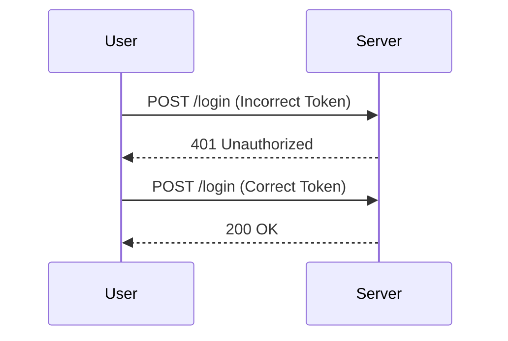

## Introduction to Business Logic Vulnerabilities

Business logic vulnerabilities occur when the application's core business rules are not properly enforced, leading to unintended behavior that can be exploited by attackers. These vulnerabilities often arise due to insufficient validation of input data, improper handling of sensitive information, or inadequate enforcement of business rules. One such vulnerability is the **Authentication Bypass via Encryption Oracle**, which we will explore in detail in this chapter.

### What is an Encryption Oracle?

An encryption oracle is a mechanism that allows an attacker to determine whether a given ciphertext decrypts correctly without knowing the key. This can happen if the application provides feedback about the decryption process, either through error messages or other observable behaviors. An encryption oracle can be used to perform various attacks, including authentication bypasses, as we will see in this lab.

### Why Does This Matter?

Understanding encryption oracles is crucial because they can lead to serious security breaches. For instance, if an attacker can bypass authentication by exploiting an encryption oracle, they can gain unauthorized access to sensitive resources, manipulate data, or even take control of the system. This can result in significant financial losses, reputational damage, and legal consequences for the organization.

### How Does It Work Under the Hood?

To understand how an encryption oracle works, let's break down the process:

1. **Encryption Process**: The application encrypts sensitive data (such as passwords or session tokens) using a secret key.
2. **Decryption Process**: When a user submits encrypted data, the application attempts to decrypt it using the same secret key.
3. **Feedback Mechanism**: If the decryption fails, the application may provide some form of feedback, such as an error message or a different response. This feedback can be used by an attacker to determine whether the decryption was successful.

### Real-World Example: CVE-2019-16758

A real-world example of an encryption oracle vulnerability is CVE-2019-16758, which affected the Atlassian Jira software. The vulnerability allowed attackers to bypass authentication by exploiting an encryption oracle. The application provided different error messages based on whether the submitted token was correctly formatted or not, allowing attackers to iteratively guess the correct token.

### Lab Setup

In this lab, we will use the PortSwigger Web Security Academy to explore an authentication bypass via encryption oracle. The lab environment is designed to simulate a real-world scenario where an encryption oracle is exposed to users.

#### Accessing the Lab

1. **Sign Up**: If you do not have an account on the Web Security Academy, visit `https://portswigger.net/web-security` and click on the sign-up button.
2. **Log In**: Once you have an account, log in and navigate to the Academy section.
3. **Select Lab**: Search for "business logic vulnerabilities" and find Lab Number 11 titled "authentication bypass via encryption oracle."

### Lab Objective

The objective of this lab is to exploit the logic flaw that exposes an encryption oracle to users and use it to gain access to the admin panel and delete the user named "Carlos."

### Initial Setup

1. **Credentials**: You are provided with credentials for a regular user. Log in using these credentials.
2. **Built-In Browser**: The lab uses a built-in browser integrated with Burp Suite, ensuring that all requests are intercepted by the proxy.

### Step-by-Step Exploitation

#### Step 1: Analyze the Login Process

1. **Login Request**: Click on "My Account" and log in using the provided credentials. The password is "Peter."
2. **Intercepted Request**: Observe the login request in Burp Suite. The request typically includes a username and a password.

```http
POST /login HTTP/1.1
Host: vulnerable-app.com
Content-Type: application/x-www-form-urlencoded
Content-Length: 26

username=admin&password=Peter
```

#### Step 2: Identify the Encryption Oracle

1. **Error Messages**: Pay attention to any error messages returned by the server after submitting incorrect credentials. These messages might indicate whether the decryption was successful or not.
2. **Feedback Analysis**: Analyze the differences in the server's response when the decryption is successful versus when it fails.

```http
HTTP/1.1 200 OK
Date: Tue, 01 Jan 2024 12:00:00 GMT
Server: Apache/2.4.41 (Ubuntu)
Content-Type: text/html; charset=UTF-8
Content-Length: 1234

<!-- Successful decryption response -->
```

```http
HTTP/1.1 401 Unauthorized
Date: Tue, 01 Jan 2024 12:00:00 GMT
Server: Apache/2.4.41 (Ubuntu)
Content-Type: text/html; charset=UTF-8
Content-Length: 1234

<!-- Failed decryption response -->
```

#### Step 3: Exploit the Encryption Oracle

1. **Iterative Guessing**: Use the feedback from the server to iteratively guess the correct encrypted token. This can be done by modifying the password field and observing the server's response.
2. **Burp Intruder**: Utilize Burp Intruder to automate the guessing process. Set up the payload list with potential encrypted tokens and run the attack.



#### Step 4: Gain Admin Access

1. **Admin Panel**: Once you have successfully bypassed authentication, navigate to the admin panel.
2. **Delete Carlos**: Locate the user "Carlos" and delete their account.

### Common Pitfalls

1. **Insufficient Feedback Analysis**: Failing to carefully analyze the server's response can lead to missing subtle differences that indicate successful decryption.
2. **Manual Guessing**: Relying solely on manual guessing can be time-consuming and error-prone. Automating the process with tools like Burp Intruder is more efficient.

### How to Prevent / Defend

#### Detection

1. **Logging and Monitoring**: Implement logging and monitoring to detect unusual patterns in login attempts.
2. **Behavioral Analysis**: Use behavioral analysis tools to identify suspicious activity that could indicate an encryption oracle attack.

#### Prevention

1. **Proper Error Handling**: Ensure that error messages do not reveal whether the decryption was successful or not. Return generic error messages instead.
2. **Input Validation**: Validate all input data thoroughly to prevent injection attacks.
3. **Secure Coding Practices**: Follow secure coding practices to avoid exposing encryption oracles. Use established cryptographic libraries and frameworks.

#### Secure Code Fix

**Vulnerable Code**

```python
def authenticate(username, password):
    encrypted_password = encrypt(password)
    stored_password = get_stored_password(username)
    if encrypted_password == stored_password:
        return True
    else:
        return False
```

**Fixed Code**

```python
import os
from cryptography.hazmat.primitives import hashes
from cryptography.hazmat.primitives.kdf.pbkdf2 import PBKDF2HMAC
from cryptography.hazmat.primitives.ciphers import Cipher, algorithms, modes

def authenticate(username, password):
    salt = get_salt(username)
    kdf = PBKDF2HMAC(
        algorithm=hashes.SHA256(),
        length=32,
        salt=salt,
        iterations=100000,
    )
    key = kdf.derive(password.encode())
    iv = os.urandom(16)
    cipher = Cipher(algorithms.AES(key), modes.CBC(iv))
    encryptor = cipher.encryptor()
    encrypted_password = encryptor.update(password.encode()) + encryptor.finalize()
    stored_password = get_stored_password(username)
    if constant_time_compare(encrypted_password, stored_password):
        return True
    else:
        return False

def constant_time_compare(val1, val2):
    if len(val1) != len(val2):
        return False
    result = 0
    for x, y in zip(val1, val2):
        result |= x ^ y
    return result == 0
```

### Conclusion

In this chapter, we explored the concept of business logic vulnerabilities, specifically focusing on the authentication bypass via encryption oracle. We covered the theory behind encryption oracles, real-world examples, and practical steps to exploit and defend against such vulnerabilities. By understanding and implementing secure coding practices, organizations can significantly reduce the risk of such attacks.

### Hands-On Practice

For hands-on practice, you can use the following labs:

- **PortSwigger Web Security Academy**: Lab Number 11 in the Business Logic Vulnerabilities module.
- **OWASP Juice Shop**: Explore similar vulnerabilities in the OWASP Juice Shop.
- **DVWA**: Use the Damn Vulnerable Web Application (DVWA) to practice exploiting and defending against encryption oracle vulnerabilities.

By engaging in these labs, you can gain practical experience and deepen your understanding of business logic vulnerabilities and encryption oracles.

---
<!-- nav -->
[[Web Security (PortSwigger)/15-Business Logic Vulnerabilities/12-Lab 11 Authentication bypass via encryption oracle/00-Overview|Overview]] | [[02-Business Logic Vulnerabilities Authentication Bypass via Encryption Oracle|Business Logic Vulnerabilities Authentication Bypass via Encryption Oracle]]
