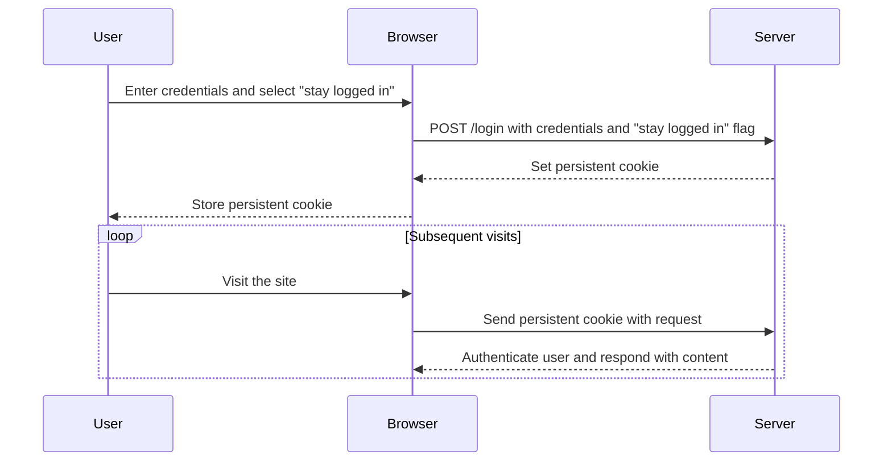
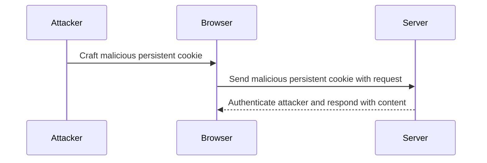

## Business Logic Vulnerabilities: Authentication Bypass via Encryption Oracle

### Introduction to Business Logic Vulnerabilities

Business logic vulnerabilities occur when the application's business rules are not properly enforced, leading to unintended behavior that can be exploited by attackers. These vulnerabilities often arise due to insufficient validation of input data, improper handling of sensitive information, or inadequate enforcement of access control policies. In this section, we will explore a specific type of business logic vulnerability: authentication bypass via an encryption oracle.

### Understanding Persistent Cookies

Persistent cookies, also known as long-lived cookies, are used to maintain a user's session across multiple visits to a website. Unlike session cookies, which typically expire when the browser is closed, persistent cookies remain active even after the browser is closed and reopened. This allows users to stay logged into an application without having to re-enter their credentials each time they visit the site.

#### How Persistent Cookies Work

When a user logs into an application and selects the "stay logged in" feature, the server generates a persistent cookie that contains a unique identifier. This identifier is stored on the client's machine and is sent back to the server with each subsequent request. The server uses this identifier to authenticate the user and maintain their session.

#### Example of Persistent Cookie Usage

Consider the following scenario:

1. A user logs into an application and selects the "stay logged in" feature.
2. The server generates a persistent cookie and sends it to the client.
3. The client stores the cookie on their machine.
4. On subsequent visits, the client sends the persistent cookie with each request.
5. The server validates the cookie and authenticates the user based on the identifier contained within the cookie.



### Analyzing the Login Request

To understand how the "stay logged in" feature works, let's analyze the login request in detail.

#### Regular Login Request

A regular login request typically includes the following parameters:

- `CSRF` token: A token used to prevent Cross-Site Request Forgery (CSRF) attacks.
- `username`: The user's username.
- `password`: The user's password.

The server responds by setting a session cookie that manages the user's session.

```http
POST /login HTTP/1.1
Host: example.com
Content-Type: application/x-www-form-urlencoded

CSRF=abc123&username=johndoe&password=secret
```

Response:

```http
HTTP/1.1 200 OK
Set-Cookie: session_id=def456; Path=/; HttpOnly
Content-Type: text/html

<!DOCTYPE html>
<html>
<head>
    <title>Welcome</title>
</head>
<body>
    <h1>Welcome, johndoe!</h1>
</body>
</html>
```

#### Login Request with "Stay Logged In" Feature

When the "stay logged in" feature is selected, the login request includes an additional parameter:

- `stay_logged_in`: A flag indicating whether the user wants to stay logged in.

The server responds by setting both a session cookie and a persistent cookie.

```http
POST /login HTTP/1.1
Host: example.com
Content-Type: application/x-www-form-urlencoded

CSRF=abc123&username=johndoe&password=secret&stay_logged_in=on
```

Response:

```http
HTTP/1.1 200 OK
Set-Cookie: session_id=def456; Path=/; HttpOnly
Set-Cookie: persistent_session_id=ghi789; Path=/; HttpOnly; Max-Age=2592000
Content-Type: text/html

<!DOCTYPE html>
<html>
<head>
    <title>Welcome</title>
</head>
<body>
    <h1>Welcome, johndoe!</h1>
</body>
</html>
```

### Business Logic Vulnerability: Authentication Bypass via Encryption Oracle

An encryption oracle is a mechanism that allows an attacker to determine whether a given ciphertext decrypts correctly without knowing the plaintext. In the context of the "stay logged in" feature, an encryption oracle can be exploited to bypass authentication.

#### How the Vulnerability Works

If the server does not properly validate the persistent cookie, an attacker can craft a malicious persistent cookie that decrypts to a valid session identifier. By sending this malicious cookie in a request, the attacker can bypass authentication and gain unauthorized access to the application.

#### Real-World Example: CVE-2021-3129

CVE-2021-3129 is a real-world example of an encryption oracle vulnerability in the Apache Struts framework. The vulnerability allowed attackers to bypass authentication by crafting a malicious cookie that decrypted to a valid session identifier.



### How to Prevent / Defend Against Authentication Bypass via Encryption Oracle

To prevent authentication bypass via an encryption oracle, several measures can be taken:

#### Secure Cookie Management

Ensure that persistent cookies are securely managed:

- **Use Strong Encryption**: Use strong encryption algorithms (e.g., AES) to encrypt the persistent cookie.
- **Include Nonces**: Include nonces or random values in the cookie to prevent replay attacks.
- **Validate Cookies**: Validate the persistent cookie on each request to ensure it has not been tampered with.

#### Example of Secure Cookie Management

Here is an example of how to securely manage persistent cookies using Python and Flask:

```python
from flask import Flask, request, make_response
from itsdangerous import URLSafeTimedSerializer

app = Flask(__name__)
app.config['SECRET_KEY'] = 'your_secret_key'

serializer = URLSafeTimedSerializer(app.config['SECRET_KEY'])

@app.route('/login', methods=['POST'])
def login():
    username = request.form['username']
    password = request.form['password']
    stay_logged_in = request.form.get('stay_logged_in')

    # Validate username and password
    if username == 'johndoe' and password == 'secret':
        session_id = 'def456'
        response = make_response('Welcome, johndoe!')
        response.set_cookie('session_id', session_id, httponly=True)

        if stay_logged_in:
            persistent_session_id = serializer.dumps(session_id)
            response.set_cookie('persistent_session_id', persistent_session_id, max_age=2592000, httponly=True)

        return response

    return 'Invalid credentials', 401

@app.route('/', methods=['GET'])
def index():
    session_id = request.cookies.get('session_id')
    persistent_session_id = request.cookies.get('persistent_session_id')

    if session_id:
        return f'Welcome, {session_id}!'
    elif persistent_session_id:
        try:
            session_id = serializer.loads(persistent_session_id, max_age=2592000)
            return f'Welcome, {session_id}!'
        except Exception:
            return 'Invalid session', 401

    return 'Please log in', 401
```

#### Detection and Monitoring

Implement monitoring and logging to detect potential exploitation of the encryption oracle:

- **Log Access Attempts**: Log all access attempts, including successful and failed login attempts.
- **Monitor for Anomalies**: Monitor for unusual patterns of access, such as repeated login attempts with different cookies.

#### Example of Logging and Monitoring

Here is an example of how to log and monitor access attempts using Python and Flask:

```python
import logging

logging.basicConfig(filename='access.log', level=logging.INFO)

@app.route('/login', methods=['POST'])
def login():
    username = request.form['username']
    password = request.form['password']
    stay_logged_in = request.form.get('stay_logged_in')

    logging.info(f'Login attempt: username={username}, stay_logged_in={stay_logged_in}')

    # Validate username and password
    if username == 'johndoe' and password == 'secret':
        session_id = 'def456'
        response = make_response('Welcome, johndoe!')
        response.set_cookie('session_id', session_id, httponly=True)

        if stay_logged_in:
            persistent_session_id = serializer.dumps(session_id)
            response.set_cookie('persistent_session_id', persistent_session_id, max_age=2592000, httponly=True)

        return response

    logging.warning(f'Failed login attempt: username={username}')
    return 'Invalid credentials', 401
```

### Conclusion

Business logic vulnerabilities, such as authentication bypass via an encryption oracle, can have severe consequences if not properly addressed. By understanding how persistent cookies work and implementing secure cookie management practices, developers can mitigate these risks and ensure the security of their applications. Additionally, by monitoring and logging access attempts, organizations can detect and respond to potential exploitation of these vulnerabilities.

### Practice Labs

For hands-on practice with business logic vulnerabilities and encryption oracles, consider the following labs:

- **PortSwigger Web Security Academy**: Offers a variety of labs that cover different types of business logic vulnerabilities, including authentication bypass via encryption oracle.
- **OWASP Juice Shop**: Provides a vulnerable web application that includes various business logic vulnerabilities, allowing you to practice identifying and exploiting them.
- **DVWA (Damn Vulnerable Web Application)**: Another vulnerable web application that includes business logic vulnerabilities, providing a practical environment for learning and testing.

By engaging with these labs, you can gain a deeper understanding of business logic vulnerabilities and develop the skills necessary to identify and mitigate them in real-world applications.

---
<!-- nav -->
[[Web Security (PortSwigger)/15-Business Logic Vulnerabilities/12-Lab 11 Authentication bypass via encryption oracle/01-Introduction to Business Logic Vulnerabilities|Introduction to Business Logic Vulnerabilities]] | [[Web Security (PortSwigger)/15-Business Logic Vulnerabilities/12-Lab 11 Authentication bypass via encryption oracle/00-Overview|Overview]] | [[Web Security (PortSwigger)/15-Business Logic Vulnerabilities/12-Lab 11 Authentication bypass via encryption oracle/03-Business Logic Vulnerabilities|Business Logic Vulnerabilities]]
