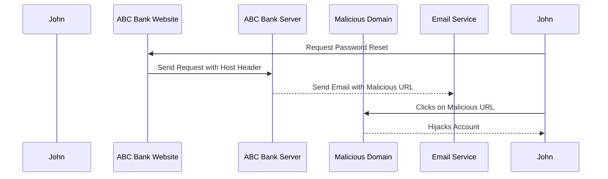

## Password Reset Poisoning

Password reset poisoning is a type of attack where an attacker manipulates the Host header to inject their own domain into the password reset link. This can result in the victim receiving a password reset link that points to the attacker's domain instead of the legitimate one. Once the victim clicks on this link, the attacker can potentially hijack the user's account.

### How Password Reset Poisoning Works

Let's break down the steps involved in a password reset poisoning attack:

1. **User Requests Password Reset**: A user, let's call them John, forgets their password and initiates a password reset request on the ABC Bank website.
2. **Request Sent to Backend**: The frontend application sends a request to the backend server with the necessary details, including the Host header.
3. **Backend Constructs URL**: The backend server uses the Host header to construct the password reset link. If the Host header is manipulated, the constructed URL will point to the attacker's domain.
4. **Email Sent to User**: The backend server sends an email to John containing the password reset link.
5. **User Clicks Link**: John receives the email and clicks on the link, which redirects him to the attacker's domain.
6. **Attacker Hijacks Account**: The attacker can now intercept the password reset process and gain access to John's account.

### Example Scenario

Consider the following scenario:

- **User Request**: John requests a password reset on the ABC Bank website.
- **Host Header Manipulation**: An attacker intercepts the request and modifies the Host header to `malicious-domain.com`.
- **Backend Response**: The backend constructs the password reset link using the modified Host header, resulting in a URL like `https://malicious-domain.com/reset-password?token=abc123`.
- **Email Sent**: The backend sends an email to John with the malicious URL.
- **User Interaction**: John clicks on the link, which redirects him to the attacker's domain.

### Real-World Examples

Recent real-world examples of password reset poisoning attacks include:

- **CVE-2021-3427**: This vulnerability was found in several web applications where the Host header was improperly validated, leading to potential password reset poisoning attacks.
- **Breaches at Financial Institutions**: Several financial institutions have reported incidents where attackers used password reset poisoning to gain unauthorized access to customer accounts.

### Code Example

Here is an example of how a backend might construct a password reset link using the Host header:

```python
def generate_password_reset_link(request, token):
    host = request.headers.get('Host')
    return f"https://{host}/reset-password?token={token}"
```

### Vulnerable Code

```python
# Vulnerable Code
def generate_password_reset_link_vulnerable(request, token):
    host = request.headers.get('Host')  # Unvalidated Host header
    return f"https://{host}/reset-password?token={token}"
```

### Secure Code

To prevent this vulnerability, the Host header should be validated against a list of trusted domains:

```python
# Secure Code
def generate_password_reset_link_secure(request, token):
    trusted_domains = ['www.abcbank.com', 'secure.abcbank.com']
    host = request.headers.get('Host')
    if host in trusted_domains:
        return f"https://{host}/reset-password?token={token}"
    else:
        raise ValueError("Invalid Host header")
```

### Detection and Prevention

#### Detection

- **Logging and Monitoring**: Implement logging and monitoring to detect unusual patterns in password reset requests.
- **Anomaly Detection**: Use anomaly detection tools to identify suspicious activities related to password resets.

#### Prevention

- **Validate Host Header**: Ensure that the Host header is validated against a list of trusted domains.
- **Use HTTPS**: Always use HTTPS to encrypt the communication between the client and the server.
- **Rate Limiting**: Implement rate limiting on password reset requests to prevent abuse.

### Sequence Diagram

A sequence diagram illustrating the steps involved in a password reset poisoning attack:



---
<!-- nav -->
[[05-How to Prevent Host Header Attacks|How to Prevent Host Header Attacks]] | [[Web Security (PortSwigger)/16-HTTP Host Header Attacks/01-HTTP Host Header Attacks Complete Guide/00-Overview|Overview]] | [[Web Security (PortSwigger)/16-HTTP Host Header Attacks/01-HTTP Host Header Attacks Complete Guide/07-Understanding HTTP Host Header Attacks|Understanding HTTP Host Header Attacks]]
