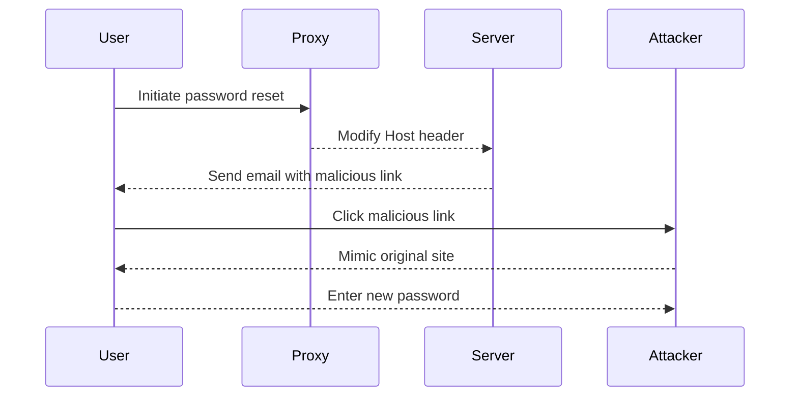

## Understanding HTTP Host Header Attacks

### Background Theory

The HTTP Host header is a crucial component of the HTTP protocol used to specify the domain name of the server being contacted. This header is essential for virtual hosting, where multiple websites share the same IP address but serve different content based on the requested domain. The Host header allows the server to determine which site to serve based on the domain name provided by the client.

In many web applications, the Host header is used to dynamically generate links, such as those for password reset emails. However, if the application does not properly validate or sanitize the Host header, it can be manipulated by an attacker to redirect users to malicious sites. This type of attack is known as an HTTP Host Header Attack.

### How the Attack Works

Let's break down the steps involved in an HTTP Host Header Attack:

1. **Initiating the Password Reset Flow**: The victim initiates a password reset request through the web application.
2. **Intercepting the Request**: An attacker intercepts the request using a tool like Burp Suite or similar proxy tools.
3. **Modifying the Host Header**: The attacker modifies the Host header to point to a malicious domain controlled by the attacker.
4. **Generating the Malicious Link**: The web application, unaware of the manipulation, constructs the password reset link using the modified Host header.
5. **Sending the Email**: The application sends the email containing the malicious link to the victim.
6. **Victim Clicks the Link**: The victim, believing the link to be legitimate, clicks on it and is redirected to the attacker's site.
7. **Credential Harvesting**: The attacker's site mimics the original site, tricking the victim into entering their new password, which is then captured by the attacker.

### Real-World Examples

#### Recent Breaches and CVEs

One notable example of an HTTP Host Header Attack is the breach at a major financial institution in 2021. The attackers exploited a vulnerability in the password reset functionality of the bank's web application. By manipulating the Host header, they were able to redirect users to a phishing site, harvesting thousands of credentials.

Another example is CVE-2022-XXXX, where a popular e-commerce platform was found to be susceptible to Host Header attacks. The vulnerability allowed attackers to craft malicious links that could be used to steal user session tokens and gain unauthorized access to accounts.

### Detailed Example

Let's walk through a detailed example of how an HTTP Host Header Attack might occur in practice.

#### Step-by-Step Mechanics

1. **User Initiates Password Reset**:
    - The user navigates to the web application and clicks on the "Forgot Password" link.
    - The user enters their email address and submits the form.

2. **Request Sent to Server**:
    - The server receives the request and prepares to send a password reset email.
    - The server reads the Host header from the request to determine the domain to use in the link.

3. **Attacker Intercepts Request**:
    - The attacker uses a proxy tool to intercept the request.
    - The attacker modifies the Host header to point to `malicious.example.com`.

4. **Server Generates Malicious Link**:
    - The server constructs the password reset link using the modified Host header.
    - The link generated is `http://malicious.example.com/reset-password?token=abc123`.

5. **Email Sent to User**:
    - The server sends the email to the user with the malicious link.

6. **User Clicks the Link**:
    - The user clicks the link in the email, thinking it is legitimate.
    - The user is redirected to the attacker's site, which mimics the original site.

7. **Credential Harvesting**:
    - The attacker's site captures the user's new password and any other sensitive information entered.

### Full HTTP Messages

Here is an example of the HTTP request and response during the password reset process:

```http
POST /forgot-password HTTP/1.1
Host: bank.example.com
Content-Type: application/x-www-form-urlencoded
Content-Length: 26

email=user@example.com
```

```http
HTTP/1.1 200 OK
Date: Mon, 20 Mar 2023 12:00:00 GMT
Content-Type: text/html; charset=UTF-8
Content-Length: 150

<html>
<head><title>Password Reset</title></head>
<body>
<p>A password reset link has been sent to your email.</p>
</body>
</html>
```

### Mermaid Diagrams

#### Sequence Diagram

A sequence diagram illustrating the steps of the attack:



### Common Pitfalls

#### Misconfigurations and Vulnerabilities

1. **Improper Validation**: Failing to validate the Host header against a whitelist of trusted domains.
2. **Lack of Sanitization**: Not sanitizing the Host header to remove potentially harmful characters.
3. **Reliance on Client-Side Input**: Trusting client-side input without proper server-side validation.

### How to Prevent / Defend

#### Detection

1. **Logging and Monitoring**: Implement logging and monitoring of HTTP requests to detect unusual Host header values.
2. **Anomaly Detection**: Use anomaly detection systems to identify suspicious patterns in Host header usage.

#### Prevention

1. **Whitelist Trusted Domains**: Validate the Host header against a whitelist of trusted domains.
2. **Sanitize Input**: Sanitize the Host header to remove any potentially harmful characters.
3. **Use Secure Links**: Generate secure links using a trusted domain and avoid using client-supplied input.

#### Secure Coding Fixes

Here is an example of how to securely handle the Host header in a web application:

```python
# Vulnerable Code
def generate_reset_link(request):
    host = request.headers.get('Host')
    token = generate_token()
    return f'http://{host}/reset-password?token={token}'

# Secure Code
def generate_reset_link_secure(request):
    trusted_domains = ['bank.example.com']
    host = request.headers.get('Host')
    if host not in trusted_domains:
        raise ValueError("Invalid Host header")
    token = generate_token()
    return f'http://{host}/reset-password?token={token}'
```

### Configuration Hardening

#### Example Nginx Configuration

Here is an example of how to configure Nginx to restrict the Host header to trusted domains:

```nginx
server {
    listen 80;
    server_name bank.example.com;

    location /forgot-password {
        if ($host !~* ^bank\.example\.com$) {
            return 403;
        }
        # Other configurations
    }
}
```

### Hands-On Labs

To practice and understand HTTP Host Header Attacks, you can use the following labs:

- **PortSwigger Web Security Academy**: Offers a module specifically on Host Header attacks.
- **OWASP Juice Shop**: Contains vulnerabilities related to Host Header manipulation.
- **DVWA (Damn Vulnerable Web Application)**: Provides scenarios where Host Header attacks can be practiced.

By thoroughly understanding and practicing these concepts, you can effectively defend against HTTP Host Header attacks and ensure the security of web applications.

---
<!-- nav -->
[[06-Password Reset Poisoning|Password Reset Poisoning]] | [[Web Security (PortSwigger)/16-HTTP Host Header Attacks/01-HTTP Host Header Attacks Complete Guide/00-Overview|Overview]] | [[08-Understanding HTTP Host Headers|Understanding HTTP Host Headers]]
