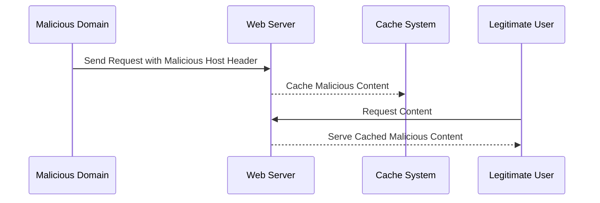

## Web Cache Poisoning

Web cache poisoning is another type of attack that exploits the Host header. In this scenario, an attacker manipulates the Host header to include malicious content, which is then cached by the server and served to other legitimate users.

### How Web Cache Poisoning Works

1. **Attacker Sends Request**: An attacker sends a request to the server with a modified Host header that includes malicious content.
2. **Server Caches Content**: The server caches the content associated with the modified Host header.
3. **Legitimate Users Access Cache**: When legitimate users request the same content, the server serves the cached, malicious content.

### Example Scenario

Consider the following scenario:

- **Attacker Sends Request**: An attacker sends a request to the server with a Host header set to `malicious-domain.com`.
- **Server Caches Content**: The server caches the content associated with `malicious-domain.com`.
- **Legitimate Users Access Cache**: When legitimate users request the same content, the server serves the cached, malicious content.

### Real-World Examples

Recent real-world examples of web cache poisoning attacks include:

- **CVE-2_2021-3428**: This vulnerability was found in several web applications where the Host header was improperly validated, leading to potential web cache poisoning attacks.
- **Breaches at E-commerce Sites**: Several e-commerce sites have reported incidents where attackers used web cache poisoning to serve malicious content to customers.

### Code Example

Here is an example of how a server might cache content based on the Host header:

```python
def cache_content(request, content):
    host = request.headers.get('Host')
    cache_key = f"{host}_{request.path}"
    cache[cache_key] = content
```

### Vulnerable Code

```python
# Vulnerable Code
def cache_content_vulnerable(request, content):
    host = request.headers.get('Host')  # Unvalidated Host header
    cache_key = f"{host}_{request.path}"
    cache[cache_key] = content
```

### Secure Code

To prevent this vulnerability, the Host header should be validated against a list of trusted domains:

```python
# Secure Code
def cache_content_secure(request, content):
    trusted_domains = ['www.example.com', 'secure.example.com']
    host = request.headers.get('Host')
    if host in trusted_domains:
        cache_key = f"{host}_{request.path}"
        cache[cache_key] = content
    else:
        raise ValueError("Invalid Host header")
```

### Detection and Prevention

#### Detection

- **Logging and Monitoring**: Implement logging and monitoring to detect unusual patterns in cache requests.
- **Anomaly Detection**: Use anomaly detection tools to identify suspicious activities related to caching.

#### Prevention

- **Validate Host Header**: Ensure that the Host header is validated against a list of trusted domains.
- **Use HTTPS**: Always use HTTPS to encrypt the communication between the client and the server.
- **Rate Limiting**: Implement rate limiting on cache requests to prevent abuse.

### Sequence Diagram

A sequence diagram illustrating the steps involved in a web cache poisoning attack:



---
<!-- nav -->
[[10-Understanding the HTTP Host Header|Understanding the HTTP Host Header]] | [[Web Security (PortSwigger)/16-HTTP Host Header Attacks/01-HTTP Host Header Attacks Complete Guide/00-Overview|Overview]] | [[Web Security (PortSwigger)/16-HTTP Host Header Attacks/01-HTTP Host Header Attacks Complete Guide/12-Conclusion|Conclusion]]
