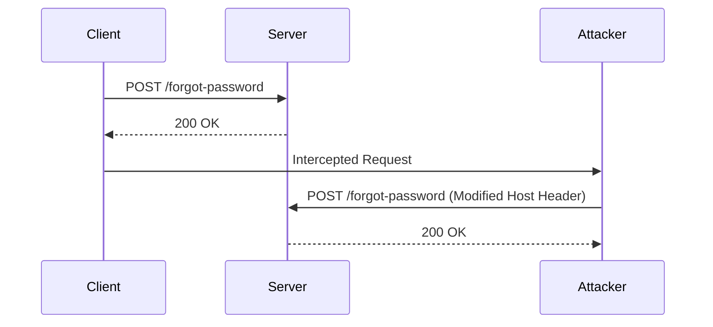

## Understanding HTTP Host Header Attacks

### Background Theory

The HTTP Host header is a crucial component of HTTP requests. It specifies the domain name of the server to which the request is being sent. This header is essential because it allows a single IP address to serve multiple websites, a practice known as virtual hosting. However, the Host header can also be manipulated maliciously, leading to various security vulnerabilities.

### What is the Host Header?

The Host header is one of the standard HTTP headers. Its primary function is to identify the domain name of the server that the client wants to communicate with. For example, in an HTTP request to `https://example.com`, the Host header would look like this:

```http
GET / HTTP/1.1
Host: example.com
```

### Why Does the Host Header Matter?

The Host header is critical for several reasons:
- **Virtual Hosting**: Multiple domains can share the same IP address, and the server uses the Host header to determine which site to serve.
- **Security Implications**: Manipulating the Host header can lead to various security issues, such as phishing attacks, cross-site scripting (XSS), and other types of injection attacks.

### How Does the Host Header Work Under the Hood?

When a client sends an HTTP request to a server, the request includes the Host header. The server then uses this header to route the request to the appropriate application or service. For instance, if the Host header is set to `example.com`, the server will direct the request to the application associated with `example.com`.

### Common Vulnerabilities Related to the Host Header

One of the most common vulnerabilities related to the Host header is **Host Header Injection**. This occurs when an attacker manipulates the Host header to trick the server into serving content from a different domain than intended. This can be particularly dangerous in scenarios involving password resets, as demonstrated in the lab exercise.

### Real-World Examples

#### CVE-2021-32790: Host Header Injection in WordPress

In 2021, a vulnerability was discovered in WordPress plugins that allowed attackers to manipulate the Host header to perform phishing attacks. The vulnerability affected plugins that did not properly validate the Host header, allowing attackers to redirect users to malicious sites during the password reset process.

#### CVE-2022-22965: Host Header Injection in Joomla

Another example is a vulnerability found in Joomla, where the Host header was not properly validated during the password reset process. This allowed attackers to inject a malicious Host header, leading to potential phishing attacks.

### Lab Exercise: Basic Password Reset Poisoning

Let's walk through the lab exercise to understand how Host Header Injection can be exploited in a password reset scenario.

#### Step-by-Step Mechanics

1. **Access the Lab Environment**:
   - Open the lab environment in a new window.
   - Ensure that all requests are being passed through Burp Suite Proxy.

2. **Navigate to the Login Page**:
   - Click on "My Account".
   - Observe the login functionality that takes a username and password.

3. **Initiate the Password Reset Process**:
   - Click on the "Forgot Password" link.
   - Enter a username or email address.

4. **Manipulate the Host Header**:
   - Intercept the request using Burp Suite.
   - Modify the Host header to point to a malicious domain.

#### Example HTTP Request and Response

Here is a complete example of the HTTP request and response:

```http
POST /forgot-password HTTP/1.1
Host: example.com
Content-Type: application/x-www-form-urlencoded
Content-Length: 29

username=alice@example.com
```

Response:

```http
HTTP/1.1 200 OK
Date: Tue, 14 Mar 2023 12:00:00 GMT
Server: Apache/2.4.41 (Ubuntu)
Content-Type: text/html; charset=UTF-8
Content-Length: 1234

<!DOCTYPE html>
<html>
<head>
    <title>Password Reset</title>
</head>
<body>
    <h1>Password Reset</h1>
    <p>A password reset email has been sent to alice@example.com.</p>
</body>
</html>
```

#### Sequence Diagram

A sequence diagram can help visualize the interaction between the client, server, and attacker:



### Common Mistakes and Pitfalls

- **Improper Validation**: Not validating the Host header can lead to successful exploitation.
- **Reliance on User Input**: Relying solely on user input for the Host header can expose the system to attacks.
- **Lack of Awareness**: Many developers are unaware of the risks associated with the Host header, leading to vulnerabilities.

### How to Prevent / Defend Against Host Header Injection

#### Detection

To detect Host Header Injection vulnerabilities, you can use tools like Burp Suite, ZAP, or custom scripts to monitor and analyze HTTP traffic.

#### Prevention

1. **Validate the Host Header**:
   - Ensure that the Host header matches a list of trusted domains.
   - Reject requests with invalid or unexpected Host headers.

2. **Secure Coding Practices**:
   - Implement proper validation and sanitization of user inputs.
   - Avoid using user-provided data directly in sensitive operations.

3. **Configuration Hardening**:
   - Configure web servers to reject requests with invalid Host headers.
   - Use security headers like `Strict-Transport-Security` to enhance security.

#### Secure Code Fix

Here is an example of how to securely validate the Host header in a Python Flask application:

```python
from flask import Flask, request

app = Flask(__name__)

@app.route('/forgot-password', methods=['POST'])
def forgot_password():
    allowed_hosts = ['example.com']
    if request.headers.get('Host') not in allowed_hosts:
        return "Invalid Host header", 400
    
    username = request.form['username']
    # Proceed with password reset logic
    return f"Password reset email sent to {username}"

if __name__ == '__main__':
    app.run()
```

#### Vulnerable vs. Secure Code

**Vulnerable Code**:

```python
from flask import Flask, request

app = Flask(__name__)

@app.route('/forgot-password', methods=['POST'])
def forgot_password():
    username = request.form['username']
    # Proceed with password reset logic
    return f"Password reset email sent to {username}"

if __name__ == '__main__':
    app.run()
```

**Secure Code**:

```python
from flask import Flask, request

app = Flask(__name__)

@app.route('/forgot-password', methods=['POST'])
def forgot_password():
    allowed_hosts = ['example.com']
    if request.headers.get('Host') not in allowed_hosts:
        return "Invalid Host header", 400
    
    username = request.form['username']
    # Proceed with password reset logic
    return f"Password reset email sent to {username}"

if __name__ == '__main__':
    app.run()
```

### Hands-On Labs

For practical experience with HTTP Host Header attacks, consider the following labs:
- **PortSwigger Web Security Academy**: Offers detailed labs on various web security topics, including Host Header Injection.
- **OWASP Juice Shop**: A deliberately insecure web application for practicing web security skills.
- **DVWA (Damn Vulnerable Web Application)**: Another popular platform for learning web security through practical exercises.

By thoroughly understanding the mechanics and implications of HTTP Host Header attacks, you can better protect web applications from these vulnerabilities.

---
<!-- nav -->
[[02-HTTP Host Header Attacks Password Reset Poisoning|HTTP Host Header Attacks Password Reset Poisoning]] | [[Web Security (PortSwigger)/16-HTTP Host Header Attacks/02-Lab 1 Basic password reset poisoning/00-Overview|Overview]] | [[Web Security (PortSwigger)/16-HTTP Host Header Attacks/02-Lab 1 Basic password reset poisoning/04-Practice Questions & Answers|Practice Questions & Answers]]
