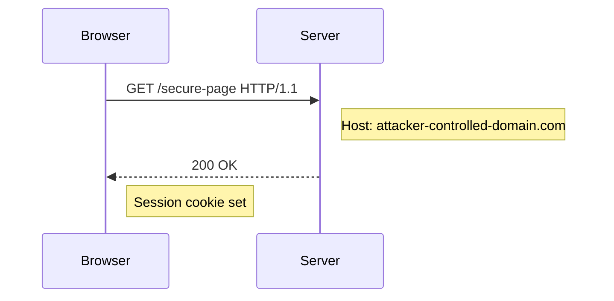
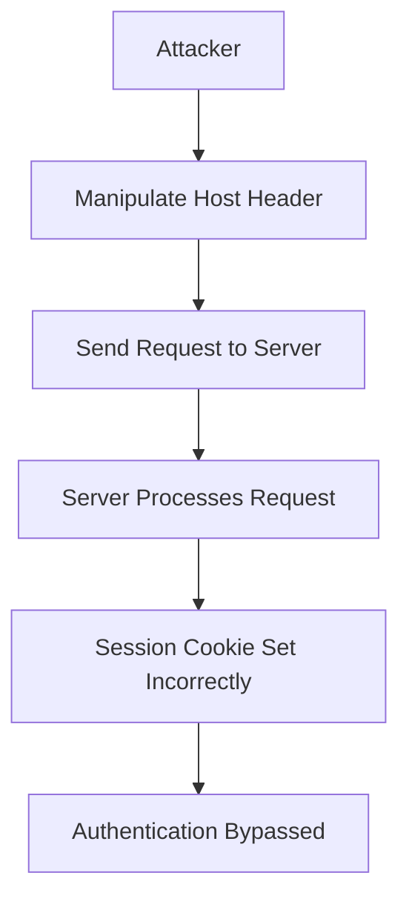

## HTTP Host Header Attacks

### Background Theory

The `Host` header is a crucial component of HTTP requests, used to specify the domain name of the server being contacted. This header is essential because it allows a single IP address to serve multiple websites (virtual hosting). However, this flexibility can also introduce security vulnerabilities if not handled correctly.

When a web server receives an HTTP request, it uses the `Host` header to determine which website should handle the request. If the server does not properly validate or sanitize this header, attackers can manipulate it to bypass security measures such as authentication.

### Attack Vector: Host Header Injection

#### What is Host Header Injection?

Host header injection occurs when an attacker manipulates the `Host` header in an HTTP request to trick the server into performing actions that it would not normally allow. This can lead to various security issues, including authentication bypass, content spoofing, and cross-site scripting (XSS).

#### Why Does It Matter?

Many web applications rely on the `Host` header to determine the context of a request. For example, an application might use the `Host` header to decide which user session to load or which database to query. If this header is not validated, an attacker can inject malicious values that cause the server to behave unexpectedly.

#### How Does It Work?

Consider a scenario where a web application uses the `Host` header to determine the current user's session. An attacker could craft a request with a manipulated `Host` header to make the server think the request is coming from a different domain, potentially bypassing authentication checks.

```http
GET /secure-page HTTP/1.1
Host: attacker-controlled-domain.com
Cookie: session=valid-session-id
```

In this example, the server might interpret the `Host` header and load a session associated with `attacker-controlled-domain.com`, even though the actual request is coming from a different domain.

### Real-World Examples

#### Recent Breaches and CVEs

One notable example of a host header injection vulnerability is CVE-2020-14182, which affected the WordPress REST API. In this case, attackers could manipulate the `Host` header to bypass authentication and gain unauthorized access to sensitive data.

Another example is CVE-2021-32796, which impacted the Django web framework. This vulnerability allowed attackers to inject malicious `Host` headers to bypass certain security checks, leading to potential information disclosure and other attacks.

### Complete Example

Let's consider a more detailed example where a web application uses the `Host` header to determine the active user session. Suppose the application has a `/login` endpoint that sets a session cookie based on the `Host` header.

#### Vulnerable Code

```python
def login(request):
    host = request.headers.get('Host')
    if host == 'example.com':
        # Set session cookie for example.com
        response = HttpResponse("Logged in")
        response.set_cookie('session', 'valid-session-id')
    else:
        response = HttpResponse("Invalid host", status=403)
    return response
```

#### Exploitation

An attacker could craft a request with a manipulated `Host` header to bypass the check:

```http
POST /login HTTP/1.1
Host: attacker-controlled-domain.com
Content-Type: application/x-www-form-urlencoded

username=admin&password=secret
```

The server would interpret the `Host` header and fail to set the session cookie, allowing the attacker to bypass the intended security measure.

### How to Prevent / Defend

#### Detection

To detect host header injection vulnerabilities, you can use automated tools like Burp Suite, OWASP ZAP, or commercial scanners. These tools can help identify requests where the `Host` header is manipulated and flag potential issues.

#### Prevention

1. **Validate the `Host` Header**: Ensure that the `Host` header matches a list of trusted domains. This can be done by comparing the header value against a whitelist of allowed domains.

2. **Use Secure Headers**: Implement security headers such as `Strict-Transport-Security` (HSTS) and `Content-Security-Policy` (CSP) to mitigate the impact of host header injection attacks.

3. **Secure Coding Practices**: Avoid using the `Host` header to make critical security decisions. Instead, rely on more secure methods such as session management and proper authentication mechanisms.

#### Secure Code Fix

Here is the corrected version of the vulnerable code:

```python
def login(request):
    host = request.headers.get('Host')
    trusted_hosts = ['example.com']
    if host in trusted_hosts:
        # Set session cookie for example.com
        response = HttpResponse("Logged in")
        response.set_cookie('session', 'valid-session-id')
    else:
        response = HttpResponse("Invalid host", status=403)
    return response
```

### Configuration Hardening

Ensure that your web server and application frameworks are configured to reject requests with invalid `Host` headers. For example, in Nginx, you can configure the `server_name` directive to only accept specific hostnames:

```nginx
server {
    listen 80;
    server_name example.com;

    location / {
        # Your application logic here
    }
}
```

### Mermaid Diagrams

#### Request Flow Diagram



#### Attack Chain Diagram



### Practice Labs

For hands-on practice with HTTP host header attacks, consider the following labs:

- **PortSwigger Web Security Academy**: Offers interactive labs on various web security topics, including host header injection.
- **OWASP Juice Shop**: A deliberately insecure web application for practicing web security skills, including host header manipulation.
- **DVWA (Damn Vulnerable Web Application)**: Provides a range of vulnerabilities, including those related to HTTP headers.

By thoroughly understanding and implementing these preventive measures, you can significantly reduce the risk of host header injection attacks and ensure the security of your web applications.

---
<!-- nav -->
[[Web Security (PortSwigger)/16-HTTP Host Header Attacks/03-Lab 2 Host header authentication bypass/01-Introduction to HTTP Host Header Attacks|Introduction to HTTP Host Header Attacks]] | [[Web Security (PortSwigger)/16-HTTP Host Header Attacks/03-Lab 2 Host header authentication bypass/00-Overview|Overview]] | [[Web Security (PortSwigger)/16-HTTP Host Header Attacks/03-Lab 2 Host header authentication bypass/03-Understanding HTTP Host Header Attacks|Understanding HTTP Host Header Attacks]]
