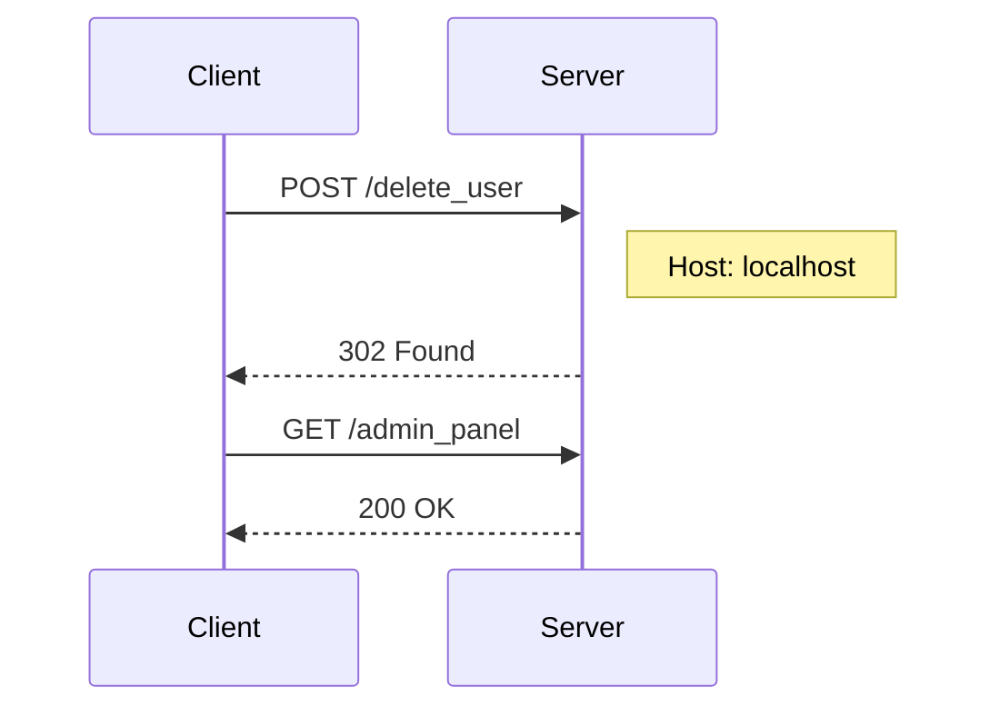

## Understanding HTTP Host Headers

### What is an HTTP Host Header?

An HTTP Host Header is a part of the HTTP request that specifies the domain name or IP address of the server being contacted. This header is crucial for virtual hosting, where multiple websites share the same IP address but are distinguished by their domain names. The Host header allows the server to route the request to the correct website based on the domain name provided.

### Why is the Host Header Important?

The Host header is important for several reasons:

1. **Virtual Hosting**: Multiple websites can coexist on the same IP address, and the server uses the Host header to determine which site to serve.
2. **Routing Requests**: In complex environments, such as load balancers or reverse proxies, the Host header helps route the request to the appropriate backend server.
3. **Security Considerations**: The Host header can be manipulated to perform various attacks, including host header injection attacks.

### How Does the Host Header Work Under the Hood?

When a client sends an HTTP request, the Host header is included in the request headers. Here’s an example of an HTTP request with a Host header:

```http
GET /index.html HTTP/1.1
Host: www.example.com
User-Agent: Mozilla/5.0 (Windows NT 10.0; Win64; x64) AppleWebKit/537.36 (KHTML, like Gecko) Chrome/58.0.3029.110 Safari/537.3
Accept: text/html,application/xhtml+xml,application/xml;q=0.9,image/webp,*/*;q=0.8
```

In this example, the `Host` header specifies `www.example.com`, indicating that the request is intended for the `www.example.com` domain.

### Real-World Example: CVE-2021-21972

One real-world example of a host header injection vulnerability is CVE-2021-21972, which affected the Apache Struts framework. This vulnerability allowed attackers to inject malicious data via the Host header, leading to remote code execution. This demonstrates the critical importance of securing the Host header against manipulation.

### Pitfalls of Misusing the Host Header

Misusing the Host header can lead to several issues:

1. **Authentication Bypass**: As seen in the lecture, an attacker can manipulate the Host header to bypass authentication mechanisms.
2. **Data Leakage**: An attacker might use the Host header to trick the server into revealing sensitive information.
3. **Cross-Site Scripting (XSS)**: Manipulating the Host header can sometimes lead to XSS vulnerabilities.

### How to Prevent / Defend Against Host Header Injection

#### Detection

To detect potential host header injection vulnerabilities, you can:

1. **Monitor Logs**: Look for unusual Host header values in your server logs.
2. **Use Security Tools**: Tools like Burp Suite, ZAP, and OWASP Dependency-Check can help identify suspicious Host header values.

#### Prevention

To prevent host header injection attacks:

1. **Validate Host Headers**: Ensure that the Host header matches a list of valid domains. Reject requests with invalid Host headers.
2. **Use Secure Coding Practices**: Avoid using the Host header for critical decisions like authentication. Instead, rely on secure methods like session tokens.
3. **Configuration Hardening**: Configure your web server to reject requests with invalid Host headers.

Here’s an example of how to validate the Host header in a web application:

```python
def validate_host_header(request):
    allowed_hosts = ['example.com', 'www.example.com']
    host = request.headers.get('Host')
    if host not in allowed_hosts:
        return False
    return True
```

### Complete Example: Exploiting Host Header Authentication Bypass

Let’s walk through the complete example from the lecture, explaining each step in detail.

#### Step 1: Identify the Vulnerability

The application accepts any arbitrary host value and uses it to determine if the user is coming from a local perspective or not. This allows an attacker to bypass the authentication mechanism.

#### Step 2: Craft the Attack

To exploit this vulnerability, the attacker needs to manipulate the Host header to make the application think the request is coming from a local perspective.

#### Step 3: Send the Request

Here’s the full HTTP request and response:

**Request:**

```http
POST /delete_user HTTP/1.1
Host: localhost
Content-Type: application/x-www-form-urlencoded
Content-Length: 11

username=Carlos
```

**Response:**

```http
HTTP/1.1 302 Found
Date: Mon, 20 Mar 2023 12:00:00 GMT
Server: Apache/2.4.41 (Ubuntu)
Location: /admin_panel
Content-Length: 0
```

#### Step 4: Analyze the Response

The server responds with a 302 status code, indicating a redirect to the admin panel. This confirms that the attacker has successfully bypassed the authentication mechanism.

### Sequence Diagram: Host Header Authentication Bypass



### How to Prevent / Defend Against Host Header Authentication Bypass

#### Detection

To detect potential host header authentication bypass attacks:

1. **Monitor Logs**: Look for unusual Host header values in your server logs.
2. **Use Security Tools**: Tools like Burp Suite, ZAP, and OWASP Dependency-Check can help identify suspicious Host header values.

#### Prevention

To prevent host header authentication bypass attacks:

1. **Validate Host Headers**: Ensure that the Host header matches a list of valid domains. Reject requests with invalid Host headers.
2. **Use Secure Coding Practices**: Avoid using the Host header for critical decisions like authentication. Instead, rely on secure methods like session tokens.
3. **Configuration Hardening**: Configure your web server to reject requests with invalid Host headers.

Here’s an example of how to validate the Host header in a web application:

```python
def validate_host_header(request):
    allowed_hosts = ['example.com', 'www.example.com']
    host = request.headers.get('Host')
    if host not in allowed_hosts:
        return False
    return True
```

### Secure Code Fix: Host Header Validation

#### Vulnerable Code

```python
def handle_request(request):
    if request.headers.get('Host') == 'localhost':
        # Allow access to admin panel
        return render_template('admin_panel.html')
    else:
        # Redirect to login page
        return redirect('/login')
```

#### Fixed Code

```python
def handle_request(request):
    if validate_host_header(request):
        if request.headers.get('Host') == 'localhost':
            # Allow access to admin panel
            return render_template('admin_panel.html')
        else:
            # Redirect to login page
            return redirect('/login')
    else:
        # Reject request with invalid Host header
        return "Invalid Host header", 400
```

### Conclusion

Understanding and securing the HTTP Host header is crucial for preventing various types of attacks, including host header injection and authentication bypass. By validating the Host header and using secure coding practices, you can significantly reduce the risk of these vulnerabilities.

### Practice Labs

For hands-on practice with host header attacks, consider the following labs:

- **PortSwigger Web Security Academy**: Offers a comprehensive set of labs covering various web security topics, including host header injection.
- **OWASP Juice Shop**: A deliberately insecure web application that includes several host header-related challenges.
- **DVWA (Damn Vulnerable Web Application)**: Another popular web application with numerous security vulnerabilities, including host header injection.

These labs provide practical experience in identifying and exploiting host header vulnerabilities, as well as learning how to defend against them.

---
<!-- nav -->
[[Web Security (PortSwigger)/16-HTTP Host Header Attacks/03-Lab 2 Host header authentication bypass/03-Understanding HTTP Host Header Attacks|Understanding HTTP Host Header Attacks]] | [[Web Security (PortSwigger)/16-HTTP Host Header Attacks/03-Lab 2 Host header authentication bypass/00-Overview|Overview]] | [[Web Security (PortSwigger)/16-HTTP Host Header Attacks/03-Lab 2 Host header authentication bypass/05-Practice Questions & Answers|Practice Questions & Answers]]
