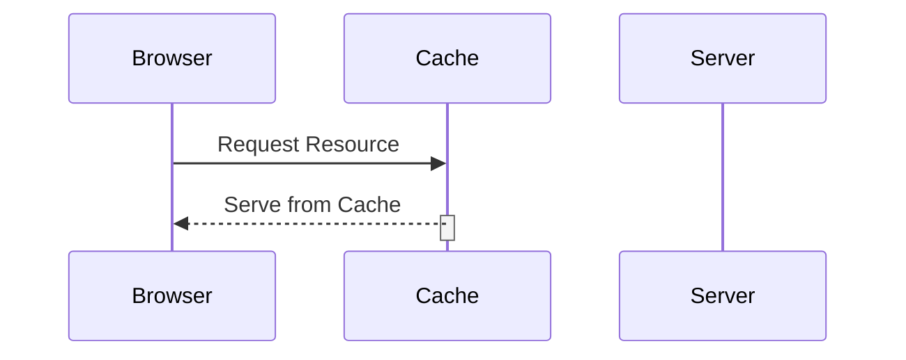

## Introduction to Web Caching

Web caching is a technique used to improve the performance and reduce the load on web servers by storing copies of frequently accessed resources closer to the end-users. This reduces the number of requests that need to be processed by the origin server, thereby decreasing latency and improving overall user experience. The primary goal of web caching is to minimize the amount of data that needs to be transferred over the network, which can significantly reduce bandwidth usage and server load.

### How Web Caching Works

When a user requests a resource (such as a webpage) for the first time, the browser sends a request to the web server. The server processes the request and returns the resource to the user's browser. This initial request is not cached, meaning the server must generate the response from scratch.

However, subsequent requests for the same resource can be served from a cache. A cache is a temporary storage area that holds copies of recently accessed resources. When a user makes a second request for the same resource, the browser checks the local cache first. If the resource is found in the cache, it is served directly from there, bypassing the need to contact the server again. This process is illustrated below:



If the resource is not in the cache, the browser forwards the request to the server, which then processes the request and returns the resource. The server also includes caching directives in the response headers, which instruct the cache on how long to keep the resource and under what conditions it should be revalidated.

### Why Web Caching Matters

Web caching is crucial for several reasons:

1. **Reduced Latency**: Serving resources from a cache located closer to the user reduces the time it takes for the resource to be delivered.
2. **Bandwidth Savings**: By reducing the number of requests made to the server, less data needs to be transferred over the network, saving bandwidth.
3. **Server Load Reduction**: With fewer requests reaching the server, the load on the server is reduced, allowing it to handle more concurrent users efficiently.

### Example of Web Caching in Action

Consider a scenario where a user requests a homepage for the first time. The browser sends an HTTP request to the server, which processes the request and returns the homepage along with caching directives in the response headers. Here is an example of such an HTTP response:

```http
HTTP/1.1 200 OK
Date: Mon, 23 May 2023 12:00:00 GMT
Server: Apache/2.4.41 (Ubuntu)
Content-Type: text/html; charset=UTF-8
Cache-Control: max-age=3600
Expires: Mon, 23 May 2023 13:00:00 GMT
Content-Length: 1234

<!DOCTYPE html>
<html>
<head>
    <title>Homepage</title>
</head>
<body>
    <h1>Welcome to our Homepage</h1>
</body>
</html>
```

In this example, the `Cache-Control` header specifies that the resource should be cached for one hour (`max-age=3600`). The `Expires` header provides a specific date and time after which the resource should no longer be considered fresh.

### Common Pitfalls in Web Caching

While web caching offers significant benefits, it also introduces potential vulnerabilities if not implemented correctly. One such vulnerability is web cache poisoning, which occurs when an attacker manipulates the cache to store malicious content.

---
<!-- nav -->
[[02-Introduction to HTTP Host Header Attacks|Introduction to HTTP Host Header Attacks]] | [[Web Security (PortSwigger)/16-HTTP Host Header Attacks/04-Lab 3 Web cache poisoning via ambiguous requests/00-Overview|Overview]] | [[04-HTTP Host Header Attacks and Web Cache Poisoning|HTTP Host Header Attacks and Web Cache Poisoning]]
