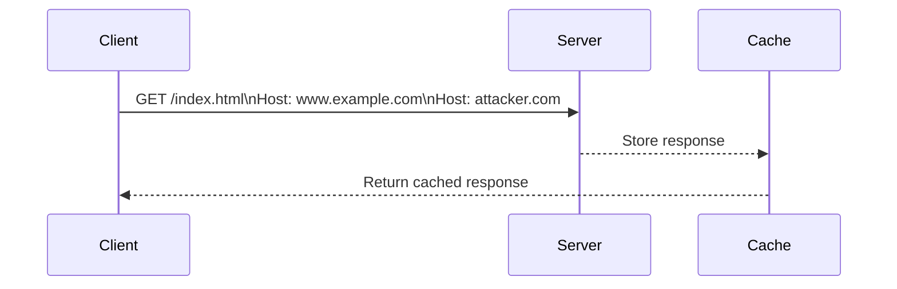

## HTTP Host Header Attacks

### Background Theory

The HTTP `Host` header is a critical component of the HTTP protocol used to specify the domain name of the server being contacted. This header is essential because it allows a single IP address to serve multiple domains, a practice known as virtual hosting. However, the `Host` header can also be manipulated to perform various attacks, including web cache poisoning via ambiguous requests.

### Understanding the `Host` Header

When a client sends an HTTP request to a server, the `Host` header specifies which domain the request is intended for. For example:

```http
GET /index.html HTTP/1.1
Host: www.example.com
```

In this request, the `Host` header tells the server that the client is requesting resources from `www.example.com`.

#### Why the `Host` Header Matters

The `Host` header is crucial for several reasons:
1. **Virtual Hosting**: Allows multiple websites to share the same IP address.
2. **Routing**: Helps the server route the request to the correct application or service.
3. **Security**: Can be used to enforce security policies based on the requested domain.

### Vulnerability: Multiple `Host` Headers

Some web servers and applications may accept multiple `Host` headers in a single request. This behavior can lead to vulnerabilities, particularly in scenarios involving caching mechanisms.

#### Example Request with Multiple `Host` Headers

Consider the following HTTP request with two `Host` headers:

```http
GET /index.html HTTP/1.1
Host: www.example.com
Host: attacker.com
```

This request contains two `Host` headers, which might be accepted by some servers.

### Attack Scenario: Web Cache Poisoning

Web cache poisoning occurs when an attacker manipulates the cache of a web server or proxy to store malicious content. By exploiting the acceptance of multiple `Host` headers, an attacker can inject malicious data into the cache.

#### Step-by-Step Attack

1. **Send Request with Multiple `Host` Headers**:
   The attacker crafts a request with multiple `Host` headers, hoping that the server will process the second `Host` header.

2. **Check Response**:
   The attacker sends the request and checks if the server processes the second `Host` header. If the server accepts the second `Host` header, the attacker proceeds to the next step.

3. **Inject Malicious Content**:
   The attacker crafts a request that includes malicious content in the second `Host` header. This content is then stored in the cache.

4. **Exploit Cached Content**:
   Other users who access the cached content will receive the malicious content instead of the legitimate content.

### Real-World Example: CVE-2021-23222

CVE-2021-23222 is a real-world example of a web cache poisoning vulnerability. In this case, the vulnerability was found in the Apache Traffic Server (ATS) web proxy. The vulnerability allowed attackers to inject malicious content into the cache by manipulating the `Host` header.

#### Exploitation Details

1. **Attack Vector**:
   The attacker sent a request with a specially crafted `Host` header that included malicious content.

2. **Impact**:
   The malicious content was stored in the cache and served to other users, leading to potential security risks such as cross-site scripting (XSS).

### Detection and Prevention

#### How to Detect

To detect web cache poisoning vulnerabilities, you can perform the following steps:

1. **Monitor Logs**:
   Check server logs for requests containing multiple `Host` headers.

2. **Use Security Tools**:
   Utilize tools like Burp Suite, OWASP ZAP, or custom scripts to test for vulnerabilities.

#### How to Prevent

To prevent web cache poisoning, implement the following measures:

1. **Validate `Host` Headers**:
   Ensure that the server only processes a single `Host` header and rejects requests with multiple `Host` headers.

2. **Secure Caching Mechanisms**:
   Implement proper caching policies to ensure that only trusted content is cached.

3. **Input Validation**:
   Validate all inputs to prevent injection of malicious content.

#### Secure Coding Fix

Here is an example of how to validate the `Host` header in a web application:

```python
def validate_host_header(request):
    host_header = request.headers.get('Host')
    if not host_header:
        return False
    # Validate the host header against a whitelist of allowed hosts
    allowed_hosts = ['www.example.com', 'subdomain.example.com']
    if host_header not in allowed_hosts:
        return False
    return True
```

### Mermaid Diagrams

#### Request Flow Diagram



### Complete Example

#### Vulnerable Code

```python
from flask import Flask, request

app = Flask(__name__)

@app.route('/')
def index():
    host_header = request.headers.get('Host')
    return f"<h1>Welcome to {host_header}</h1>"
```

#### Secure Code

```python
from flask import Flask, request

app = Flask(__name__)

@app.route('/')
def index():
    host_header = request.headers.get('Host')
    if not validate_host_header(request):
        return "Invalid Host header", 400
    return f"<h1>Welcome to {host_header}</h1>"
```

### Practice Labs

For hands-on experience with HTTP Host header attacks, consider the following labs:

- **PortSwigger Web Security Academy**: Offers interactive labs on web cache poisoning and other HTTP header-related vulnerabilities.
- **OWASP Juice Shop**: Provides a vulnerable web application where you can test and learn about various web security issues, including HTTP header manipulation.

### Conclusion

Understanding and preventing HTTP Host header attacks is crucial for maintaining the security of web applications. By validating inputs, securing caching mechanisms, and using secure coding practices, you can mitigate the risks associated with these vulnerabilities. Always stay informed about the latest security threats and best practices to protect your applications.

---
<!-- nav -->
[[04-HTTP Host Header Attacks and Web Cache Poisoning|HTTP Host Header Attacks and Web Cache Poisoning]] | [[Web Security (PortSwigger)/16-HTTP Host Header Attacks/04-Lab 3 Web cache poisoning via ambiguous requests/00-Overview|Overview]] | [[06-Lab Exercise Web Cache Poisoning via Ambiguous Requests|Lab Exercise Web Cache Poisoning via Ambiguous Requests]]
