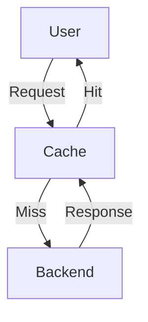
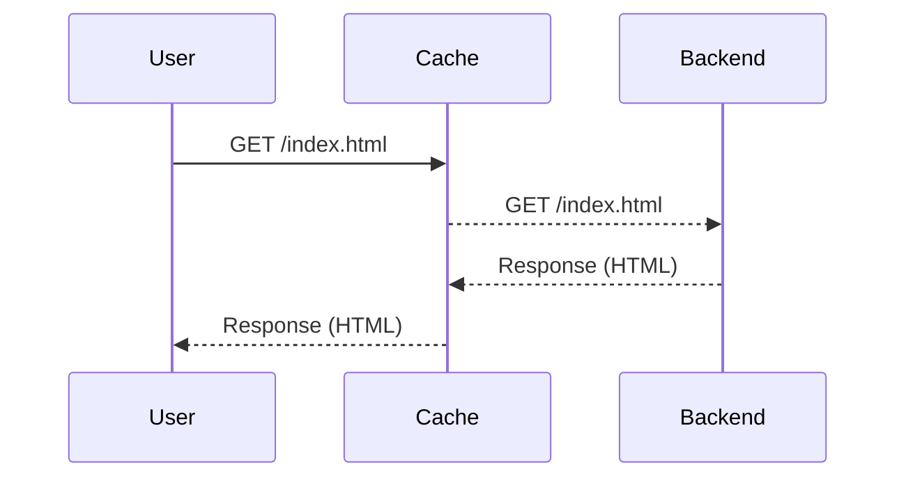
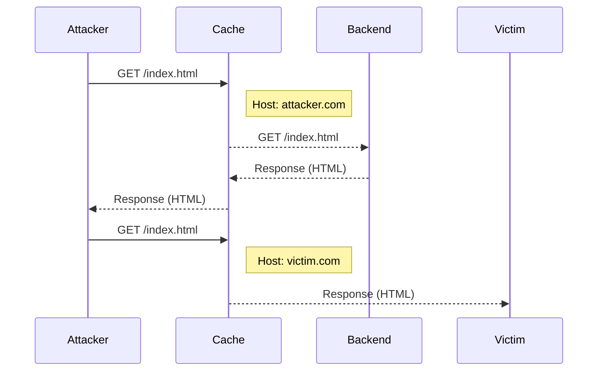

## Understanding Web Cache Poisoning

Web cache poisoning is a sophisticated attack vector that leverages the caching mechanisms of web applications to serve malicious content to unsuspecting users. This type of attack can have severe consequences, including the execution of arbitrary JavaScript in the victim's browser, leading to potential data theft, session hijacking, and more. To fully grasp the mechanics of web cache poisoning, it is essential to understand the underlying principles of web caching and how attackers can exploit them.

### Background Theory of Web Caching

Web caching is a mechanism used to improve the performance and scalability of web applications. When a user requests a resource from a web server, the server can store a copy of the requested resource in a cache. Subsequent requests for the same resource can be served directly from the cache, reducing the load on the backend server and improving response times for users.

#### Components of Web Caching

- **User**: The client making the request to the web server.
- **Cache**: An intermediary storage layer that holds copies of frequently accessed resources.
- **Backend Web Server**: The origin server that generates the content.



### How Web Caching Works

When a user requests a resource, the following steps occur:

1. **Initial Request**: The user sends a request to the web server.
2. **Cache Check**: The cache checks if it already has a copy of the requested resource.
3. **Cache Miss**: If the resource is not in the cache, the request is forwarded to the backend server.
4. **Response Generation**: The backend server processes the request and generates the response.
5. **Cache Storage**: The generated response is stored in the cache.
6. **Cache Hit**: On subsequent requests for the same resource, the cache serves the stored response directly to the user.

### Example Scenario

Let's consider a simple example where a user requests the homepage of a web application.



In this scenario, the initial request from the user is forwarded to the backend server, which generates the HTML content for the homepage. This content is then stored in the cache. Subsequent requests for the same resource are served directly from the cache, improving performance.

### Web Cache Poisoning Attack

Web cache poisoning occurs when an attacker manipulates the caching mechanism to store and serve malicious content. This can happen due to vulnerabilities in the way the cache handles requests and responses.

#### Common Vulnerabilities

- **Ambiguous Requests**: Requests that can be interpreted differently by the cache and the backend server.
- **Host Header Injection**: Manipulating the `Host` header to trick the cache into storing malicious content.

### Real-World Examples

Recent real-world examples of web cache poisoning include:

- **CVE-2021-23222**: A vulnerability in Akamai's caching system allowed attackers to inject malicious content into cached responses.
- **CVE-2020-13776**: A vulnerability in Cloudflare's caching system allowed attackers to bypass security controls and inject malicious content.

### Exploitation Steps

To exploit web cache poisoning, an attacker typically follows these steps:

1. **Identify Vulnerable Endpoint**: Find an endpoint that is susceptible to ambiguous requests or host header injection.
2. **Craft Malicious Request**: Construct a request that will cause the cache to store malicious content.
3. **Trigger Cache Storage**: Ensure the malicious content is stored in the cache.
4. **Serve Malicious Content**: Wait for legitimate users to request the poisoned resource.

### Complete Example

Let's walk through a complete example of a web cache poisoning attack using the `Host` header injection technique.

#### Initial Setup

Consider a web application with a caching mechanism. The attacker wants to inject malicious JavaScript into the homepage.



#### Step-by-Step Exploitation

1. **Initial Request**: The attacker sends a request to the cache with a modified `Host` header.
    ```http
    GET /index.html HTTP/1.1
    Host: attacker.com
    ```

2. **Cache Miss**: The cache forwards the request to the backend server.
    ```http
    GET /index.html HTTP/1.1
    Host: attacker.com
    ```

3. **Response Generation**: The backend server generates the response and stores it in the cache.
    ```http
    HTTP/1.1 200 OK
    Content-Type: text/html
    <html>
        <body>
            <script>alert('XSS');</script>
        </body>
    </html>
    ```

4. **Cache Storage**: The cache stores the response with the `Host: attacker.com` header.

5. **Subsequent Request**: The attacker sends another request with a different `Host` header.
    ```http
    GET /index.html HTTP/1.1
    Host: victim.com
    ```

6. **Cache Hit**: The cache serves the previously stored response to the victim.
    ```http
    HTTP/1.1 200 OK
    Content-Type: text/html
    <html>
        <body>
            <script>alert('XSS');</script>
        </body>
    </html>
    ```

### How to Prevent / Defend

To prevent web cache poisoning, several measures can be taken:

#### Secure Coding Practices

1. **Validate Input**: Ensure that all input, including headers like `Host`, is validated and sanitized.
2. **Use Content Security Policy (CSP)**: Implement CSP to restrict the sources of executable scripts.

```http
Content-Security-Policy: script-src 'self'
```

#### Configuration Hardening

1. **Configure Cache Settings**: Ensure that the cache is configured to handle ambiguous requests correctly.
2. **Use Strict Transport Security (HSTS)**: Enforce HTTPS to prevent man-in-the-middle attacks.

```http
Strict-Transport-Security: max-age=31536000; includeSubDomains
```

#### Detection and Monitoring

1. **Log Analysis**: Monitor logs for suspicious activity, such as requests with unusual `Host` headers.
2. **Security Tools**: Use tools like Burp Suite, OWASP ZAP, or commercial security scanners to detect vulnerabilities.

### Complete Code Examples

#### Vulnerable Code

```python
from flask import Flask, request

app = Flask(__name__)

@app.route('/')
def index():
    return f"<html><body><script>alert('{request.host}');</script></body></html>"

if __name__ == '__main__':
    app.run()
```

#### Secure Code

```python
from flask import Flask, request

app = Flask(__name__)

@app.route('/')
def index():
    host = request.host.split(':')[0]
    return f"<html><body><script>alert('{host}');</script></body></html>"

if __name__ == '__main__':
    app.run()
```

### Practice Labs

For hands-on practice with web cache poisoning, consider the following labs:

- **PortSwigger Web Security Academy**: Offers interactive labs on web cache poisoning and related topics.
- **OWASP Juice Shop**: Provides a vulnerable web application for practicing various web security techniques.
- **DVWA (Damn Vulnerable Web Application)**: A deliberately insecure web application for learning and testing web security concepts.

By thoroughly understanding the mechanics of web cache poisoning and implementing robust defensive measures, you can significantly reduce the risk of such attacks compromising your web applications.

---
<!-- nav -->
[[Web Security (PortSwigger)/16-HTTP Host Header Attacks/04-Lab 3 Web cache poisoning via ambiguous requests/07-Understanding HTTP Host Header Attacks|Understanding HTTP Host Header Attacks]] | [[Web Security (PortSwigger)/16-HTTP Host Header Attacks/04-Lab 3 Web cache poisoning via ambiguous requests/00-Overview|Overview]] | [[09-Web Cache Poisoning via Ambiguous Requests|Web Cache Poisoning via Ambiguous Requests]]
