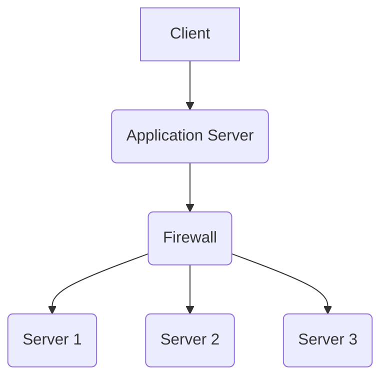
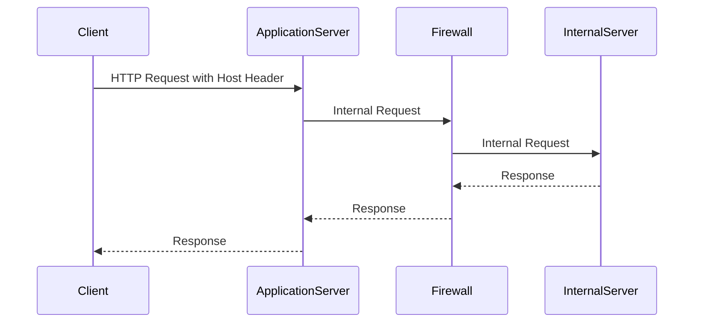

## HTTP Host Header Attacks and SSRF Vulnerabilities

### Background Theory

HTTP Host Header attacks and Server-Side Request Forgery (SSRF) vulnerabilities are critical security issues in web applications. These vulnerabilities can allow attackers to bypass network security measures and gain unauthorized access to internal resources. Understanding these concepts requires a deep dive into how HTTP requests work, the role of the Host header, and the implications of SSRF.

#### What is the HTTP Host Header?

The HTTP Host header is a part of the HTTP request that specifies the domain name of the server being contacted. This header is crucial for virtual hosting, where multiple websites share the same IP address. The server uses the Host header to determine which website to serve.

**Example HTTP Request:**
```http
GET /index.html HTTP/1.1
Host: www.example.com
User-Agent: Mozilla/5.0 (Windows NT 10.0; Win64; x64) AppleWebKit/538.37 (KHTML, like Gecko) Chrome/91.0.4472.124 Safari/538.37
Accept: text/html,application/xhtml+xml,application/xml;q=0.9,image/webp,*/*;q=0.8
```

In this example, the `Host` header specifies `www.example.com`, indicating that the request should be directed to the server associated with that domain.

#### What is SSRF?

Server-Side Request Forgery (SSRF) is a type of attack where an attacker tricks a server into making HTTP requests to an unintended location. This can be used to bypass firewalls and access internal resources that are not supposed to be accessible from the internet.

### How SSRF Works

To understand SSRF, consider a scenario where a web application makes HTTP requests to external services based on user input. An attacker can manipulate this input to make the server send requests to internal resources instead.

**Example Scenario:**

Imagine a web application that fetches weather data from an external API. The application takes a URL from the user and makes an HTTP GET request to that URL. An attacker can provide a URL pointing to an internal server, causing the application to make a request to that internal server.

**Vulnerable Code Example:**
```python
import requests

def get_weather_data(url):
    response = requests.get(url)
    return response.text

# User-provided URL
url = "http://internal-server/weather"
weather_data = get_weather_data(url)
```

In this example, the `get_weather_data` function takes a URL from the user and makes an HTTP GET request to that URL. If the user provides a URL pointing to an internal server, the server will make a request to that internal server.

### Real-World Examples

Recent real-world examples of SSRF vulnerabilities include:

- **CVE-2021-21972**: A vulnerability in VMware vCenter Server allowed an attacker to perform SSRF attacks, leading to unauthorized access to internal resources.
- **CVE-2021-22205**: A vulnerability in GitLab allowed an attacker to perform SSRF attacks, leading to unauthorized access to internal resources.

These vulnerabilities highlight the importance of securing web applications against SSRF attacks.

### HTTP Host Header Injection

HTTP Host Header injection is a specific type of SSRF attack where the attacker manipulates the Host header to trick the server into making requests to internal resources.

**Example Attack:**

Consider a web application that constructs URLs based on the Host header provided by the user. An attacker can manipulate the Host header to make the server send requests to internal resources.

**Vulnerable Code Example:**
```python
import requests

def get_resource():
    host_header = request.headers.get('Host')
    url = f"http://{host_header}/resource"
    response = requests.get(url)
    return response.text

# Attacker-provided Host header
request.headers['Host'] = "internal-server"
resource_data = get_resource()
```

In this example, the `get_resource` function constructs a URL based on the `Host` header provided by the user. If the user provides a `Host` header pointing to an internal server, the server will make a request to that internal server.

### Detection and Prevention

#### How to Detect SSRF Vulnerabilities

Detecting SSRF vulnerabilities involves analyzing the code for insecure handling of user input and network requests. Tools like static analysis tools (e.g., SonarQube, Fortify) and dynamic analysis tools (e.g., Burp Suite, ZAP) can help identify potential SSRF vulnerabilities.

**Static Analysis Example:**
```bash
sonar-scanner -Dsonar.projectKey=myproject -Dsonar.sources=. -Dsonar.language=py
```

**Dynamic Analysis Example:**
```bash
burp --scan http://example.com
```

#### How to Prevent SSRF Vulnerabilities

Preventing SSRF vulnerabilities involves several best practices:

1. **Validate and Sanitize Input:** Ensure that user input is validated and sanitized before using it to construct URLs or make network requests.
2. **Use Allowlists:** Use allowlists to restrict the domains that the server can make requests to.
3. **Avoid Using User Input Directly:** Avoid using user input directly to construct URLs or make network requests. Instead, use predefined constants or safe methods to construct URLs.
4. **Monitor Network Traffic:** Monitor network traffic to detect unusual patterns that may indicate SSRF attacks.

**Secure Code Example:**
```python
import requests

def get_weather_data():
    allowed_hosts = ["api.weather.com"]
    host_header = request.headers.get('Host')
    if host_header in allowed_hosts:
        url = f"http://{host_header}/weather"
        response = requests.get(url)
        return response.text
    else:
        return "Invalid host"

# Attacker-provided Host header
request.headers['Host'] = "internal-server"
weather_data = get_weather_data()
```

In this example, the `get_weather_data` function checks if the `Host` header is in the allowlist before making a request. If the `Host` header is not in the allowlist, the function returns an error message.

### Hands-On Labs

To practice detecting and preventing SSRF vulnerabilities, consider the following hands-on labs:

- **PortSwigger Web Security Academy:** Offers a comprehensive set of labs covering various web security topics, including SSRF.
- **OWASP Juice Shop:** A deliberately insecure web application for security training purposes, which includes SSRF vulnerabilities.
- **DVWA (Damn Vulnerable Web Application):** A PHP/MySQL web application that is riddled with vulnerabilities, including SSRF.

### Conclusion

HTTP Host Header attacks and SSRF vulnerabilities are serious security issues that can lead to unauthorized access to internal resources. By understanding the underlying mechanisms and implementing best practices, developers can effectively prevent these vulnerabilities. Regularly testing and monitoring web applications can help detect and mitigate these risks.

### Diagrams

#### Network Topology



This diagram shows the network topology where the client communicates with the application server, which is protected by a firewall. Internal servers (Server 1, Server 2, Server 3) are behind the firewall and are not directly accessible from the internet.

#### Attack Chain



This sequence diagram illustrates the attack chain where the client sends an HTTP request with a manipulated Host header to the application server. The application server makes an internal request to the internal server, bypassing the firewall, and the response is returned to the client.

### Complete Example

#### Vulnerable Code

```python
import requests

def get_resource():
    host_header = request.headers.get('Host')
    url = f"http://{host_header}/resource"
    response = requests.get(url)
    return response.text

# Attacker-provided Host header
request.headers['Host'] = "internal-server"
resource_data = get_resource()
```

#### Secure Code

```python
import requests

def get_resource():
    allowed_hosts = ["api.example.com"]
    host_header = request.headers.get('Host')
    if host_header in allowed_hosts:
        url = f"http://{host_header}/resource"
        response = requests.get(url)
        return response.text
    else:
        return "Invalid host"

# Attacker-provided Host header
request.headers['Host'] = "internal-server"
resource_data = get_resource()
```

### Summary

Understanding HTTP Host Header attacks and SSRF vulnerabilities is crucial for securing web applications. By validating and sanitizing input, using allowlists, avoiding direct use of user input, and monitoring network traffic, developers can effectively prevent these vulnerabilities. Regular testing and monitoring can help detect and mitigate these risks.

---
<!-- nav -->
[[02-Lab 4 Routing-Based SSRF|Lab 4 Routing-Based SSRF]] | [[Web Security (PortSwigger)/16-HTTP Host Header Attacks/05-Lab 4 Routing based SSRF/00-Overview|Overview]] | [[04-HTTP Host Header Attacks and Server-Side Request Forgery (SSRF)|HTTP Host Header Attacks and Server-Side Request Forgery (SSRF)]]
