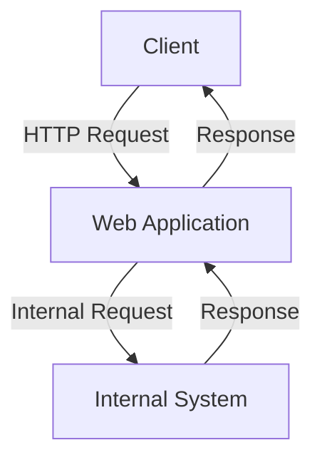
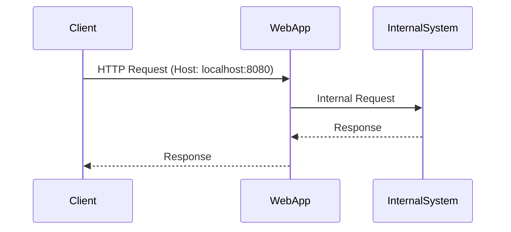

## HTTP Host Header Attacks and Server-Side Request Forgery (SSRF)

### Background Theory

HTTP Host Header attacks involve manipulating the `Host` header in an HTTP request to trick the server into routing the request to a different domain or IP address than intended. This can lead to various vulnerabilities, including Server-Side Request Forgery (SSRF).

The `Host` header is a crucial part of HTTP requests. It specifies the domain name of the server to which the request is being sent. For example:

```http
GET /index.html HTTP/1.1
Host: www.example.com
```

In this request, the `Host` header tells the server that the request is intended for `www.example.com`.

### Server-Side Request Forgery (SSRF)

Server-Side Request Forgery (SSRF) is a type of attack where an attacker tricks a server into making HTTP requests to an unintended location. This can be exploited to access internal networks, sensitive data, or even execute commands on the server.

When combined with the `Host` header manipulation, SSRF can become particularly dangerous. An attacker can manipulate the `Host` header to make the server send requests to internal IP addresses or other domains controlled by the attacker.

### Example Scenario

Consider a web application that allows users to input a URL, which the server then fetches and displays. If the server does not properly validate the URL, an attacker can inject a malicious URL with a manipulated `Host` header.

#### Vulnerable Code Example

Here is an example of a vulnerable code snippet in Python:

```python
import requests

def fetch_url(url):
    response = requests.get(url)
    return response.text

# User input
url = "http://example.com"
print(fetch_url(url))
```

If the user inputs a URL like `http://localhost:8080`, the server might fetch data from the local machine, leading to SSRF.

### Real-World Examples

#### CVE-2021-21972

CVE-2021-21972 is a SSRF vulnerability found in the Jenkins plugin "Blue Ocean". The plugin allowed attackers to manipulate the `Host` header and perform SSRF attacks, potentially accessing internal systems.

#### CVE-2020-14182

CVE-2020-14182 is another SSRF vulnerability found in the Docker API. Attackers could manipulate the `Host` header to make the Docker daemon send requests to internal IP addresses, leading to unauthorized access.

### How to Perform the Attack

To perform an SSRF attack using the `Host` header, follow these steps:

1. **Identify the Vulnerability**: Find a web application that allows user input to be used in HTTP requests.
2. **Manipulate the Host Header**: Craft a request with a manipulated `Host` header pointing to an internal IP address or another domain.
3. **Send the Request**: Use tools like Burp Suite to intercept and modify the request.

#### Using Burp Suite

Burp Suite is a powerful tool for testing web applications. Here’s how to set it up:

1. **Install Burp Suite**: Download and install Burp Suite Community Edition.
2. **Configure Proxy**: Set up Burp Suite as a proxy to intercept HTTP requests.
3. **Intercept Requests**: Use the built-in browser in Burp Suite to send requests through the proxy.

Example of a modified request:

```http
GET /index.html HTTP/1.1
Host: localhost:8080
```

### Detection and Prevention

#### Detection

To detect SSRF vulnerabilities, you can use automated tools and manual testing:

1. **Automated Tools**: Use tools like Burp Suite, OWASP ZAP, or Nessus to scan for SSRF vulnerabilities.
2. **Manual Testing**: Manually test the application by injecting crafted URLs and observing the server's behavior.

#### Prevention

To prevent SSRF attacks, implement the following measures:

1. **Input Validation**: Validate and sanitize user input to ensure it does not contain malicious URLs.
2. **Whitelist Domains**: Use a whitelist of allowed domains and reject any requests to unauthorized domains.
3. **Use Secure Libraries**: Use libraries that provide built-in protection against SSRF attacks.

#### Secure Code Example

Here is a secure version of the previous code snippet:

```python
import requests

def fetch_url(url):
    allowed_domains = ["example.com"]
    parsed_url = urlparse(url)
    if parsed_url.netloc not in allowed_domains:
        raise ValueError("Invalid domain")
    response = requests.get(url)
    return response.text

# User input
url = "http://example.com"
print(fetch_url(url))
```

### How to Prevent / Defend

#### Detection

1. **Logging and Monitoring**: Implement logging and monitoring to detect unusual HTTP requests.
2. **Network Segmentation**: Segment the network to limit the impact of SSRF attacks.

#### Prevention

1. **Input Validation**: Always validate and sanitize user input.
2. **Whitelist Domains**: Use a whitelist of allowed domains.
3. **Secure Coding Practices**: Follow secure coding practices to avoid SSRF vulnerabilities.

### Complete Example

#### Vulnerable Code

```python
import requests

def fetch_url(url):
    response = requests.get(url)
    return response.text

# User input
url = "http://localhost:8080"
print(fetch_url(url))
```

#### Secure Code

```python
import requests
from urllib.parse import urlparse

def fetch_url(url):
    allowed_domains = ["example.com"]
    parsed_url = urlparse(url)
    if parsed_url.netloc not in allowed_domains:
        raise ValueError("Invalid domain")
    response = requests.get(url)
    return response.text

# User input
url = "http://example.com"
print(fetch_url(url))
```

### Mermaid Diagrams

#### Network Topology



#### Attack Chain



### Practice Labs

For hands-on practice, consider the following labs:

- **PortSwigger Web Security Academy**: Offers comprehensive labs on SSRF and other web security topics.
- **OWASP Juice Shop**: Provides a vulnerable web application for practicing various web security attacks.
- **DVWA (Damn Vulnerable Web Application)**: Another popular lab for practicing web security vulnerabilities.

By thoroughly understanding and implementing the preventive measures, you can significantly reduce the risk of SSRF attacks in your web applications.

---
<!-- nav -->
[[03-HTTP Host Header Attacks and SSRF Vulnerabilities|HTTP Host Header Attacks and SSRF Vulnerabilities]] | [[Web Security (PortSwigger)/16-HTTP Host Header Attacks/05-Lab 4 Routing based SSRF/00-Overview|Overview]] | [[Web Security (PortSwigger)/16-HTTP Host Header Attacks/05-Lab 4 Routing based SSRF/05-Understanding HTTP Host Header Attacks|Understanding HTTP Host Header Attacks]]
