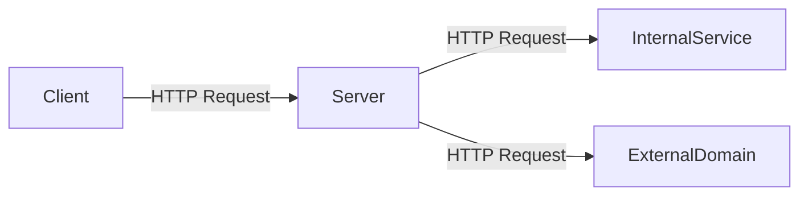
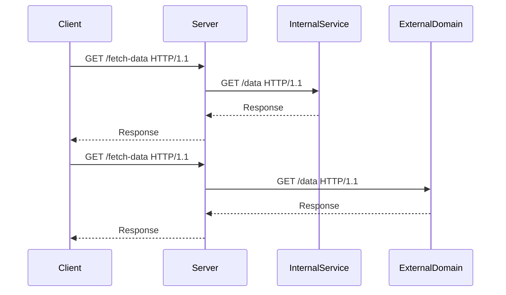

## Understanding HTTP Host Header Attacks

### Background Theory

The HTTP Host header is a crucial component of HTTP requests, used to specify the domain name of the server being contacted. This header is essential for virtual hosting, where multiple websites share the same IP address but have different domain names. However, this flexibility can also introduce security vulnerabilities, particularly when the server does not properly validate or sanitize the Host header.

### What is an HTTP Host Header Attack?

An HTTP Host header attack occurs when an attacker manipulates the Host header to trick the server into making unintended requests or revealing sensitive information. This can lead to various security issues, including Server-Side Request Forgery (SSRF), Cross-Site Scripting (XSS), and more.

#### Why Does It Matter?

The Host header is often trusted implicitly by web applications and servers. If an attacker can control this header, they can potentially:

- **Forge requests** to internal services or other domains.
- **Bypass security controls** designed to restrict access to certain resources.
- **Exploit vulnerabilities** in the server's handling of the Host header.

### How Does It Work Under the Hood?

When a client sends an HTTP request to a server, the request includes a Host header. The server uses this header to determine which website to serve. If the server does not properly validate the Host header, an attacker can manipulate it to achieve their goals.

#### Example of a Malicious Request

Consider the following HTTP request:

```http
GET / HTTP/1.1
Host: attacker-controlled-domain.com
```

If the server trusts the Host header without validation, it may make a request to `attacker-controlled-domain.com`, potentially exposing sensitive data or allowing the attacker to perform unauthorized actions.

### Real-World Examples

Recent vulnerabilities involving Host header attacks include:

- **CVE-2021-21972**: A vulnerability in the Apache HTTP Server allowed attackers to bypass security restrictions by manipulating the Host header.
- **CVE-2020-1938**: A vulnerability in the Nginx web server allowed attackers to bypass security restrictions by manipulating the Host header.

These examples highlight the importance of proper validation and sanitization of the Host header.

### Steps to Perform an HTTP Host Header Attack

To demonstrate an HTTP Host header attack, let's walk through the steps using a hypothetical scenario.

#### Step 1: Set Up a Collaborator Server

A collaborator server is a tool provided by some security platforms (like Burp Suite Professional) to help detect and analyze outgoing requests from a target server. To set up a collaborator server:

1. Click on "Get Started" in your security tool.
2. Copy the collaborator URL to your clipboard.

#### Step 2: Inject the Collaborator URL into the Host Header

Using a tool like Burp Suite Repeater, inject the collaborator URL into the Host header of an HTTP request:

```http
GET / HTTP/1.1
Host: collaborator-url.com
```

#### Step 3: Send the Request and Monitor Responses

Send the request and monitor the responses to see if the server makes a request to the collaborator URL. If the server responds with data from the collaborator URL, it indicates a potential vulnerability.

### Detection and Prevention

#### How to Detect

To detect HTTP Host header attacks, you can:

1. **Monitor outgoing requests**: Use tools like Burp Suite to monitor and analyze outgoing HTTP requests.
2. **Check server logs**: Review server logs for unexpected requests to external domains.

#### How to Prevent

To prevent HTTP Host header attacks, implement the following measures:

1. **Validate the Host header**: Ensure that the Host header matches a list of valid domains.
2. **Use strict security policies**: Implement strict security policies to restrict access to sensitive resources.
3. **Sanitize user input**: Sanitize all user input to prevent injection attacks.

#### Secure Coding Fixes

Here is an example of how to securely validate the Host header in a web application:

**Vulnerable Code:**

```python
def handle_request(request):
    host = request.headers.get('Host')
    # Process request using the host
```

**Secure Code:**

```python
def handle_request(request):
    allowed_hosts = ['example.com', 'subdomain.example.com']
    host = request.headers.get('Host')
    
    if host not in allowed_hosts:
        raise ValueError("Invalid Host header")
    
    # Process request using the host
```

### Detailed Example with Code and Diagrams

Let's consider a detailed example of an HTTP Host header attack and how to defend against it.

#### Scenario: Server-Side Request Forgery (SSRF)

In this scenario, an attacker wants to exploit a server-side request forgery vulnerability by manipulating the Host header.

##### Vulnerable Configuration

Consider a web application that makes HTTP requests to an internal service based on the Host header:

**Vulnerable Configuration:**

```python
import requests

def fetch_data(host):
    response = requests.get(f"http://{host}/data")
    return response.text

# Example usage
host = request.headers.get('Host')
data = fetch_data(host)
```

##### Attacker's Exploit

The attacker can manipulate the Host header to make the server send a request to an external domain:

**Attacker's Request:**

```http
GET /fetch-data HTTP/1.1
Host: attacker-controlled-domain.com
```

##### Secure Configuration

To secure the application, validate the Host header against a list of allowed domains:

**Secure Configuration:**

```python
import requests

def fetch_data(host):
    allowed_hosts = ['internal-service.example.com']
    
    if host not in allowed_hosts:
        raise ValueError("Invalid Host header")
    
    response = requests.get(f"http://{host}/data")
    return response.text

# Example usage
host = request.headers.get('Host')
try:
    data = fetch_data(host)
except ValueError as e:
    print(e)
```

### Mermaid Diagrams

#### Network Topology



#### Request/Response Flow



### Practice Labs

For hands-on practice with HTTP Host header attacks, consider the following labs:

- **PortSwigger Web Security Academy**: Offers interactive labs to practice detecting and exploiting HTTP Host header vulnerabilities.
- **OWASP Juice Shop**: Provides a vulnerable web application to practice various web security techniques, including HTTP Host header attacks.
- **DVWA (Damn Vulnerable Web Application)**: A deliberately insecure web application for practicing web hacking techniques.

By thoroughly understanding and practicing these concepts, you can effectively detect and prevent HTTP Host header attacks in real-world scenarios.

---
<!-- nav -->
[[04-HTTP Host Header Attacks and Server-Side Request Forgery (SSRF)|HTTP Host Header Attacks and Server-Side Request Forgery (SSRF)]] | [[Web Security (PortSwigger)/16-HTTP Host Header Attacks/05-Lab 4 Routing based SSRF/00-Overview|Overview]] | [[06-Understanding the HTTP Host Header|Understanding the HTTP Host Header]]
