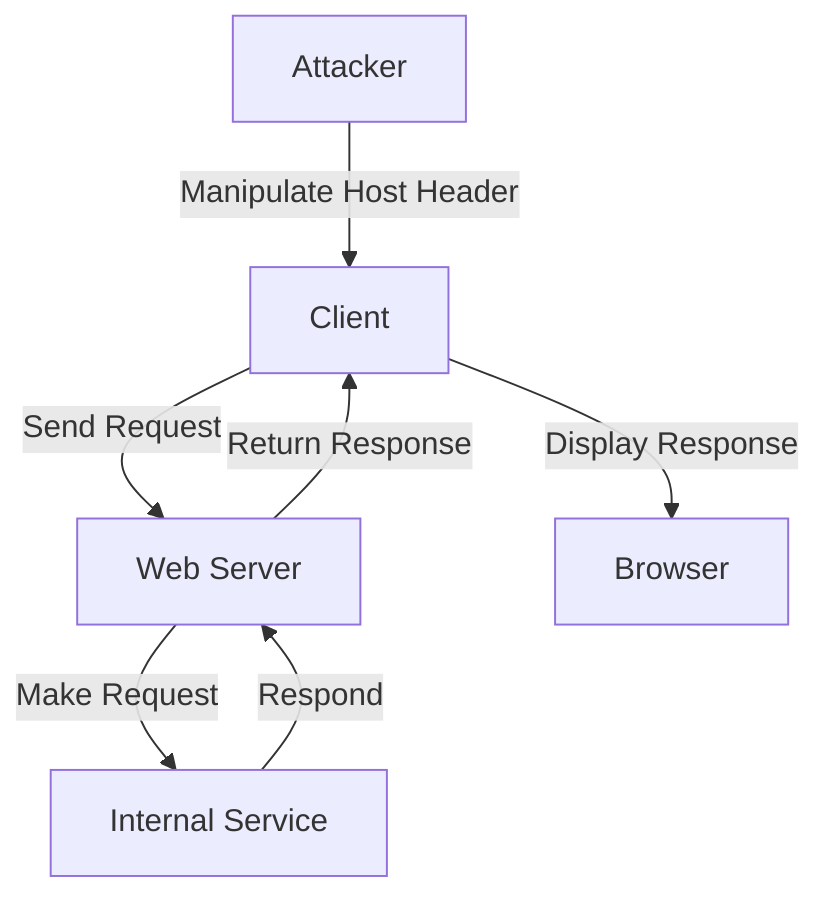

## Understanding the HTTP Host Header

The HTTP `Host` header is a critical component of the HTTP protocol, used to identify the domain name of the server being contacted. This header is essential because it allows a single IP address to serve multiple websites, a practice known as virtual hosting. When a client sends an HTTP request to a server, the `Host` header specifies which domain the request is intended for. The server uses this information to route the request to the appropriate website.

### Why the Host Header Matters

The `Host` header is crucial for several reasons:

1. **Virtual Hosting**: Multiple websites can share the same IP address. The server uses the `Host` header to determine which website should handle the request.
2. **Routing**: In complex environments, the `Host` header helps in routing the request to the correct backend service.
3. **Security**: Proper handling of the `Host` header is essential to prevent various types of attacks, including Server-Side Request Forgery (SSRF).

### How the Host Header Works Under the Hood

When a client sends an HTTP request, the request includes the `Host` header. Here’s an example of an HTTP request with the `Host` header:

```http
GET /index.html HTTP/1.1
Host: www.example.com
User-Agent: Mozilla/5.0 (Windows NT 10.0; Win64; x64) AppleWebKit/537.36 (KHTML, like Gecko) Chrome/58.0.3029.110 Safari/537.3
```

In this example, the `Host` header specifies `www.example.com`. The server receives this request and routes it to the appropriate website based on the `Host` header.

### Potential Vulnerabilities

If the server implicitly trusts the `Host` header and fails to validate it properly, an attacker can manipulate the `Host` header to cause unexpected behavior. This can lead to various types of attacks, including SSRF.

### Real-World Example: CVE-2021-21972

One notable example of a vulnerability related to improper handling of the `Host` header is CVE-2021-21972, which affected the Apache HTTP Server. In this case, an attacker could manipulate the `Host` header to bypass certain security checks and potentially execute arbitrary commands on the server.

### Full HTTP Request and Response

Here is a complete HTTP request and response demonstrating the use of the `Host` header:

**Request:**

```http
GET /index.html HTTP/1.1
Host: www.example.com
User-Agent: Mozilla/5.0 (Windows NT 10.0; Win64; x64) AppleWebKit/537.36 (KHTML, like Gecko) Chrome/58.0.3029.110 Safari/537.3
Accept: text/html,application/xhtml+xml,application/xml;q=0.9,image/webp,*/*;q=0.8
Accept-Language: en-US,en;q=0.5
Connection: keep-alive
```

**Response:**

```http
HTTP/1.1 200 OK
Date: Mon, 27 Jul 2020 12:28:53 GMT
Server: Apache/2.4.41 (Ubuntu)
Content-Type: text/html; charset=UTF-8
Content-Length: 1234
Last-Modified: Wed, 22 Jul 2020 19:15:56 GMT
ETag: "b7-5b6c93b6c5b8c"
Accept-Ranges: bytes
Vary: Accept-Encoding
Cache-Control: max-age=3600
Expires: Mon, 27 Jul 2020 13:28:53 GMT

<!DOCTYPE html>
<html>
<head>
    <title>Example Page</title>
</head>
<body>
    <h1>Welcome to Example Page</h1>
</body>
</html>
```

### Common Pitfalls

One common pitfall is trusting the `Host` header without proper validation. This can lead to SSRF attacks, where an attacker can trick the server into making requests to unintended locations.

### How to Prevent / Defend

#### Detection

To detect potential issues with the `Host` header, you can monitor logs for unusual `Host` values. Tools like IDS/IPS can help in identifying suspicious activity.

#### Prevention

1. **Validate the Host Header**: Ensure that the `Host` header matches a list of allowed domains.
2. **Use a Web Application Firewall (WAF)**: A WAF can help in filtering out malicious requests.
3. **Secure Coding Practices**: Implement secure coding practices to avoid trusting user input blindly.

#### Secure Code Fix

Here is an example of how to securely validate the `Host` header in a Python Flask application:

**Vulnerable Code:**

```python
from flask import Flask, request

app = Flask(__name__)

@app.route('/')
def index():
    host = request.headers.get('Host')
    return f"Welcome to {host}"

if __name__ == '__main__':
    app.run()
```

**Fixed Code:**

```python
from flask import Flask, request

app = Flask(__name__)

ALLOWED_HOSTS = ['www.example.com', 'example.com']

@app.route('/')
def index():
    host = request.headers.get('Host')
    if host in ALLOWED_HOSTS:
        return f"Welcome to {host}"
    else:
        return "Invalid Host", 400

if __name__ == '__main__':
    app.run()
```

### Server-Side Request Forgery (SSRF)

Server-Side Request Forgery (SSRF) is a type of attack where an attacker tricks a server into making HTTP requests to unintended locations. This can be used to access internal services, perform port scanning, or even exfiltrate data.

### How SSRF Works

In the context of the `Host` header, an attacker can manipulate the `Host` header to cause the server to make requests to internal services or other unintended locations. For example, an attacker might set the `Host` header to `localhost` or `127.0.0.1` to access internal services.

### Real-World Example: CVE-2021-21972

CVE-2021-21972 is a good example of how improper handling of the `Host` header can lead to SSRF. In this case, an attacker could manipulate the `Host` header to cause the server to make requests to internal services, leading to unauthorized access.

### Full HTTP Request and Response for SSRF

Here is a complete HTTP request and response demonstrating an SSRF attack using the `Host` header:

**Request:**

```http
GET /fetch?url=http://localhost:8080/admin HTTP/1.1
Host: www.example.com
User-Agent: Mozilla/5.0 (Windows NT 10.0; Win64; x64) AppleWebKit/537.36 (KHTML, like Gecko) Chrome/58.0.3029.110 Safari/537.3
Accept: text/html,application/xhtml+xml,application/xml;q=0.9,image/webp,*/*;q=0.8
Accept-Language: en-US,en;q=0.5
Connection: keep-alive
```

**Response:**

```http
HTTP/1.1 200 OK
Date: Mon, 27 Jul 2020 12:28:53 GMT
Server: Apache/2.4.41 (Ubuntu)
Content-Type: text/html; charset=UTF-8
Content-Length: 1234
Last-Modified: Wed, 22 Jul 2020 19:15:56 GMT
ETag: "b7-5b6c93b6c5b8c"
Accept-Ranges: bytes
Vary: Accept-Encoding
Cache-Control: max-age=3600
Expires: Mon, 27 Jul 2020 13:28:53 GMT

<!DOCTYPE html>
<html>
<head>
    <title>Admin Page</title>
</head>
<body>
    <h1>Welcome to Admin Page</h1>
</body>
</html>
```

### How to Prevent / Defend Against SSRF

#### Detection

Monitor logs for unusual HTTP requests, especially those targeting internal services. Tools like IDS/IPS can help in identifying suspicious activity.

#### Prevention

1. **Validate User Input**: Ensure that user-provided URLs are validated against a whitelist of allowed domains.
2. **Use a Web Application Firewall (WAF)**: A WAF can help in filtering out malicious requests.
3. **Secure Coding Practices**: Implement secure coding practices to avoid trusting user input blindly.

#### Secure Code Fix

Here is an example of how to securely validate user-provided URLs in a Python Flask application:

**Vulnerable Code:**

```python
from flask import Flask, request

app = Flask(__name__)

@app.route('/fetch')
def fetch():
    url = request.args.get('url')
    return f"Fetching {url}"

if __name__ == '__main__':
    app.run()
```

**Fixed Code:**

```python
import re
from flask import Flask, request

app = Flask(__name__)

ALLOWED_DOMAINS = ['www.example.com', 'example.com']

@app.route('/fetch')
def fetch():
    url = request.args.get('url')
    if any(re.match(f'^https?://{domain}', url) for domain in ALLOWED_DOMAINS):
        return f"Fetching {url}"
    else:
        return "Invalid URL", 400

if __name__ == '__main__':
    app.run()
```

### Network Topology and Attack Chain Diagram

Here is a mermaid diagram illustrating the network topology and attack chain for an SSRF attack using the `Host` header:



### Hands-On Practice Labs

For hands-on practice with HTTP Host Header attacks and SSRF, consider the following labs:

- **PortSwigger Web Security Academy**: Offers comprehensive modules on SSRF and other web security topics.
- **OWASP Juice Shop**: Provides a vulnerable web application for practicing various web security techniques.
- **DVWA (Damn Vulnerable Web Application)**: Another popular platform for learning web security through practical exercises.

These labs provide a controlled environment to practice and understand the concepts discussed in this chapter.

### Conclusion

Understanding the HTTP `Host` header and its potential vulnerabilities is crucial for securing web applications. By validating user input and implementing secure coding practices, you can prevent attacks like SSRF and ensure the integrity of your web applications.

---
<!-- nav -->
[[Web Security (PortSwigger)/16-HTTP Host Header Attacks/05-Lab 4 Routing based SSRF/05-Understanding HTTP Host Header Attacks|Understanding HTTP Host Header Attacks]] | [[Web Security (PortSwigger)/16-HTTP Host Header Attacks/05-Lab 4 Routing based SSRF/00-Overview|Overview]] | [[Web Security (PortSwigger)/16-HTTP Host Header Attacks/05-Lab 4 Routing based SSRF/07-Practice Questions & Answers|Practice Questions & Answers]]
