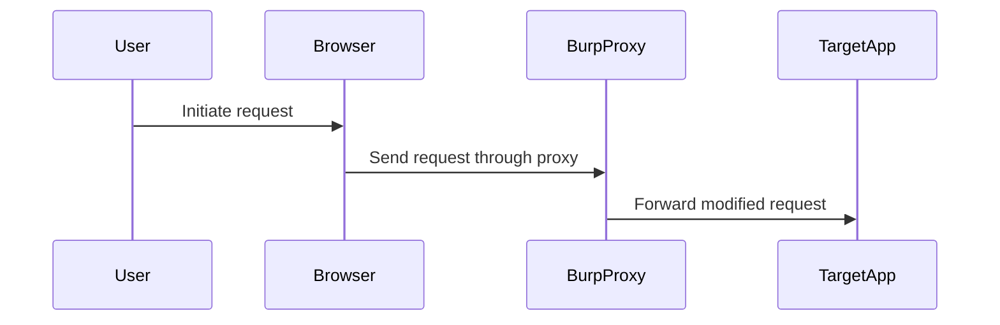
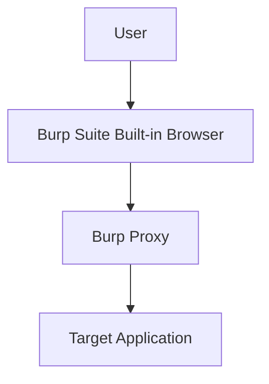
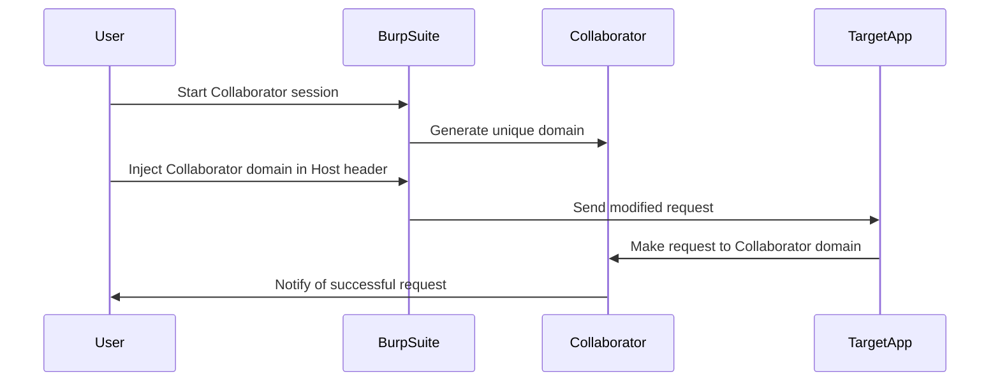

## HTTP Host Header Attacks and SSRF Vulnerabilities

### Background Theory

The HTTP `Host` header is a crucial component of HTTP requests, used to specify the domain name of the server being contacted. This header is essential for virtual hosting, where multiple domains are hosted on a single IP address. The `Host` header allows the server to determine which site to serve based on the domain name provided in the request.

However, the `Host` header can also be manipulated by attackers to exploit vulnerabilities such as Server-Side Request Forgery (SSRF). SSRF occurs when an application makes a request to an external resource without proper validation or sanitization of the input. If an attacker can control the URL or parts of the URL, they may be able to trick the application into making requests to internal resources or other unintended destinations.

### Previous Lab Recap

In the previous lab, we explored an SSRF vulnerability through host header injection. The goal was to manipulate the `Host` header to make the application send requests to internal resources or other unintended destinations. This lab builds upon that knowledge, focusing on a scenario where the application does not require any credentials to perform the SSRF attack.

### Accessing the Lab

To begin, we need to access the lab environment. We will use Burp Suite Professional, a popular tool for web application security testing. Burp Suite includes a built-in browser and a proxy that intercepts and modifies HTTP traffic.



#### Using Burp Suite Professional

We will use the built-in browser in Burp Suite to ensure that all our requests pass through the Burp proxy. This setup allows us to intercept and modify HTTP requests easily.



### Confirming Vulnerability with Collaborator

To confirm that the application is vulnerable to SSRF, we will use Burp Collaborator. Collaborator is a service that helps in detecting SSRF vulnerabilities by providing a unique domain that can be used to verify if the application is making requests to it.

#### Steps to Use Collaborator

1. **Start Collaborator**: In Burp Suite, navigate to the "Collaborator" tab and start a new session.
2. **Get Collaborator Domain**: Copy the unique domain provided by Collaborator.
3. **Inject Collaborator Domain**: Modify the `Host` header in the HTTP request to include the Collaborator domain.



### Example HTTP Request and Response

Let's look at a complete example of an HTTP request and response to demonstrate the process:

#### Vulnerable Request

```http
POST /api/resource HTTP/1.1
Host: example.com
Content-Type: application/json

{
    "url": "http://internal-service:8080"
}
```

#### Modified Request with Collaborator Domain

```http
POST /api/resource HTTP/1.1
Host: example.com
Content-Type: application/json

{
    "url": "http://<collaborator-domain>"
}
```

#### Response from Target Application

```http
HTTP/1.1 200 OK
Content-Type: application/json

{
    "response": "Request made to http://<collaborator-domain>"
}
```

### Real-World Examples

Recent real-world examples of SSRF vulnerabilities include:

- **CVE-2021-21972**: A vulnerability in the Jenkins plugin allowed attackers to perform SSRF attacks by manipulating the `Host` header.
- **CVE-2020-28492**: An SSRF vulnerability in the GitLab API allowed attackers to read sensitive files from the server.

These examples highlight the importance of properly validating and sanitizing user inputs, especially when dealing with external requests.

### How to Prevent / Defend

#### Detection

To detect SSRF vulnerabilities, you can use tools like Burp Suite Collaborator or other similar services. Additionally, monitoring logs and network traffic for unexpected requests can help identify potential SSRF attacks.

#### Prevention

1. **Input Validation**: Ensure that user inputs are validated and sanitized before being used in requests. Use whitelisting to restrict allowed domains.
2. **Network Segmentation**: Implement network segmentation to limit the ability of applications to access internal resources.
3. **Secure Coding Practices**: Follow secure coding practices to avoid common pitfalls such as improper input validation.

#### Secure Code Fix

Here is an example of how to securely validate the `Host` header in a web application:

```python
def validate_host_header(host):
    allowed_domains = ["example.com", "subdomain.example.com"]
    if host in allowed_domains:
        return True
    else:
        return False

# Example usage
host_header = "example.com"
if validate_host_header(host_header):
    print("Valid host header")
else:
    print("Invalid host header")
```

#### Hardening Configuration

For web servers, ensure that the `Host` header is properly configured to reject invalid or unexpected values. For example, in Apache, you can use the `Require all denied` directive to block requests with invalid `Host` headers.

```apache
<VirtualHost *:80>
    ServerName example.com
    <Directory "/var/www/html">
        Require all granted
    </Directory>
    SetEnvIf Host "!^example\.com$" bad_host
    Order Deny,Allow
    Deny from env=bad_host
</VirtualHost>
```

### Practice Labs

For hands-on practice with HTTP Host Header attacks and SSRF vulnerabilities, consider the following labs:

- **PortSwigger Web Security Academy**: Offers detailed labs on SSRF and other web security topics.
- **OWASP Juice Shop**: A deliberately insecure web application for practicing web security skills.
- **DVWA (Damn Vulnerable Web Application)**: A PHP/MySQL web application that contains numerous security vulnerabilities.

These labs provide a controlled environment to practice and understand the concepts covered in this chapter.

### Conclusion

Understanding and defending against HTTP Host Header attacks and SSRF vulnerabilities is crucial for maintaining the security of web applications. By following best practices, using secure coding techniques, and regularly testing for vulnerabilities, you can significantly reduce the risk of these types of attacks.

---
<!-- nav -->
[[Web Security (PortSwigger)/16-HTTP Host Header Attacks/06-Lab 5 SSRF via flawed request parsing/01-Introduction to HTTP Host Header Attacks|Introduction to HTTP Host Header Attacks]] | [[Web Security (PortSwigger)/16-HTTP Host Header Attacks/06-Lab 5 SSRF via flawed request parsing/00-Overview|Overview]] | [[Web Security (PortSwigger)/16-HTTP Host Header Attacks/06-Lab 5 SSRF via flawed request parsing/03-HTTP Host Header Attacks|HTTP Host Header Attacks]]
