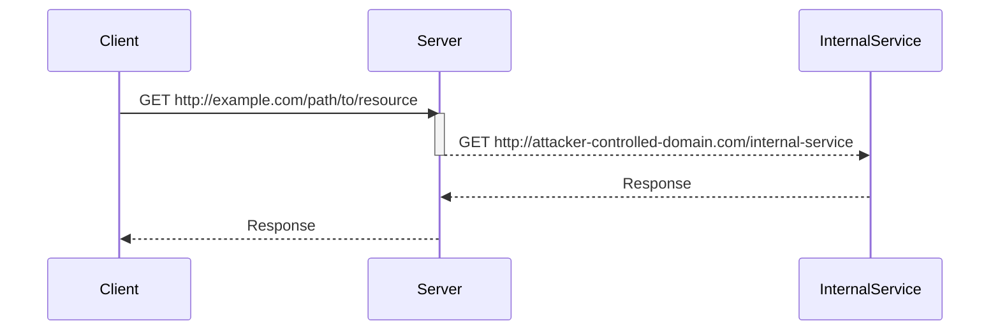

## Understanding HTTP Host Header Attacks

### Background Theory

The HTTP protocol is designed to facilitate communication between clients and servers over the internet. One of the key components of an HTTP request is the `Host` header, which specifies the domain name of the server being requested. This header is crucial because it allows a single IP address to serve multiple websites, a practice known as virtual hosting.

However, the `Host` header can also introduce security risks if not properly validated. In particular, an attacker might manipulate the `Host` header to trick the server into making unintended requests, leading to vulnerabilities such as Server-Side Request Forgery (SSRF).

### Absolute URL Requests

In the context of HTTP requests, a typical request line specifies a relative path on the requested domain. For example:

```plaintext
GET /path/to/resource HTTP/1.1
```

However, some servers are configured to handle absolute URLs in the request line. An absolute URL includes the scheme (e.g., `http://` or `https://`) and the domain name. For instance:

```plaintext
GET http://example.com/path/to/resource HTTP/1.1
```

This capability can be exploited if the server does not properly validate the `Host` header against the absolute URL in the request line.

### Discrepancies Between Systems

When both the absolute URL and the `Host` header are present in a request, discrepancies can arise between different systems. These discrepancies can lead to vulnerabilities if the server does not correctly handle them. For example, consider the following request:

```plaintext
GET http://example.com/path/to/resource HTTP/1.1
Host: attacker-controlled-domain.com
```

If the server only checks the `Host` header and ignores the absolute URL, it might make a request to `attacker-controlled-domain.com` instead of `example.com`. This can result in SSRF attacks.

### Real-World Example: CVE-2021-21972

A notable real-world example of this vulnerability is CVE-2021-21972, which affected the Jenkins Continuous Integration server. In this case, an attacker could manipulate the `Host` header to trick Jenkins into making unintended requests to internal services, leading to SSRF.

#### Full HTTP Request and Response

Here is a complete HTTP request and response demonstrating this vulnerability:

```http
POST /scriptText HTTP/1.1
Host: vulnerable-jenkins-server.com
Content-Type: application/x-www-form-urlencoded
Content-Length: 100

script=wget%20http://${Host}/internal-service
```

Response:

```http
HTTP/1.1 200 OK
Date: Mon, 20 Mar 2023 12:00:00 GMT
Server: Apache/2.4.41 (Ubuntu)
Content-Length: 0
Connection: close
Content-Type: text/html; charset=UTF-8
```

In this example, the `Host` header is manipulated to trick the server into making a request to an internal service, leading to SSRF.

### How to Prevent / Defend

To prevent host header injection and SSRF attacks, several measures can be taken:

1. **Validate the `Host` Header**: Ensure that the `Host` header matches the expected domain name. This can be done using a whitelist approach.

2. **Use Secure Coding Practices**: Avoid constructing URLs based on user input. Instead, use predefined constants or safe libraries that handle URL construction securely.

3. **Implement Input Validation**: Validate all inputs, including the `Host` header, to ensure they meet expected formats and constraints.

4. **Monitor and Log Requests**: Regularly monitor and log HTTP requests to detect unusual patterns that might indicate an attack.

#### Secure Code Example

Here is an example of insecure and secure code for handling the `Host` header:

**Insecure Code:**

```python
def handle_request(request):
    host = request.headers.get('Host')
    url = f"http://{host}/path/to/resource"
    response = requests.get(url)
    return response.text
```

**Secure Code:**

```python
import re

def handle_request(request):
    host = request.headers.get('Host')
    if not re.match(r'^[a-zA-Z0-9.-]+\.[a-zA-Z]{2,}$', host):
        raise ValueError("Invalid Host header")
    url = f"http://{host}/path/to/resource"
    response = requests.get(url)
    return response.text
```

In the secure code, the `Host` header is validated using a regular expression to ensure it matches a valid domain name format.

### Network Topology and Attack Chain Diagram

To visualize the attack chain, consider the following mermaid diagram:



This diagram shows how an attacker can manipulate the `Host` header to trick the server into making a request to an internal service.

### Practice Labs

For hands-on practice with HTTP Host Header attacks and SSRF, consider the following labs:

- **PortSwigger Web Security Academy**: Offers a module on SSRF and host header injection.
- **OWASP Juice Shop**: Contains challenges related to SSRF and other web security vulnerabilities.
- **DVWA (Damn Vulnerable Web Application)**: Provides a variety of web security vulnerabilities, including SSRF.

These labs provide practical experience in identifying and mitigating HTTP Host Header attacks and SSRF vulnerabilities.

### Conclusion

Understanding and preventing HTTP Host Header attacks and SSRF vulnerabilities is crucial for maintaining the security of web applications. By validating inputs, implementing secure coding practices, and monitoring requests, developers can significantly reduce the risk of these types of attacks.

---
<!-- nav -->
[[04-Lab Setup and Tools|Lab Setup and Tools]] | [[Web Security (PortSwigger)/16-HTTP Host Header Attacks/06-Lab 5 SSRF via flawed request parsing/00-Overview|Overview]] | [[06-Understanding HTTP Host Headers|Understanding HTTP Host Headers]]
