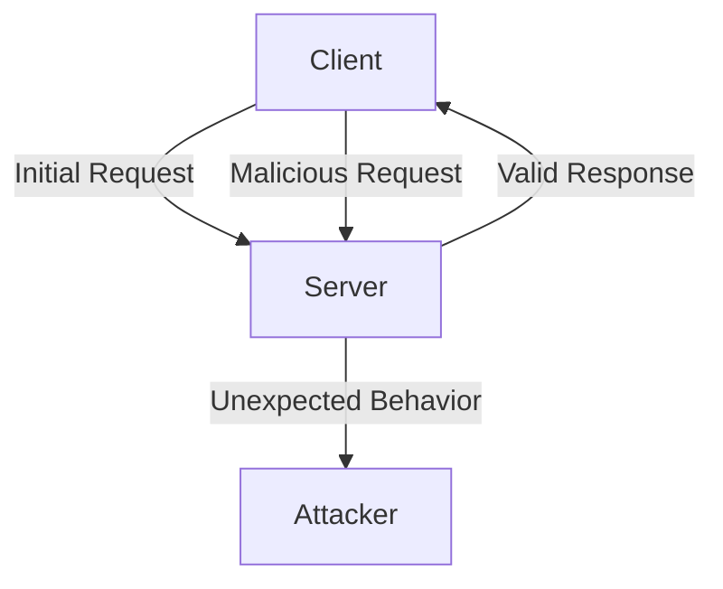
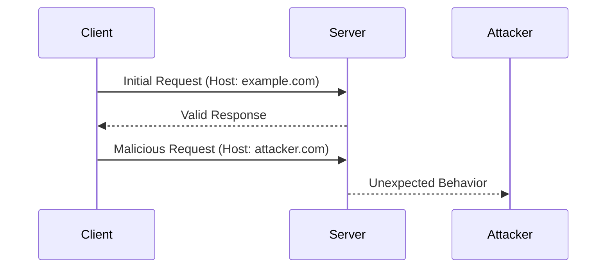

## HTTP Host Header Attacks

### Background Theory

The HTTP `Host` header is a crucial component of HTTP requests. It specifies the domain name of the server being contacted, allowing a single IP address to serve multiple domains. This is particularly important in environments like shared hosting, where many websites can reside on the same server.

#### Purpose of the `Host` Header

- **Domain Identification**: The `Host` header allows the server to determine which website is being requested. Without this header, the server would not know which site to serve.
- **Virtual Hosting**: Multiple websites can share the same IP address, and the `Host` header helps the server route the request to the correct site.

#### Syntax of the `Host` Header

```plaintext
Host: example.com
```

Here, `example.com` is the domain name of the server being contacted.

### Previous Labs Recap

In the previous two labs, we explored routing-based Server-Side Request Forgery (SSRF) attacks via the `Host` header. These attacks involve manipulating the `Host` header to trick the server into making requests to unintended destinations.

#### Prerequisites

Before proceeding with this lab, ensure you have completed the following:

- **Lab 1**: Basic SSRF attack using the `Host` header.
- **Lab 2**: Advanced SSRF attack using the `Host` header.

If you haven't watched these labs, it is recommended to pause this video, go through them, and then return to this lab.

### Current Lab Overview

This lab focuses on a specific type of attack where the server performs robust validation on the `Host` header. However, the server assumes that all requests within the same connection are based on the first request that comes in on that connection. This assumption can be exploited to bypass the validation.

#### Robust Validation Mechanism

The server employs a mechanism to validate the `Host` header to ensure it points to an allowed domain. This validation typically involves checking against a list of permitted domains.

#### Connection State Assumption

The server assumes that once a valid `Host` header is received, all subsequent requests within the same connection will also be valid. This assumption can be exploited by sending a valid initial request followed by malicious requests.

### Real-World Examples

Recent vulnerabilities involving the `Host` header include:

- **CVE-2021-22205**: A vulnerability in Apache Tomcat allowed attackers to bypass the `Host` header validation by exploiting the connection state assumption.
- **CVE-2022-22965**: A similar issue was found in Nginx, where attackers could bypass the `Host` header validation by manipulating the connection state.

These vulnerabilities highlight the importance of proper validation and the risks associated with assumptions about connection state.

### Attack Scenario

Let's walk through the steps to perform this attack.

#### Step 1: Initial Valid Request

First, send a request with a valid `Host` header to establish a connection.

```http
GET / HTTP/1.1
Host: example.com
Connection: keep-alive
```

#### Step 2: Exploit the Connection State

Once the connection is established, send a second request with a malicious `Host` header.

```http
GET / HTTP/1.1
Host: attacker.com
Connection: close
```

Since the server assumes that all requests within the same connection are based on the first request, it may not revalidate the `Host` header for the second request.

### Detailed Example

Let's consider a more detailed example using a real-world scenario.

#### Vulnerable Code

Consider a server-side application that validates the `Host` header as follows:

```python
def handle_request(request):
    host = request.headers.get('Host')
    if host not in ALLOWED_HOSTS:
        raise ValueError("Invalid Host header")
    # Process the request
```

#### Exploitation

An attacker can exploit this by establishing a connection with a valid `Host` header and then sending a malicious request.

```http
# Initial valid request
GET / HTTP/1.1
Host: example.com
Connection: keep-alive

# Malicious request
GET / HTTP/1.1
Host: attacker.com
Connection: close
```

### Mermaid Diagrams

#### Network Topology



#### Sequence Diagram



### How to Prevent / Defend

#### Detection

To detect such attacks, monitor for unexpected behavior in your logs. Look for patterns where a valid initial request is followed by a suspicious request.

#### Prevention

1. **Revalidate the `Host` Header**: Ensure that the `Host` header is validated for every request, not just the first one in a connection.
2. **Use Secure Coding Practices**: Implement strict input validation and avoid making assumptions about connection state.
3. **Configuration Hardening**: Configure your web server to enforce strict validation of the `Host` header.

#### Secure Code Fix

Compare the vulnerable and secure versions of the code.

**Vulnerable Code**

```python
def handle_request(request):
    host = request.headers.get('Host')
    if host not in ALLOWED_HOSTS:
        raise ValueError("Invalid Host header")
    # Process the request
```

**Secure Code**

```python
def handle_request(request):
    host = request.headers.get('Host')
    if host not in ALLOWED_HOSTS:
        raise ValueError("Invalid Host header")
    # Revalidate the Host header for every request
    if host != request.headers.get('Host'):
        raise ValueError("Invalid Host header")
    # Process the request
```

### Complete Example

#### Full HTTP Request and Response

**Initial Valid Request**

```http
GET / HTTP/1.1
Host: example.com
Connection: keep-alive

HTTP/1.1 200 OK
Content-Type: text/html
Connection: keep-alive

<!DOCTYPE html>
<html>
<head>
<title>Welcome</title>
</head>
<body>
<h1>Welcome to example.com</h1>
</body>
</html>
```

**Malicious Request**

```http
GET / HTTP/1.1
Host: attacker.com
Connection: close

HTTP/1.1 200 OK
Content-Type: text/html
Connection: close

<!DOCTYPE html>
<html>
<head>
<title>Welcome</title>
</head>
<body>
<h1>Welcome to attacker.com</h1>
</body>
</html>
```

### Common Pitfalls

- **Assumptions About Connection State**: Avoid making assumptions about the state of connections. Always revalidate critical headers.
- **Strict Input Validation**: Implement strict input validation to prevent unexpected behavior.

### Hands-On Practice

For hands-on practice, consider the following labs:

- **PortSwigger Web Security Academy**: Offers a variety of labs covering different aspects of web security, including SSRF attacks.
- **OWASP Juice Shop**: A deliberately insecure web application for practicing web security techniques.
- **DVWA (Damn Vulnerable Web Application)**: Another popular platform for learning web security through practical exercises.

These labs provide a safe environment to practice and understand the concepts discussed in this chapter.

### Conclusion

Understanding and defending against HTTP `Host` header attacks is crucial for maintaining the security of web applications. By validating the `Host` header for every request and avoiding assumptions about connection state, you can significantly reduce the risk of such attacks. Regularly updating your systems and monitoring for unexpected behavior can help detect and mitigate these vulnerabilities.

---
<!-- nav -->
[[Web Security (PortSwigger)/16-HTTP Host Header Attacks/07-Lab 6 Host validation bypass via connection state attack/03-Exploiting the Vulnerability|Exploiting the Vulnerability]] | [[Web Security (PortSwigger)/16-HTTP Host Header Attacks/07-Lab 6 Host validation bypass via connection state attack/00-Overview|Overview]] | [[Web Security (PortSwigger)/16-HTTP Host Header Attacks/07-Lab 6 Host validation bypass via connection state attack/05-How to Prevent  Defend|How to Prevent  Defend]]
