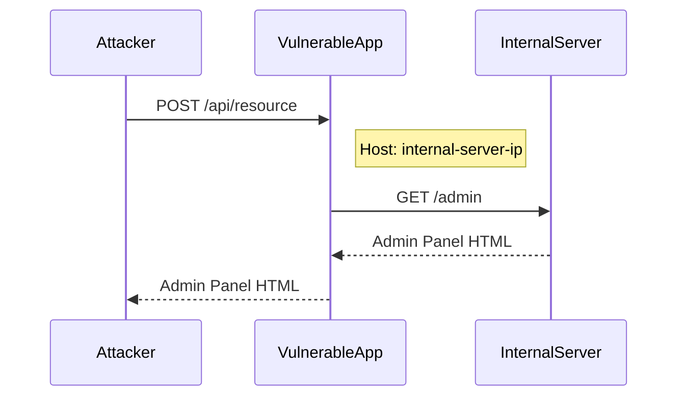

## Understanding HTTP Host Header Attacks

### Background Theory

The HTTP `Host` header is a crucial component of the HTTP protocol. It specifies the domain name of the server being contacted, allowing a single IP address to serve multiple websites. This header is essential for virtual hosting, where multiple domains share the same IP address. However, this flexibility can also introduce security vulnerabilities if not properly managed.

### What is the Host Header?

The `Host` header is included in every HTTP request and is used by the server to determine which website to serve. For example, consider the following HTTP request:

```http
GET /index.html HTTP/1.1
Host: www.example.com
```

In this case, the server knows to serve the content for `www.example.com`.

### Why Does the Host Header Matter?

The `Host` header is critical for routing requests to the correct website. Without proper validation, an attacker could manipulate this header to bypass security measures or access unauthorized resources. This is particularly dangerous in scenarios involving Server-Side Request Forgery (SSRF) attacks.

### How Does the Host Header Work Under the Hood?

When a client sends an HTTP request to a server, the server uses the `Host` header to determine which virtual host to serve. This is typically done by checking the `Host` header against a list of configured virtual hosts. If the `Host` header matches a configured virtual host, the server serves the corresponding content. Otherwise, it may return a default page or an error.

### Recent Real-World Examples

One notable example of a Host header vulnerability is CVE-2021-21972, which affected the Jenkins CI/CD platform. In this case, an attacker could manipulate the `Host` header to bypass authentication and gain unauthorized access to the system.

Another example is CVE-2021-31166, which affected the Apache Struts framework. An attacker could use a crafted `Host` header to bypass input validation and execute arbitrary commands on the server.

### Complete Example of a Host Header Attack

Let's walk through a detailed example of how an attacker might exploit a Host header vulnerability to perform an SSRF attack.

#### Step-by-Step Mechanics

1. **Identify the Vulnerable Application**: The attacker identifies a web application that does not properly validate the `Host` header.
   
2. **Craft the Malicious Request**: The attacker crafts an HTTP request with a manipulated `Host` header pointing to an internal server.

3. **Send the Request**: The attacker sends the malicious request to the vulnerable application.

4. **Exploit the Vulnerability**: If the application does not validate the `Host` header correctly, it may forward the request to the internal server, allowing the attacker to access sensitive information.

#### Full HTTP Request and Response

Here is an example of a malicious HTTP request and its response:

```http
POST /api/resource HTTP/1.1
Host: internal-server-ip
Content-Type: application/json
Content-Length: 34

{
  "action": "fetch",
  "url": "http://internal-server-ip/admin"
}
```

Response:

```http
HTTP/1.1 200 OK
Date: Mon, 20 Mar 2023 12:00:00 GMT
Server: Apache/2.4.41 (Ubuntu)
Content-Type: application/json
Content-Length: 1024

{
  "response": "<html><body><h1>Admin Panel</h1></body></html>"
}
```

### Diagramming the Attack Chain

We can visualize the attack chain using a mermaid diagram:



### Common Pitfalls

1. **Improper Validation**: Failing to validate the `Host` header can lead to SSRF attacks.
2. **Default Configuration**: Using default configurations without customizing security settings can expose vulnerabilities.
3. **Lack of Monitoring**: Not monitoring for unusual `Host` header values can allow attacks to go unnoticed.

### How to Prevent / Defend

#### Detection

To detect potential Host header attacks, monitor for unusual `Host` header values. Tools like IDS/IPS systems can help identify suspicious traffic patterns.

#### Prevention

1. **Validate the Host Header**: Ensure that the `Host` header matches a list of allowed domains.
2. **Use Whitelisting**: Implement a whitelist of allowed `Host` header values.
3. **Secure Configuration**: Harden the server configuration to prevent unauthorized access.

#### Secure Coding Fixes

Here is an example of how to securely validate the `Host` header in a web application:

**Vulnerable Code:**

```python
def handle_request(request):
    host = request.headers.get('Host')
    # Process request...
```

**Secure Code:**

```python
def handle_request(request):
    allowed_hosts = ['example.com', 'subdomain.example.com']
    host = request.headers.get('Host')
    
    if host not in allowed_hosts:
        raise ValueError("Invalid Host header")
    
    # Process request...
```

### Complete Example of a Secure Configuration

Here is an example of a secure configuration in an Nginx server block:

**Vulnerable Configuration:**

```nginx
server {
    listen 80;
    server_name example.com;

    location / {
        proxy_pass http://backend;
    }
}
```

**Secure Configuration:**

```nginx
server {
    listen 80;
    server_name example.com;

    if ($host !~* ^(example\.com|subdomain\.example\.com)$ ) {
        return 444;
    }

    location / {
        proxy_pass http://backend;
    }
}
```

### Hands-On Labs

For practical experience with Host header attacks, consider the following labs:

- **PortSwigger Web Security Academy**: Offers a comprehensive set of labs covering various web security topics, including Host header attacks.
- **OWASP Juice Shop**: A deliberately insecure web application for practicing web security skills.
- **DVWA (Damn Vulnerable Web Application)**: A PHP/MySQL web application that is riddled with vulnerabilities for educational purposes.

These labs provide a safe environment to practice and understand the mechanics of Host header attacks and how to defend against them.

### Conclusion

Understanding and defending against HTTP Host header attacks is crucial for maintaining the security of web applications. By validating the `Host` header, implementing secure configurations, and regularly monitoring for suspicious activity, organizations can significantly reduce the risk of such attacks.

---
<!-- nav -->
[[Web Security (PortSwigger)/16-HTTP Host Header Attacks/07-Lab 6 Host validation bypass via connection state attack/06-Practice Labs|Practice Labs]] | [[Web Security (PortSwigger)/16-HTTP Host Header Attacks/07-Lab 6 Host validation bypass via connection state attack/00-Overview|Overview]] | [[Web Security (PortSwigger)/16-HTTP Host Header Attacks/07-Lab 6 Host validation bypass via connection state attack/08-Understanding the Vulnerability|Understanding the Vulnerability]]
