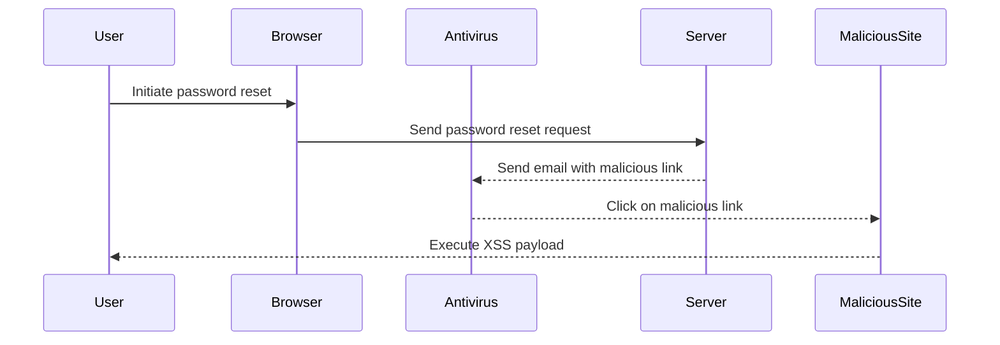

## Understanding HTTP Host Header Attacks

### Background Theory

HTTP Host Header attacks involve manipulating the `Host` header in an HTTP request to trick the server into serving content from a different domain or subdomain than intended. This can lead to various vulnerabilities, including Cross-Site Scripting (XSS), Cross-Site Request Forgery (CSRF), and other types of attacks. In the context of password reset poisoning via dangling markup, the attacker aims to exploit the way certain antivirus software handles links in emails.

### Key Concepts

#### HTTP Host Header
The `Host` header is a required part of an HTTP/1.1 request. It specifies the domain name of the server to which the request is being made. For example:

```http
GET /index.html HTTP/1.1
Host: www.example.com
```

This header is crucial because it allows a single IP address to host multiple domains, a practice known as virtual hosting.

#### Dangling Markup
Dangling markup refers to incomplete HTML tags that can be exploited to inject malicious content. For instance, if a webpage includes a script tag without a closing tag, an attacker might append their own content after the opening tag.

### Real-World Example: CVE-2021-3116

CVE-2021-3116 is a vulnerability in Microsoft Exchange Server that allowed attackers to execute arbitrary code by manipulating the `Host` header. This demonstrates the severity of such attacks and the importance of securing against them.

### Lab Setup

In this lab, we are given credentials for a regular user account. Any emails sent to this account can be read via the email client on the exploit server. We are also informed that some antivirus software scans links in emails to identify whether they are malicious.

### Step-by-Step Exploitation

#### Accessing the Lab

We start by accessing the lab environment. We will use Burp Suite, a popular tool for web application security testing. The steps can be performed in both the Professional and Community editions of Burp Suite.

1. **Start Burp Suite**: Launch Burp Suite and ensure your browser is configured to use Burp Suite as a proxy.
2. **Access the Account**: Log in to the account using the provided credentials.
3. **Initiate Password Reset**: Navigate to the "Forgot Password" page and initiate the password reset process.

#### Crafting the Attack

To exploit the scenario, we need to craft a malicious URL that will be scanned by the antivirus software. The goal is to inject a password reset link that redirects the user to a malicious site.

1. **Identify the Vulnerable Endpoint**: Determine the endpoint responsible for sending the password reset email.
2. **Craft the Malicious Link**: Create a URL that includes the `Host` header manipulation and dangling markup.

For example, consider the following malicious URL:

```http
http://vulnerable.site/reset?email=user@example.com&url=http://malicious.site/reset?email=user@example.com%3Cscript%3Ealert('XSS')%3C/script%3E
```

Here, the `Host` header is manipulated to redirect the user to a malicious site, and the dangling markup (`<script>alert('XSS')</script>`) is injected.

#### Sending the Email

Once the malicious URL is crafted, send it through the password reset functionality. The email will contain the malicious link, which will be scanned by the antivirus software.

### Full HTTP Request and Response

Below is a complete example of the HTTP request and response involved in this process:

**HTTP Request:**

```http
POST /forgot-password HTTP/1.1
Host: vulnerable.site
Content-Type: application/x-www-form-urlencoded
Content-Length: 100

email=user@example.com&url=http://malicious.site/reset?email=user@example.com%3Cscript%3Ealert('XSS')%3C/script%3E
```

**HTTP Response:**

```http
HTTP/1.1 200 OK
Date: Mon, 20 Mar 2023 12:00:00 GMT
Server: Apache/2.4.41 (Ubuntu)
Content-Type: text/html; charset=UTF-8
Content-Length: 1024

<!DOCTYPE html>
<html>
<head>
    <title>Password Reset</title>
</head>
<body>
    <h1>Password Reset Sent</h1>
    <p>An email with instructions to reset your password has been sent to user@example.com.</p>
</body>
</html>
```

### Diagramming the Attack Chain

A mermaid diagram can help visualize the attack chain:



### Common Pitfalls and Detection

#### Common Pitfalls
- **Improper Input Validation**: Failing to validate input can lead to injection attacks.
- **Lack of Content Security Policies (CSP)**: Without proper CSPs, browsers cannot prevent the execution of malicious scripts.
- **Outdated Software**: Using outdated software can expose vulnerabilities that have been patched in newer versions.

#### Detection
- **Web Application Firewalls (WAF)**: WAFs can detect and block suspicious requests.
- **Logging and Monitoring**: Regularly review logs for unusual activity.
- **Security Scanners**: Use tools like Burp Suite, OWASP ZAP, and Nessus to scan for vulnerabilities.

### How to Prevent / Defend

#### Secure Coding Practices

**Vulnerable Code:**

```python
def send_reset_email(email, url):
    # Send email with reset link
    email_body = f"Click here to reset your password: {url}"
    send_email(email, email_body)
```

**Secure Code:**

```python
from urllib.parse import quote_plus

def send_reset_email(email, url):
    # Sanitize input
    sanitized_url = quote_plus(url)
    email_body = f"Click here to reset your password: {sanitized_url}"
    send_email(email, email_body)
```

#### Configuration Hardening

**Nginx Configuration:**

```nginx
server {
    listen 80;
    server_name vulnerable.site;

    location /forgot-password {
        deny all;
    }
}
```

**Apache Configuration:**

```apache
<VirtualHost *:80>
    ServerName vulnerable.site

    <Location /forgot-password>
        Order Deny,Allow
        Deny from all
    </Location>
</VirtualHost>
```

### Conclusion

Understanding and preventing HTTP Host Header attacks is crucial for maintaining web application security. By implementing secure coding practices, configuring servers properly, and regularly monitoring for suspicious activity, organizations can significantly reduce the risk of such attacks.

### Hands-On Labs

For practical experience, consider the following labs:

- **PortSwigger Web Security Academy**: Offers detailed modules on various web security topics, including HTTP Host Header attacks.
- **OWASP Juice Shop**: A deliberately insecure web application for practicing web security skills.
- **DVWA (Damn Vulnerable Web Application)**: Another intentionally vulnerable application for learning web security.

These labs provide a safe environment to practice and understand the concepts discussed in this chapter.

---
<!-- nav -->
[[02-How to Prevent  Defend Against Password Reset Poisoning|How to Prevent  Defend Against Password Reset Poisoning]] | [[Web Security (PortSwigger)/16-HTTP Host Header Attacks/08-Lab 7 Password reset poisoning via dangling markup/00-Overview|Overview]] | [[04-Understanding Password Reset Poisoning via Dangling Markup|Understanding Password Reset Poisoning via Dangling Markup]]
