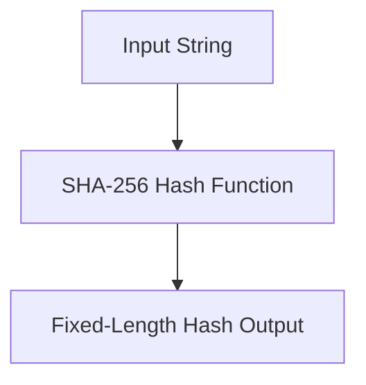

## Hashing Basics

### What is Hashing?

Hashing is a process that takes an input (or 'message') and returns a fixed-size string of bytes, which is typically a hexadecimal number. This output is called a 'hash.' The primary purpose of hashing is to ensure data integrity and to securely store sensitive information such as passwords. Hash functions are designed to be deterministic, meaning the same input will always produce the same output, but different inputs should produce different outputs.

### Why Use Hashing?

Hashing is crucial for several reasons:

1. **Data Integrity**: Hashing ensures that data has not been tampered with. If the hash of a file changes, it indicates that the file has been altered.
2. **Password Storage**: Storing passwords as hashes rather than plaintext makes it much harder for attackers to access the original passwords even if they gain access to the database.
3. **Efficiency**: Hashing allows for quick comparisons between large amounts of data. Instead of comparing entire files, you can compare their hashes, which are much smaller.

### How Does Hashing Work?

A hash function takes an input (of any length) and produces a fixed-length output. The output is often referred to as a 'digest.' Here’s a simple example using the SHA-256 algorithm:

```python
import hashlib

# Input string
input_string = "password1!"

# Create a SHA-256 hash object
hash_object = hashlib.sha256()

# Update the hash object with the input string
hash_object.update(input_string.encode('utf-8'))

# Get the hexadecimal representation of the hash
hashed_password = hash_object.hexdigest()
print(hashed_password)
```

The output will be a 64-character hexadecimal string representing the hash of the input string.

### One-Way Function

One of the key properties of a good hash function is that it is a one-way function. This means that given a hash, it is computationally infeasible to determine the original input. However, this does not mean that hashing is foolproof. There are still vulnerabilities that can be exploited.

### Real-World Example: CVE-2021-44228 (Log4Shell)

In December 2021, a critical vulnerability known as Log4Shell (CVE-2021-44228) was discovered in Apache Log4j. This vulnerability allowed attackers to execute arbitrary code on affected systems. While this particular vulnerability did not directly involve hashing, it highlights the importance of securing sensitive data and ensuring that all components of a system are up-to-date and properly configured.

### Mermaid Diagram: Hashing Process

Here’s a mermaid diagram illustrating the hashing process:



---
<!-- nav -->
[[Web Security (PortSwigger)/17-Information Disclosure/01-Information Disclosure Complete Guide/00-Overview|Overview]] | [[02-Information Disclosure A Comprehensive Guide|Information Disclosure A Comprehensive Guide]]
