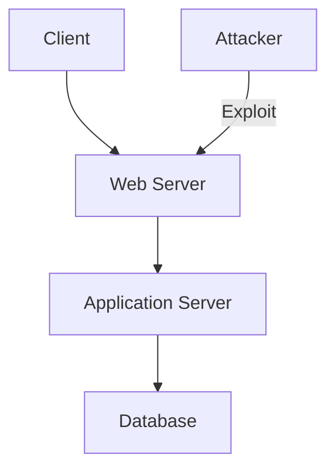
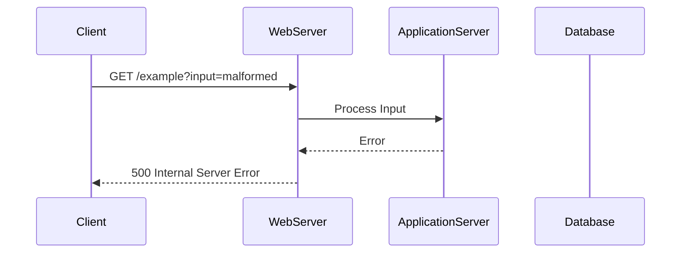

## Information Disclosure: A Comprehensive Guide

### Introduction to Information Disclosure

Information disclosure, also known as information leakage, occurs when a website unintentionally reveals sensitive information to its users. This sensitive information can take various forms, including:

- **User Data**: Such as usernames, email addresses, or other personal identifiers.
- **Personally Identifiable Information (PII)**: Including social security numbers, credit card details, or health records.
- **Sensitive Commercial Data**: Business strategies, financial reports, or intellectual property.
- **Technical Details**: About the website’s infrastructure, such as server configurations, database schemas, or software versions.

The exposure of such information can lead to significant security risks, including identity theft, financial fraud, and competitive disadvantages. Therefore, understanding and preventing information disclosure is crucial for maintaining the integrity and confidentiality of sensitive data.

### Common Forms of Information Disclosure

Information disclosure vulnerabilities can arise in numerous ways, making it challenging to cover every possible scenario. However, some common forms of information disclosure include:

#### Stack Trace Exposure

One of the most prevalent forms of information disclosure is the exposure of stack traces. A stack trace is a detailed report of the sequence of function calls leading up to an error or exception. When enabled in a production environment, stack traces can reveal critical technical details about the application, such as the frameworks and libraries being used.

**Example:**

Consider the following scenario where a user enters a malformed string in an input parameter field, causing the application to generate an error message. The error message includes a stack trace that exposes the use of the Faster XML Jackson Databind Library.

```http
HTTP/1.1 500 Internal Server Error
Content-Type: text/html; charset=UTF-8

<!DOCTYPE html>
<html>
<head>
    <title>Error</title>
</head>
<body>
    <h1>An error occurred</h1>
    <pre>
        java.lang.RuntimeException: Malformed string input
            at com.example.app.Controller.processInput(Controller.java:42)
            at com.example.app.Service.handleRequest(Service.java:35)
            at com.example.app.Controller.handleRequest(Controller.java:28)
            at sun.reflect.NativeMethodAccessorImpl.invoke0(Native Method)
            at sun.reflect.NativeMethodAccessorImpl.invoke(NativeMethodAccessorImpl.java:62)
            at sun.reflect.DelegatingMethodAccessorImpl.invoke(DelegatingMethodAccessorImpl.java:43)
            at java.lang.reflect.Method.invoke(Method.java:498)
            at org.springframework.web.method.support.InvocableHandlerMethod.doInvoke(InvocableHandlerMethod.java:205)
            at org.springframework.web.method.support.InvocableHandlerMethod.invokeForRequest(InvocableHandlerMethod.java:133)
            at org.springframework.web.servlet.mvc.method.annotation.ServletInvocableHandlerMethod.invokeAndHandle(ServletInvocableHandlerMethod.java:97)
            at org.springframework.web.servlet.mvc.method.annotation.RequestMappingHandlerAdapter.invokeHandlerMethod(RequestMappingHandlerAdapter.java:827)
            at org.springframework.web.servlet.mvc.method.annotation.RequestMappingHandlerAdapter.handleInternal(RequestMappingHandlerAdapter.java:738)
            at org.springframework.web.servlet.mvc.method.AbstractHandlerMethodAdapter.handle(AbstractHandlerMethodAdapter.java:85)
            at org.springframework.web.servlet.DispatcherServlet.doDispatch(DispatcherServlet.java:967)
            at org.springframework.web.servlet.DispatcherServlet.doService(DispatcherServlet.java:901)
            at org.springframework.web.servlet.FrameworkServlet.processRequest(FrameworkServlet.java:970)
            at org.springframework.web.servlet.FrameworkServlet.doGet(FrameworkServlet.java:861)
            at javax.servlet.http.HttpServlet.service(HttpServlet.java:634)
            at org.springframework.web.servlet.FrameworkServlet.service(FrameworkServlet.java:846)
            at javax.servlet.http.HttpServlet.service(HttpServlet.java:741)
            at org.apache.catalina.core.ApplicationFilterChain.internalDoFilter(ApplicationFilterChain.java:231)
            at org.apache.catalina.core.ApplicationFilterChain.doFilter(ApplicationFilterChain.java:166)
            at org.apache.tomcat.websocket.server.WsFilter.doFilter(WsFilter.java:53)
            at org.apache.catalina.core.ApplicationFilterChain.internalDoFilter(ApplicationFilterChain.java:193)
            at org.apache.catalina.core.ApplicationFilterChain.doFilter(ApplicationFilterChain.java:166)
            at org.springframework.web.filter.RequestContextFilter.doFilterInternal(RequestContextFilter.java:100)
            at org.springframework.web.filter.OncePerRequestFilter.doFilter(OncePerRequestFilter.java:119)
            at org.apache.catalina.core.ApplicationFilterChain.internalDoFilter(ApplicationFilterChain.java:193)
            at org.apache.catalina.core.ApplicationFilterChain.doFilter(ApplicationFilterChain.java:166)
            at org.springframework.web.filter.FormContentFilter.doFilterInternal(FormContentFilter.java:93)
            at org.springframework.web.filter.OncePerRequestFilter.doFilter(OncePerRequestFilter.java:119)
            at org.apache.catalina.core.ApplicationFilterChain.internalDoFilter(ApplicationFilterChain.java:193)
            at org.apache.catalina.core.ApplicationFilterChain.doFilter(ApplicationFilterChain.java:166)
            at org.springframework.web.filter.CharacterEncodingFilter.doFilterInternal(CharacterEncodingFilter.java:201)
            at org.springframework.web.filter.OncePerRequestFilter.doFilter(OncePerRequestFilter.java:119)
            at org.apache.catalina.core.ApplicationFilterChain.internalDoFilter(ApplicationFilterChain.java:193)
            at org.apache.catalina.core.ApplicationFilterChain.doFilter(ApplicationFilterChain.java:166)
            at org.apache.catalina.core.StandardWrapperValve.invoke(StandardWrapperValve.java:202)
            at org.apache.catalina.core.StandardContextValve.invoke(StandardContextValve.java:96)
            at org.apache.catalina.authenticator.AuthenticatorBase.invoke(AuthenticatorBase.java:541)
            at org.apache.catalina.core.StandardHostValve.invoke(StandardHostValve.java:139)
            at org.apache.catalina.valves.ErrorReportValve.invoke(ErrorReportValve.java:92)
            at org.apache.catalina.core.StandardEngineValve.invoke(StandardEngineValve.java:74)
            at org.apache.catalina.connector.CoyoteAdapter.service(CoyoteAdapter.java:343)
            at org.apache.coyote.http11.Http11Processor.service(Http11Processor.java:373)
            at org.apache.coyote.AbstractProcessorLight.process(AbstractProcessorLight.java:65)
            at org.apache.coyote.AbstractProtocol$ConnectionHandler.process(AbstractProtocol.java:868)
            at org.apache.tomcat.util.net.NioEndpoint$SocketProcessor.doRun(NioEndpoint.java:1589)
            at org.apache.tomcat.util.net.SocketProcessorBase.run(SocketProcessorBase.java:49)
            at java.util.concurrent.ThreadPoolExecutor.runWorker(ThreadPoolExecutor.java:1149)
            at java.util.concurrent.ThreadPoolExecutor$Worker.run(ThreadPoolExecutor.java:624)
            at org.apache.tomcat.util.threads.TaskThread$WrappingRunnable.run(TaskThread.java:61)
            at java.lang.Thread.run(Thread.java:748)
    </pre>
</body>
</html>
```

In this example, the stack trace reveals that the application is using the Faster XML Jackson Databind Library. Previous versions of this library have been known to be vulnerable to deserialization vulnerabilities, which can lead to remote code execution.

### How to Prevent / Defend Against Information Disclosure

To prevent information disclosure, several measures can be taken:

#### Disable Stack Traces in Production

Ensure that stack traces are disabled in the production environment. This can be achieved by configuring the application server or framework to suppress detailed error messages.

**Spring Boot Example:**

```yaml
# application.yml
server:
  error:
    include-stack-trace: false
```

**Nginx Example:**

```nginx
error_page 500 /500.html;
location = /500.html {
    internal;
}
```

#### Proper Error Handling

Implement proper error handling mechanisms to ensure that sensitive information is not exposed through error messages. This includes logging errors securely and providing generic error messages to users.

**Secure Error Handling Example:**

```java
@Controller
public class MyController {

    @GetMapping("/example")
    public String handleRequest(@RequestParam String input) {
        try {
            // Process input
            return "success";
        } catch (Exception e) {
            logger.error("An error occurred", e);
            return "error";
        }
    }
}
```

#### Secure Configuration Management

Manage configuration files securely to prevent accidental exposure of sensitive information. Ensure that configuration files are not included in version control systems and are stored in secure locations.

**Secure Configuration Example:**

```properties
# application.properties
spring.datasource.url=jdbc:mysql://localhost:3306/mydb
spring.datasource.username=myuser
spring.datasource.password=mypassword
```

#### Regular Audits and Penetration Testing

Regularly audit the application and perform penetration testing to identify and mitigate information disclosure vulnerabilities. This includes reviewing logs, monitoring network traffic, and conducting security assessments.

### Real-World Examples

#### Recent CVEs and Breaches

Several recent CVEs and breaches highlight the importance of preventing information disclosure:

- **CVE-2021-44228 (Log4Shell)**: This vulnerability in Apache Log4j allowed attackers to execute arbitrary code by injecting malicious log messages. The vulnerability was exploited due to improper error handling and logging mechanisms.
- **Equifax Breach (2017)**: The breach exposed sensitive information of over 143 million individuals due to a vulnerability in Apache Struts. The vulnerability was exploited due to improper error handling and lack of security patches.

### Mermaid Diagrams

#### Network Topology

A network topology diagram can help visualize the flow of data and identify potential points of information disclosure.



#### Request/Response Flow

A request/response flow diagram can illustrate how sensitive information might be disclosed through error messages.



### Conclusion

Information disclosure is a serious security risk that can lead to significant consequences. By understanding the common forms of information disclosure and implementing proper preventive measures, organizations can protect sensitive information and maintain the integrity of their applications.

### Practice Labs

To gain hands-on experience with information disclosure vulnerabilities, consider the following practice labs:

- **PortSwigger Web Security Academy**: Offers interactive labs on various web security topics, including information disclosure.
- **OWASP Juice Shop**: A deliberately insecure web application for practicing web security skills.
- **DVWA (Damn Vulnerable Web Application)**: A PHP/MySQL web application that demonstrates web application vulnerabilities.

By engaging with these labs, you can deepen your understanding of information disclosure and improve your ability to prevent and defend against such vulnerabilities.

---
<!-- nav -->
[[01-Hashing Basics|Hashing Basics]] | [[Web Security (PortSwigger)/17-Information Disclosure/01-Information Disclosure Complete Guide/00-Overview|Overview]] | [[03-Introduction to Information Disclosure Vulnerabilities|Introduction to Information Disclosure Vulnerabilities]]
