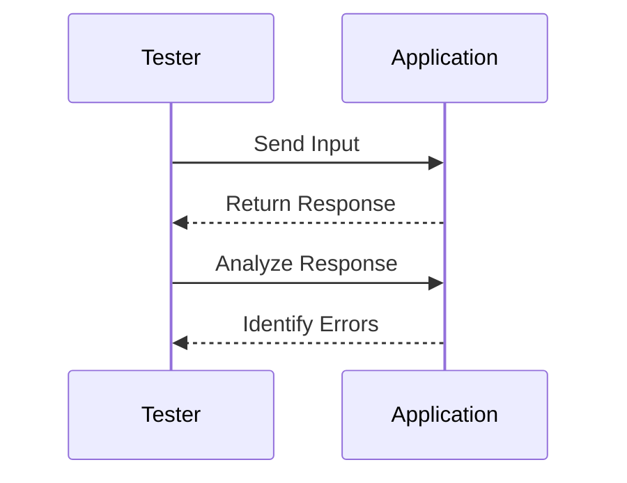
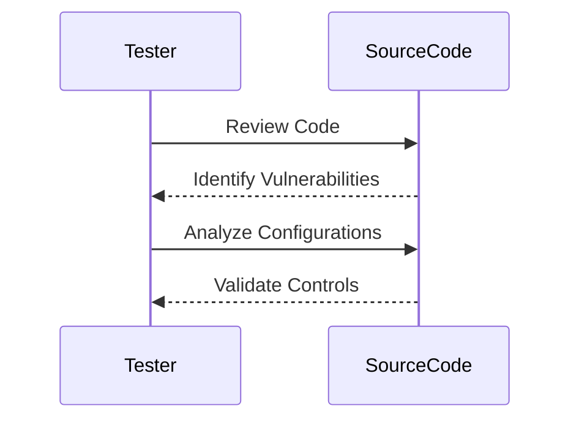

## Introduction to Information Disclosure Vulnerabilities

Information disclosure vulnerabilities occur when sensitive information is unintentionally exposed to unauthorized users. This can happen through various means such as error messages, debug logs, or even through improper handling of data. These vulnerabilities are significant because they can lead to the exposure of sensitive data, which can be exploited by attackers to gain further access to systems or to perform malicious activities.

### Background Theory

In the context of web applications, information disclosure vulnerabilities often arise due to poor coding practices, misconfigured servers, or inadequate security measures. The OWASP Top Ten list, a widely recognized standard for identifying and mitigating web application security risks, has historically included information disclosure as one of the top vulnerabilities. Recently, OWASP has reclassified some aspects of information disclosure under "Sensitive Data Exposure," focusing more on the underlying issues related to cryptography and data handling.

#### Why Information Disclosure Matters

Information disclosure can have severe consequences, including:

- **Data Breaches:** Exposing sensitive data such as user credentials, financial information, or personal identifiable information (PII).
- **Reputation Damage:** Loss of trust among customers and stakeholders.
- **Legal Consequences:** Violation of data protection laws such as GDPR, CCPA, etc., leading to fines and legal actions.
- **Further Exploitation:** Use of disclosed information to launch additional attacks, such as phishing or social engineering.

### Real-World Examples

Recent real-world examples of information disclosure vulnerabilities include:

- **CVE-2021-21972:** A vulnerability in the Microsoft Exchange Server allowed attackers to access sensitive data through a web-based management interface. This led to widespread exploitation and data breaches.
- **CVE-2022-22965:** A vulnerability in the Log4j library exposed sensitive data through improperly configured logging mechanisms, leading to widespread exploitation and data leaks.

### Types of Information Disclosure Vulnerabilities

Information disclosure vulnerabilities can manifest in several ways:

- **Error Messages:** Revealing internal server details or stack traces.
- **Debug Logs:** Exposing sensitive data through log files.
- **Improper Handling of Data:** Failing to sanitize or properly handle sensitive data.

### Testing for Information Disclosure Vulnerabilities

To effectively test for information disclosure vulnerabilities, it is essential to understand the different perspectives from which testing can be conducted. These perspectives are typically categorized into black box testing and white box testing.

#### Black Box Testing

Black box testing is performed without prior knowledge of the system's internal workings. The tester interacts with the application through its interfaces and observes the outputs. This approach is useful for simulating an attacker's perspective and identifying vulnerabilities that might be exploited by unauthorized users.

##### Steps for Black Box Testing

1. **Identify Interfaces:** Determine all input and output interfaces of the application.
2. **Input Validation:** Test the application with various inputs to check for unexpected behavior or error messages.
3. **Error Handling:** Analyze error messages and responses to identify potential information disclosure.
4. **Logging Analysis:** Check for any sensitive data being logged in error logs or debug logs.



#### White Box Testing

White box testing involves having detailed knowledge of the system's internal workings. The tester has access to the source code, architecture, and configurations. This approach allows for a more thorough analysis of the application's security posture.

##### Steps for White Box Testing

1. **Source Code Review:** Examine the source code for insecure coding practices or improper handling of sensitive data.
2. **Configuration Analysis:** Review server configurations and settings to ensure they are secure.
3. **Dependency Scanning:** Check for outdated or vulnerable dependencies that could expose sensitive data.
4. **Security Controls:** Verify the presence and effectiveness of security controls such as encryption, access controls, and logging mechanisms.



### Common Mistakes and Pitfalls

When testing for information disclosure vulnerabilities, it is crucial to avoid common mistakes and pitfalls:

- **Ignoring Error Messages:** Failing to analyze error messages can lead to missed vulnerabilities.
- **Overlooking Logging Mechanisms:** Not checking for sensitive data in logs can result in undetected information disclosure.
- **Neglecting Configuration Settings:** Misconfigured servers or services can expose sensitive data.

### How to Prevent / Defend Against Information Disclosure Vulnerabilities

#### Detection

To detect information disclosure vulnerabilities, implement the following measures:

- **Automated Scanning Tools:** Use tools like Burp Suite, OWASP ZAP, or commercial scanners to automate the process of identifying vulnerabilities.
- **Manual Testing:** Conduct thorough manual testing to identify vulnerabilities that automated tools might miss.
- **Logging Analysis:** Regularly review logs for any signs of information disclosure.

#### Prevention

To prevent information disclosure vulnerabilities, follow these best practices:

- **Sanitize Inputs:** Ensure all user inputs are properly sanitized to prevent injection attacks.
- **Secure Error Handling:** Implement proper error handling to avoid revealing sensitive information in error messages.
- **Encrypt Sensitive Data:** Use encryption to protect sensitive data both in transit and at rest.
- **Limit Access Controls:** Restrict access to sensitive data and ensure proper authentication and authorization mechanisms are in place.

#### Secure Coding Fixes

Here is an example of a vulnerable code snippet and its secure counterpart:

**Vulnerable Code:**

```python
def get_user_data(user_id):
    user = User.query.get(user_id)
    return user.to_dict()
```

**Secure Code:**

```python
def get_user_data(user_id):
    user = User.query.get(user_id)
    if user:
        return user.to_dict()
    else:
        return {"error": "User not found"}
```

### Complete Example: Full HTTP Request and Response

Consider a scenario where a web application exposes sensitive data through an error message.

**HTTP Request:**

```http
GET /api/user/123 HTTP/1.1
Host: example.com
Accept: application/json
```

**HTTP Response:**

```http
HTTP/1.1 500 Internal Server Error
Content-Type: application/json

{
    "error": "An unexpected error occurred",
    "details": "Traceback (most recent call last): File \"app.py\", line 12, in get_user_data user = User.query.get(user_id)"
}
```

**Corrected HTTP Response:**

```http
HTTP/1.1 500 Internal Server Error
Content-Type: application/json

{
    "error": "An unexpected error occurred"
}
```

### Hands-On Labs

For practical experience in testing for information disclosure vulnerabilities, consider the following labs:

- **PortSwigger Web Security Academy:** Offers interactive labs to practice identifying and exploiting information disclosure vulnerabilities.
- **OWASP Juice Shop:** A deliberately insecure web application for practicing web security skills.
- **DVWA (Damn Vulnerable Web Application):** Provides a range of web application vulnerabilities for testing and learning.

By thoroughly understanding and implementing the steps outlined above, you can effectively identify and mitigate information disclosure vulnerabilities in web applications.

---
<!-- nav -->
[[02-Information Disclosure A Comprehensive Guide|Information Disclosure A Comprehensive Guide]] | [[Web Security (PortSwigger)/17-Information Disclosure/01-Information Disclosure Complete Guide/00-Overview|Overview]] | [[04-Introduction to Information Disclosure|Introduction to Information Disclosure]]
