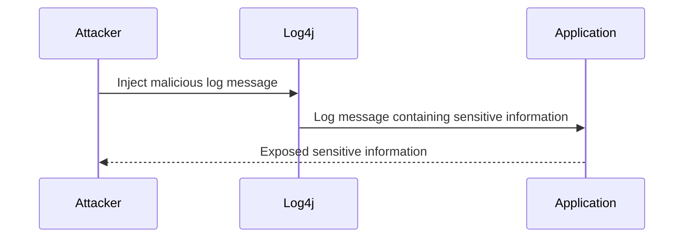
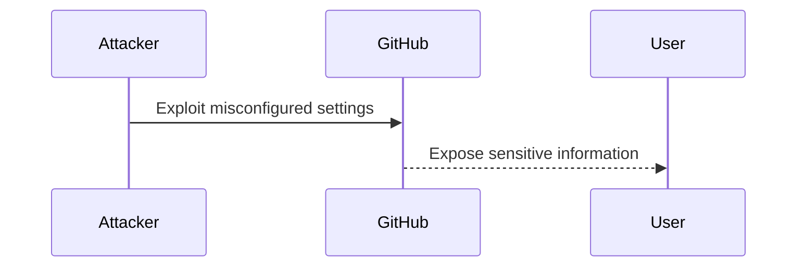

## Introduction to Information Disclosure

Information disclosure is a type of vulnerability that occurs when sensitive information is unintentionally exposed to unauthorized users. This can happen through various means such as code auditing, third-party integrations, and misconfigured settings. Understanding how to identify and mitigate information disclosure vulnerabilities is crucial for maintaining the security and integrity of web applications.

### What is Information Disclosure?

Information disclosure refers to the exposure of sensitive data that should not be accessible to unauthorized users. This can include database credentials, API keys, internal system details, and other confidential information. When such data is leaked, it can lead to severe consequences, including data breaches, unauthorized access, and exploitation of further vulnerabilities.

### Why Does Information Disclosure Matter?

Information disclosure is significant because it can provide attackers with valuable insights into the inner workings of an application. By gaining access to sensitive information, attackers can:

- **Exploit Further Vulnerabilities:** Use the disclosed information to find and exploit additional weaknesses in the system.
- **Gain Unauthorized Access:** Leverage credentials or keys to gain unauthorized access to critical systems.
- **Compromise Data Integrity:** Manipulate or corrupt data based on the information obtained.

### How Does Information Disclosure Occur?

Information disclosure can occur through various mechanisms, including:

- **Code Auditing:** Inadequate code reviews and testing can lead to the inclusion of sensitive information within the application.
- **Third-Party Integrations:** Misconfigured third-party services can expose sensitive data.
- **Misconfigured Settings:** Incorrectly configured application settings can inadvertently reveal sensitive information.

### Real-World Examples

#### Example 1: CVE-2021-21972

In 2021, a vulnerability was discovered in the popular open-source project `Log4j`. The vulnerability, known as `CVE-2021-21972`, allowed attackers to inject malicious log messages that could disclose sensitive information, including environment variables and system properties.

#### Example 2: GitHub Data Breach

In 2022, GitHub experienced a data breach where sensitive information, including API tokens and SSH keys, was exposed due to misconfigured settings. This incident highlights the importance of proper configuration management to prevent information disclosure.

---
<!-- nav -->
[[03-Introduction to Information Disclosure Vulnerabilities|Introduction to Information Disclosure Vulnerabilities]] | [[Web Security (PortSwigger)/17-Information Disclosure/01-Information Disclosure Complete Guide/00-Overview|Overview]] | [[05-What is Information Disclosure|What is Information Disclosure]]
