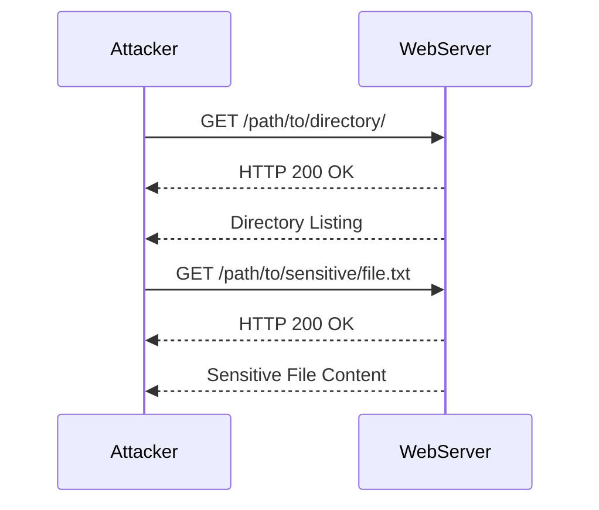

## What is Information Disclosure?

Information disclosure is a type of security vulnerability that occurs when sensitive information is unintentionally exposed to unauthorized users. This can happen through various means, such as misconfigured servers, improper error handling, or insecure coding practices. The exposure of sensitive data can lead to serious consequences, including identity theft, financial loss, and reputational damage.

### What is an Information Disclosure Vulnerability?

An information disclosure vulnerability is a flaw in a system that allows unauthorized access to sensitive information. This can include personal data, confidential business information, or technical details about the system itself. The severity of these vulnerabilities can vary widely depending on the nature of the disclosed information and the context in which it is exposed.

#### Types of Information Disclosure Vulnerabilities

There are several types of information disclosure vulnerabilities, each with its own characteristics and potential impacts:

1. **Sensitive Data Exposure**: This occurs when sensitive data, such as passwords, credit card numbers, or personal identification numbers (PINs), is exposed to unauthorized users. This can happen due to improper encryption, weak access controls, or misconfigured systems.

2. **Error Messages**: Improperly configured error messages can reveal sensitive information about the underlying system, such as database structures, file paths, or server configurations. These messages can provide attackers with valuable insights into how to exploit other vulnerabilities.

3. **Directory Listings**: When directory listings are enabled on a web server, it can expose the structure of the file system, revealing potentially sensitive files and directories. This can help attackers identify additional vulnerabilities or gain unauthorized access to sensitive data.

4. **Backup Files**: Backup files, such as `.bak` or `.tmp` files, often contain sensitive information and may be left accessible to unauthorized users. These files can be used to gain unauthorized access to the system or to steal sensitive data.

5. **Debugging Information**: Debugging information, such as stack traces or error logs, can reveal sensitive details about the system, including internal structures, dependencies, and potential vulnerabilities. This information can be exploited by attackers to gain unauthorized access or to perform further attacks.

### How Common Are Information Disclosure Vulnerabilities?

Information disclosure vulnerabilities are quite common and can be found in a wide range of systems and applications. According to the Common Vulnerabilities and Exposures (CVE) database, thousands of information disclosure vulnerabilities are reported each year. These vulnerabilities can affect web applications, mobile apps, network devices, and other types of software and hardware.

#### Real-World Examples

Here are some recent real-world examples of information disclosure vulnerabilities:

1. **CVE-2021-21972**: This vulnerability was discovered in the Microsoft Exchange Server. Attackers could exploit this vulnerability to disclose sensitive information, such as email addresses and server configurations. This led to widespread exploitation and significant damage to many organizations.

2. **CVE-2020-1472**: This vulnerability, also known as "Zerologon," affected the Netlogon Remote Protocol (MS-NRPC) in Windows Server operating systems. Attackers could exploit this vulnerability to disclose sensitive information and gain unauthorized access to the system.

3. **CVE-2019-11510**: This vulnerability was discovered in the Apache Struts framework. Attackers could exploit this vulnerability to disclose sensitive information, such as server configurations and user data. This led to widespread exploitation and significant damage to many organizations.

### Finding Information Disclosure Vulnerabilities

Finding information disclosure vulnerabilities requires a combination of technical skills and knowledge of the system being tested. There are two main approaches to finding these vulnerabilities: white box testing and black box testing.

#### White Box Testing

White box testing involves having access to the source code and internal workings of the system. This allows testers to analyze the code and identify potential vulnerabilities. Here are some steps to follow when performing white box testing:

1. **Review Source Code**: Carefully review the source code to identify any instances where sensitive information might be exposed. Look for functions that handle sensitive data, such as password handling or encryption routines.

2. **Check Error Handling**: Review the error handling mechanisms to ensure that sensitive information is not exposed in error messages. Ensure that error messages are generic and do not reveal sensitive details about the system.

3. **Analyze Configuration Files**: Review configuration files to ensure that sensitive information is not exposed. Check for any hardcoded credentials or sensitive data that might be stored in plain text.

4. **Test Internal APIs**: Test internal APIs to ensure that sensitive information is not exposed. Use tools like Postman or cURL to send requests to the API and check the responses for any sensitive data.

#### Black Box Testing

Black box testing involves testing the system without access to the source code or internal workings. This requires a more exploratory approach, using tools and techniques to identify potential vulnerabilities. Here are some steps to follow when performing black box testing:

1. **Use Web Application Scanners**: Use web application scanners like Burp Suite or OWASP ZAP to scan the application for potential vulnerabilities. These tools can automatically detect many types of information disclosure vulnerabilities.

2. **Manual Testing**: Perform manual testing to identify potential vulnerabilities. This can involve sending crafted requests to the application and analyzing the responses for any sensitive information.

3. **Review HTTP Responses**: Review HTTP responses to ensure that sensitive information is not exposed. Look for any unexpected data in the response body or headers.

4. **Test Directory Listings**: Test directory listings to ensure that sensitive files are not exposed. Send requests to the server and check the responses for any directory listings.

### Exploiting Information Disclosure Vulnerabilities

Once an information disclosure vulnerability has been identified, the next step is to exploit it to achieve the desired outcome. This can involve extracting sensitive information, gaining unauthorized access to the system, or performing further attacks.

#### Example Exploit

Let's consider an example where an attacker discovers a directory listing vulnerability on a web server. The attacker can exploit this vulnerability to gain unauthorized access to sensitive files and directories.

In this example, the attacker sends a request to the web server to access a directory. The web server responds with a directory listing, exposing the structure of the file system. The attacker can then use this information to access sensitive files and directories.

### How to Prevent / Defend Against Information Disclosure Vulnerabilities

Preventing and defending against information disclosure vulnerabilities requires a combination of technical measures and best practices. Here are some steps to follow to prevent and defend against these vulnerabilities:

#### Secure Coding Practices

1. **Avoid Hardcoding Sensitive Data**: Avoid hardcoding sensitive data, such as passwords or API keys, in the source code. Instead, use environment variables or secure storage mechanisms.

2. **Use Encryption**: Use encryption to protect sensitive data at rest and in transit. Ensure that encryption algorithms and key management practices are up-to-date and secure.

3. **Implement Access Controls**: Implement strict access controls to ensure that only authorized users can access sensitive data. Use role-based access control (RBAC) to restrict access based on user roles and permissions.

4. **Sanitize Input**: Sanitize input to prevent injection attacks and other types of vulnerabilities. Use input validation and sanitization libraries to ensure that user input is safe and secure.

#### Secure Configuration

1. **Disable Directory Listings**: Disable directory listings on web servers to prevent unauthorized access to sensitive files and directories. Configure the server to return a custom error page instead of a directory listing.

2. **Configure Error Handling**: Configure error handling to ensure that sensitive information is not exposed in error messages. Use generic error messages that do not reveal sensitive details about the system.

3. **Use Secure Headers**: Use secure HTTP headers to enhance the security of web applications. Set the `Content-Security-Policy` header to restrict the sources of content that can be loaded by the browser. Set the `X-Frame-Options` header to prevent clickjacking attacks.

4. **Enable Logging and Monitoring**: Enable logging and monitoring to detect and respond to information disclosure vulnerabilities. Use security information and event management (SIEM) tools to monitor for suspicious activity and alert on potential vulnerabilities.

#### Secure Development Lifecycle

1. **Code Reviews**: Perform regular code reviews to identify and fix potential vulnerabilities. Use automated tools to scan the code for common vulnerabilities and weaknesses (CWAs).

2. **Penetration Testing**: Perform regular penetration testing to identify and fix potential vulnerabilities. Use tools like Burp Suite or Metasploit to simulate attacks and test the security of the system.

3. **Security Training**: Provide regular security training to developers and other stakeholders to ensure that they are aware of the latest security threats and best practices.

4. **Patch Management**: Implement a patch management process to ensure that all systems and applications are up-to-date with the latest security patches and updates.

### Detection and Prevention Tools

Here are some tools that can be used to detect and prevent information disclosure vulnerabilities:

1. **Burp Suite**: Burp Suite is a popular web application security testing tool that can be used to detect and exploit information disclosure vulnerabilities. It includes features such as web application scanning, proxying, and interception.

2. **OWASP ZAP**: OWASP ZAP is an open-source web application security scanner that can be used to detect and exploit information disclosure vulnerabilities. It includes features such as web application scanning, proxying, and interception.

3. **Metasploit**: Metasploit is a popular penetration testing framework that can be used to detect and exploit information disclosure vulnerabilities. It includes a large number of exploits and payloads that can be used to test the security of the system.

4. **Nmap**: Nmap is a network scanning tool that can be used to detect and exploit information disclosure vulnerabilities. It includes features such as port scanning, service detection, and OS fingerprinting.

### Hands-On Lab Exercises

To practice detecting and preventing information disclosure vulnerabilities, you can use the following hands-on lab exercises:

1. **PortSwigger Web Security Academy**: The PortSwigger Web Security Academy offers a variety of hands-on lab exercises that cover information disclosure vulnerabilities. You can practice detecting and exploiting these vulnerabilities using tools like Burp Suite and OWASP ZAP.

2. **OWASP Juice Shop**: The OWASP Juice Shop is a deliberately insecure web application that can be used to practice detecting and exploiting information disclosure vulnerabilities. You can use tools like Burp Suite and OWASP ZAP to test the security of the application.

3. **DVWA**: The Damn Vulnerable Web Application (DVWA) is a deliberately insecure web application that can be used to practice detecting and exploiting information disclosure vulnerabilities. You can use tools like Burp Suite and OWASP ZAP to test the security of the application.

4. **WebGoat**: WebGoat is a deliberately insecure web application that can be used to practice detecting and exploiting information disclosure vulnerabilities. You can use tools like Burp Suite and OWASP ZAP to test the security of the application.

By following these steps and using these tools, you can effectively detect and prevent information disclosure vulnerabilities in your systems and applications.

---
<!-- nav -->
[[04-Introduction to Information Disclosure|Introduction to Information Disclosure]] | [[Web Security (PortSwigger)/17-Information Disclosure/01-Information Disclosure Complete Guide/00-Overview|Overview]] | [[06-Cryptographic Flaws in Hashing|Cryptographic Flaws in Hashing]]
