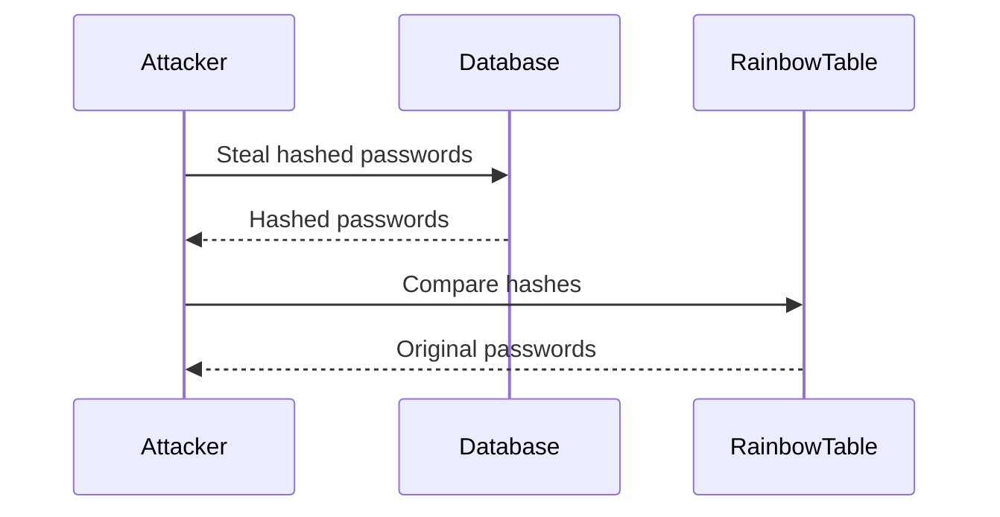

## Cryptographic Flaws in Hashing

### Lack of Salting

Even though hashing is a one-way function, there are still cryptographic flaws that can be exploited. One of the most significant flaws is the lack of salting. Salting involves adding a unique random value to the input before hashing. This makes it much harder for attackers to use precomputed hash tables (rainbow tables) to reverse-engineer the original input.

### Precomputed Hash Tables (Rainbow Tables)

Without salting, an attacker can create a precomputed hash table (rainbow table) containing hashes of common passwords. They can then compare these hashes to the hashes stored in a database to determine the original passwords.

#### Example: Creating a Rainbow Table

Here’s a simplified example of how an attacker might create a rainbow table:

```python
import hashlib

# List of common passwords
common_passwords = ["password", "123456", "qwerty", "letmein", "password1!"]

# Dictionary to store the rainbow table
rainbow_table = {}

for password in common_passwords:
    # Create a SHA-256 hash object
    hash_object = hashlib.sha256()
    
    # Update the hash object with the password
    hash_object.update(password.encode('utf-8'))
    
    # Get the hexadecimal representation of the hash
    hashed_password = hash_object.hexdigest()
    
    # Add the hash to the rainbow table
    rainbow_table[hashed_password] = password

# Print the rainbow table
for hash_value, original_password in rainbow_table.items():
    print(f"{hash_value}: {original_password}")
```

### Real-World Example: LinkedIn Breach (2012)

In 2012, LinkedIn suffered a massive data breach where over 6.5 million hashed passwords were stolen. The passwords were hashed using SHA-1, but without salting. This made it possible for attackers to use rainbow tables to crack many of the passwords.

### Mermaid Diagram: Rainbow Table Attack

Here’s a mermaid diagram illustrating a rainbow table attack:



---
<!-- nav -->
[[05-What is Information Disclosure|What is Information Disclosure]] | [[Web Security (PortSwigger)/17-Information Disclosure/01-Information Disclosure Complete Guide/00-Overview|Overview]] | [[07-Disabling Debugging and Diagnostic Features in Production|Disabling Debugging and Diagnostic Features in Production]]
