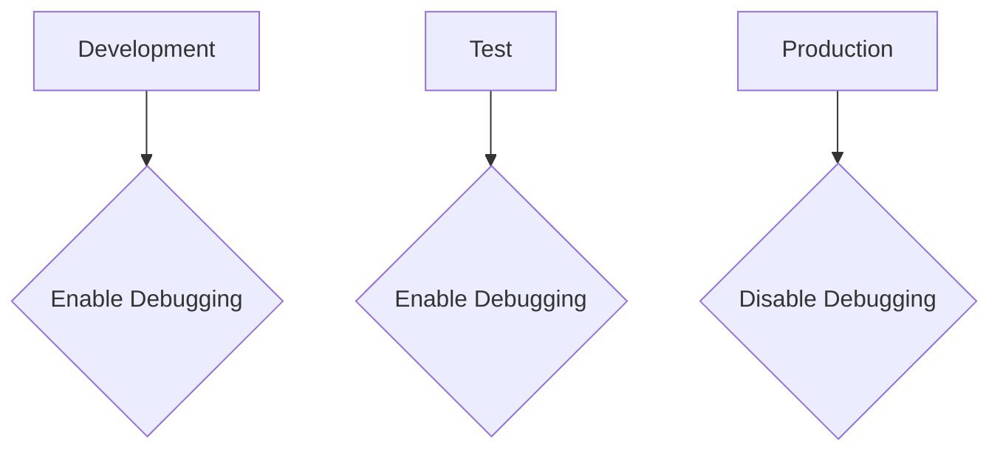

## Disabling Debugging and Diagnostic Features in Production

### What Are Debugging and Diagnostic Features?

Debugging and diagnostic features are tools and settings that help developers identify and resolve issues during development and testing phases. These features often provide detailed information about the application's internal state, which can be extremely useful for troubleshooting but highly dangerous if exposed in a production environment.

### Why Disable These Features in Production?

Enabling debugging and diagnostic features in production can lead to severe security risks, including:

- **Stack Traces**: Revealing the exact location and nature of errors, which can help attackers pinpoint vulnerabilities.
- **Detailed Logs**: Exposing sensitive data and application logic that could be exploited.
- **Sensitive Information**: Disclosing internal configurations and secrets.

### How to Disable These Features

Disabling these features typically involves modifying configuration settings and ensuring that they are only enabled in non-production environments.

### Real-World Example: CVE-2019-11510

In 2019, a vulnerability (CVE-2019-11510) was found in the Jenkins Continuous Integration server. This vulnerability allowed attackers to execute arbitrary commands due to a misconfiguration that left debugging features enabled in the production environment.

#### Vulnerable Configuration Example

Consider a Jenkins configuration file (`config.xml`) that leaves debugging features enabled:

```xml
<jenkins>
  <systemMessage>Debug mode enabled</systemMessage>
  <useSecurity>true</useSecurity>
  <!-- Other configurations -->
</jenkins>
```

#### Secure Configuration Example

To prevent such vulnerabilities, ensure that debugging features are disabled:

```xml
<jenkins>
  <systemMessage></systemMessage>
  <useSecurity>true</useSecurity>
  <!-- Other configurations -->
</jenkins>
```

### How to Prevent / Defend

**Detection**:
- **Configuration Review**: Regularly review configuration files to ensure that debugging features are disabled.
- **Automated Scanning**: Use automated tools to scan for misconfigurations that leave debugging features enabled.

**Prevention**:
- **Environment-Specific Configurations**: Use different configuration files for development, testing, and production environments.
- **CI/CD Pipeline**: Integrate checks into the CI/CD pipeline to ensure that debugging features are disabled before deployment.

### Mermaid Diagram: Environment-Specific Configurations



---
<!-- nav -->
[[06-Cryptographic Flaws in Hashing|Cryptographic Flaws in Hashing]] | [[Web Security (PortSwigger)/17-Information Disclosure/01-Information Disclosure Complete Guide/00-Overview|Overview]] | [[08-Exploiting Information Disclosure Vulnerabilities|Exploiting Information Disclosure Vulnerabilities]]
