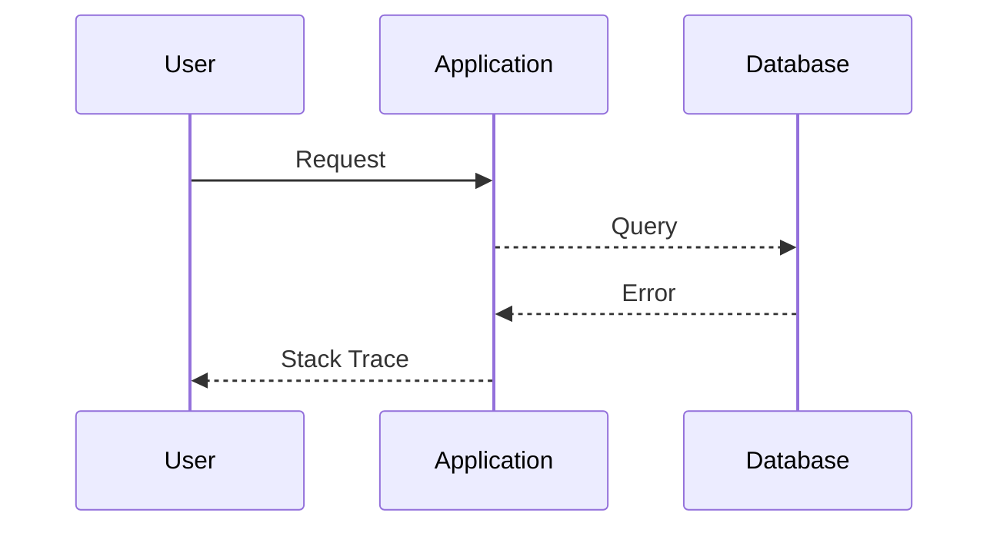
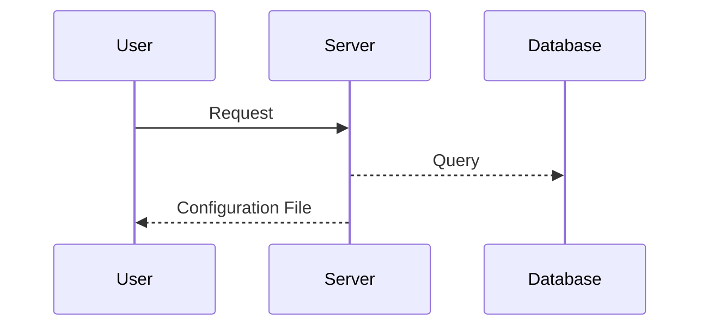
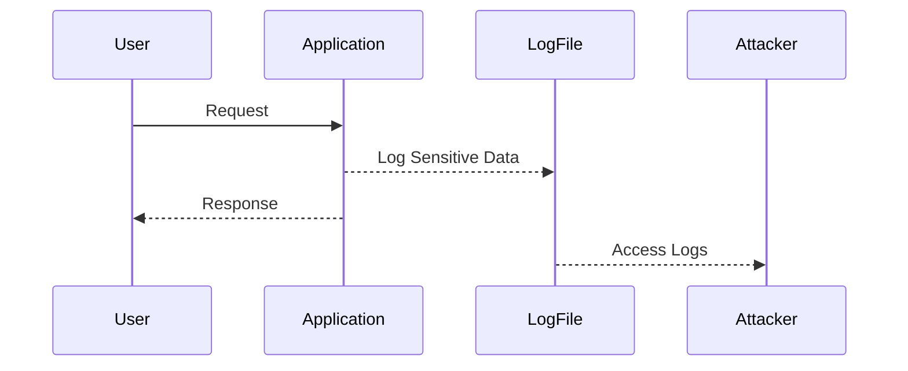

## Exploiting Information Disclosure Vulnerabilities

Exploiting information disclosure vulnerabilities requires a deep understanding of the application and its environment. In the upcoming sections, we will explore different types of information disclosure vulnerabilities and how to exploit them.

### Type 1: Stack Trace Exposure

Stack trace exposure occurs when detailed error messages are returned to users. These error messages can reveal internal application logic and help attackers craft more sophisticated attacks.

#### Example: Exploiting Stack Trace Exposure

Suppose an application returns a detailed stack trace when an error occurs. An attacker can use this information to understand the application’s internal structure and potentially launch further attacks.

#### How to Exploit

1. **Trigger an Error**: Cause an error in the application to trigger the stack trace.
2. **Analyze the Stack Trace**: Use the stack trace to understand the application’s internal structure.
3. **Craft Further Attacks**: Use the insights gained from the stack trace to launch further attacks.

### Type 2: Configuration File Exposure

Configuration file exposure occurs when sensitive configuration files are left accessible to unauthorized users. These files often contain sensitive data such as database credentials or API keys.

#### Example: Exploiting Configuration File Exposure

Suppose a misconfigured server exposes a configuration file containing database credentials. An attacker can use these credentials to access the database and steal sensitive user data.

#### How to Exploit

1. **Access the Configuration File**: Directly access the configuration file to retrieve sensitive data.
2. **Use the Credentials**: Use the retrieved credentials to access the database and steal sensitive user data.

### Type 3: Sensitive Data Exposure

Sensitive data exposure occurs when sensitive data such as PII or credentials is inadvertently exposed to unauthorized users. This can happen due to poor logging practices or insecure data handling.

#### Example: Exploiting Sensitive Data Exposure

Suppose an application inadvertently logs sensitive data such as credit card details. An attacker can access these logs to steal sensitive user data.

#### How to Exploit

1. **Access the Logs**: Gain access to the application logs to retrieve sensitive data.
2. **Steal the Data**: Use the retrieved data to launch further attacks or sell it on the dark web.

---
<!-- nav -->
[[07-Disabling Debugging and Diagnostic Features in Production|Disabling Debugging and Diagnostic Features in Production]] | [[Web Security (PortSwigger)/17-Information Disclosure/01-Information Disclosure Complete Guide/00-Overview|Overview]] | [[Web Security (PortSwigger)/17-Information Disclosure/01-Information Disclosure Complete Guide/09-Generic Error Messages|Generic Error Messages]]
