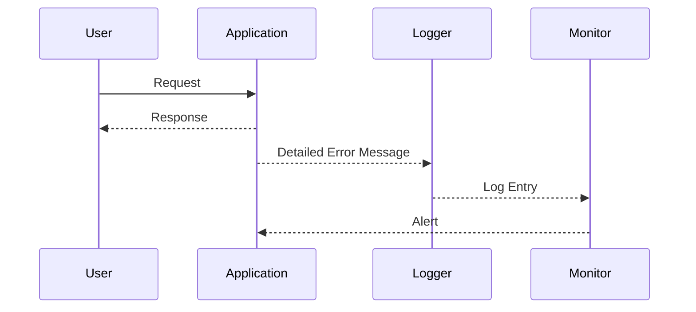

## Generic Error Messages

### What Are Generic Error Messages?

Generic error messages are standardized, non-specific messages that are displayed to users when an error occurs within an application. These messages are designed to provide minimal information about the underlying issue while avoiding the disclosure of sensitive details that could be exploited by attackers.

### Why Use Generic Error Messages?

Using generic error messages is crucial for maintaining the security and integrity of an application. Specific error messages can reveal sensitive information such as:

- **Backend Technologies**: Revealing the type of database, server software, or programming language used.
- **Data Structure**: Providing insights into the structure of the data stored in the application.
- **Internal Errors**: Exposing internal errors that could indicate vulnerabilities or misconfigurations.

### How Do Generic Error Messages Work?

When an error occurs, instead of displaying detailed information about the error, a generic message is shown. This message might look something like:

```plaintext
An unexpected error occurred. Please try again later.
```

This approach ensures that users are informed of the problem without exposing sensitive details that could be used to launch further attacks.

### Real-World Example: CVE-2021-21972

In 2021, a vulnerability was discovered in the Apache Struts framework (CVE-2021-21972). This vulnerability allowed attackers to execute arbitrary code by exploiting a deserialization flaw. One of the ways this vulnerability was exploited was through detailed error messages that revealed the presence of the vulnerable component.

#### Vulnerable Code Example

Consider a scenario where an application uses Apache Struts and displays detailed error messages:

```java
try {
    // Some code that interacts with Apache Struts
} catch (Exception e) {
    System.out.println("Error: " + e.getMessage());
}
```

#### Secure Code Example

To prevent such disclosures, the error handling should be modified to use a generic message:

```java
try {
    // Some code that interacts with Apache Struts
} catch (Exception e) {
    System.out.println("An unexpected error occurred.");
}
```

### How to Prevent / Defend

**Detection**:
- **Logging**: Implement logging mechanisms to capture detailed error messages internally while showing generic messages to users.
- **Monitoring**: Use monitoring tools to track and analyze error logs for patterns that might indicate vulnerabilities.

**Prevention**:
- **Error Handling**: Ensure that all error handling mechanisms use generic messages.
- **Configuration**: Configure the application to suppress detailed error messages in production environments.

### Mermaid Diagram: Error Handling Flow



---
<!-- nav -->
[[08-Exploiting Information Disclosure Vulnerabilities|Exploiting Information Disclosure Vulnerabilities]] | [[Web Security (PortSwigger)/17-Information Disclosure/01-Information Disclosure Complete Guide/00-Overview|Overview]] | [[Web Security (PortSwigger)/17-Information Disclosure/01-Information Disclosure Complete Guide/10-Hands-On Labs|Hands-On Labs]]
