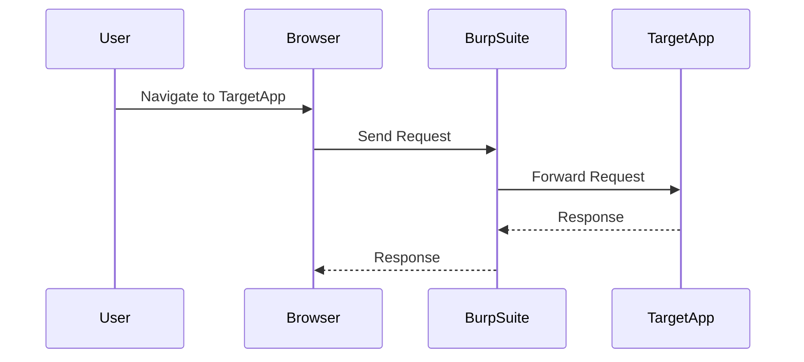

## Identifying Information Disclosure Vulnerabilities

Identifying information disclosure vulnerabilities requires a thorough understanding of the application and its environment. There are two main approaches to identifying these vulnerabilities: white-box testing and black-box testing.

### White-Box Testing

White-box testing involves having access to the source code and internal architecture of the application. This allows testers to identify potential information disclosure vulnerabilities by examining the code and configuration files.

#### Steps in White-Box Testing

1. **Review Source Code**: Look for instances where sensitive data is logged or returned in error messages.
2. **Check Configuration Files**: Ensure that sensitive data is not stored in plain text within configuration files.
3. **Analyze Logs**: Review application logs for any unintended exposure of sensitive data.

### Black-Box Testing

Black-box testing involves testing the application without access to the source code or internal architecture. This approach relies on probing the application to identify potential information disclosure vulnerabilities.

#### Steps in Black-Box Testing

1. **Error Messages**: Test for detailed error messages that might reveal internal application logic.
2. **File Access**: Attempt to access configuration files or other sensitive files directly.
3. **Sensitive Data**: Look for any exposure of sensitive data such as PII or credentials.

### Automated Tools

Automated tools can significantly speed up the process of identifying information disclosure vulnerabilities. These tools crawl the web application and look for vulnerabilities based on predefined rules.

#### Popular Web Application Vulnerability Scanners

- **Burp Suite Pro**: A comprehensive tool for web application security testing.
- **OWASP ZAP**: An open-source tool for finding vulnerabilities in web applications.
- **Acunetix**: A commercial tool for automated web application security testing.

#### Example: Using Burp Suite Pro

To use Burp Suite Pro to identify information disclosure vulnerabilities:

1. **Install and Configure Burp Suite**: Set up Burp Suite as a proxy between your browser and the target application.
2. **Scan the Application**: Use the scanner to crawl the application and identify potential vulnerabilities.
3. **Review Results**: Analyze the results to identify any information disclosure vulnerabilities.

---
<!-- nav -->
[[13-How to Prevent  Defend Against Information Disclosure|How to Prevent  Defend Against Information Disclosure]] | [[Web Security (PortSwigger)/17-Information Disclosure/01-Information Disclosure Complete Guide/00-Overview|Overview]] | [[15-Identifying Potential Information Disclosure|Identifying Potential Information Disclosure]]
