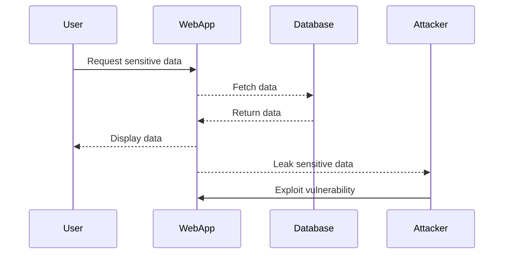

## Information Disclosure in Web Applications

Information disclosure is a critical security issue in web applications where sensitive data is inadvertently exposed to unauthorized users. This can occur through various means, such as error messages, stack traces, and other forms of unintended data leakage. Understanding and preventing information disclosure is essential for maintaining the confidentiality and integrity of your application and its data.

### What is Information Disclosure?

Information disclosure occurs when an application unintentionally reveals sensitive information to unauthorized users. This can include:

- **Stack Traces**: Detailed error messages that expose internal workings of the application.
- **Error Messages**: Generic or specific error messages that reveal details about the application’s structure or vulnerabilities.
- **Sensitive Data**: Any confidential information that should not be accessible to unauthorized users.

#### Why Does Information Disclosure Matter?

Information disclosure can provide attackers with valuable insights into the application’s architecture, dependencies, and potential vulnerabilities. This knowledge can be leveraged to craft more targeted attacks, such as exploiting known vulnerabilities in third-party libraries or customizing attacks based on the application’s specific setup.

### How Information Disclosure Happens

Information disclosure can occur in several ways:

1. **Stack Trace Exposure**:
    - **Definition**: A stack trace is a report of the active stack frames at a particular point in time during the execution of a program. It shows the sequence of function calls that led to the current point of execution.
    - **Why It Matters**: In a production environment, exposing stack traces can reveal sensitive information about the application’s internal workings, including the versions of libraries being used, which can be exploited.
    - **Example**: Consider a web application that uses a third-party library vulnerable to a remote code execution (RCE) attack. If the application exposes stack traces, an attacker might see the version of the library and exploit the known vulnerability.

2. **Generic Error Messages**:
    - **Definition**: Generic error messages are vague and do not provide specific details about the error. They are often used to avoid revealing sensitive information.
    - **Why It Matters**: While generic error messages are better than detailed ones, they can still leak information if not carefully crafted. For example, a generic error message might indicate that a certain operation failed, leading an attacker to infer the presence of a specific feature or functionality.
    - **Example**: An error message like "An unexpected error occurred" might seem safe, but if it consistently appears when a user tries to access a certain resource, an attacker might deduce the existence of that resource.

3. **Sensitive Data Leakage**:
    - **Definition**: Sensitive data includes any information that should not be accessible to unauthorized users, such as database credentials, API keys, or personal user data.
    - **Why It Matters**: Exposing sensitive data can lead to severe consequences, including unauthorized access to systems, theft of personal information, and financial loss.
    - **Example**: A web application that stores API keys in plain text within its configuration files can expose these keys if the files are improperly configured or if the application itself is compromised.

### Real-World Examples

Several high-profile breaches have been attributed to information disclosure vulnerabilities:

- **CVE-2021-21972**: This vulnerability in the Apache Log4j library allowed attackers to execute arbitrary code by injecting malicious log messages. The vulnerability was exacerbated by the fact that many applications did not properly sanitize log inputs, leading to widespread exploitation.
- **Equifax Breach (2017)**: The Equifax breach involved the exposure of sensitive personal data due to a vulnerability in the Apache Struts framework. The attackers were able to exploit this vulnerability to gain access to the company’s systems and steal data.

### Detection and Prevention

To prevent information disclosure, it is crucial to implement robust detection and prevention mechanisms. Here are some strategies:

#### Detection

1. **Logging and Monitoring**:
    - Implement comprehensive logging and monitoring to detect unusual activity or patterns that may indicate information disclosure.
    - Use tools like Splunk, ELK Stack, or Graylog to analyze logs and identify potential issues.

2. **Security Scanning Tools**:
    - Use automated security scanning tools like Burp Suite, OWASP ZAP, or Nessus to identify potential information disclosure vulnerabilities.
    - Regularly scan your application for vulnerabilities and review the results to ensure that sensitive information is not being leaked.

#### Prevention

1. **Disable Stack Traces in Production**:
    - Ensure that stack traces are disabled in production environments to prevent sensitive information from being exposed.
    - Configure your application server to suppress stack traces. For example, in a Java application using Tomcat, you can modify the `web.xml` file to disable stack traces:

    ```xml
    <error-page>
        <exception-type>java.lang.Throwable</exception-type>
        <location>/error.jsp</location>
    </error-page>
    ```

    - In a Python Flask application, you can configure the `DEBUG` mode to `False`:

    ```python
    app.config['DEBUG'] = False
    ```

2. **Use Generic Error Messages**:
    - Replace detailed error messages with generic ones that do not reveal sensitive information.
    - For example, instead of displaying a detailed error message like "Database connection failed due to invalid credentials," display a generic message like "An unexpected error occurred."

3. **Sanitize Inputs and Outputs**:
    - Ensure that all inputs and outputs are properly sanitized to prevent injection attacks and other forms of data leakage.
    - Use libraries like OWASP ESAPI or Django’s built-in sanitization functions to help with this process.

4. **Secure Configuration Management**:
    - Store sensitive data securely and ensure that configuration files are not accessible to unauthorized users.
    - Use environment variables or secure vaults to store sensitive data, and ensure that these vaults are properly secured.

### Secure Coding Practices

Here are some secure coding practices to prevent information disclosure:

1. **Avoid Hardcoding Sensitive Data**:
    - Avoid hardcoding sensitive data such as passwords, API keys, or database credentials directly in your code.
    - Instead, use environment variables or secure vaults to store sensitive data.

2. **Use Secure Libraries and Frameworks**:
    - Use well-maintained and secure libraries and frameworks that have a good track record of addressing security issues.
    - Keep your dependencies up-to-date to ensure that you are using the latest and most secure versions.

3. **Implement Input Validation**:
    - Validate all inputs to ensure that they meet the expected format and constraints.
    - Use regular expressions or validation libraries to enforce input validation rules.

### Example Code

Here is an example of how to securely handle errors in a Python Flask application:

```python
from flask import Flask, jsonify

app = Flask(__name__)

@app.errorhandler(500)
def handle_internal_server_error(error):
    return jsonify({"message": "An unexpected error occurred."}), 500

@app.route('/api/data')
def get_data():
    try:
        # Simulate a database call
        data = fetch_data_from_database()
        return jsonify(data)
    except Exception as e:
        app.logger.error(f"Error fetching data: {str(e)}")
        return handle_internal_server_error(e)

if __name__ == '__main__':
    app.run(debug=False)
```

In this example, the `handle_internal_server_error` function returns a generic error message without revealing sensitive information. The `fetch_data_from_database` function is assumed to be a placeholder for actual database operations.

### Mermaid Diagrams

Here is a mermaid diagram illustrating the flow of an information disclosure attack:



This diagram shows how an attacker can exploit an information disclosure vulnerability to gain unauthorized access to sensitive data.

### Practice Labs

For hands-on practice with information disclosure vulnerabilities, consider the following labs:

- **PortSwigger Web Security Academy**: Offers interactive labs on various web security topics, including information disclosure.
- **OWASP Juice Shop**: A deliberately insecure web application for practicing web security skills.
- **DVWA (Damn Vulnerable Web Application)**: A PHP/MySQL web application that is riddled with vulnerabilities for educational purposes.

These labs provide practical experience in identifying and mitigating information disclosure vulnerabilities.

### Conclusion

Information disclosure is a serious security issue that can have significant consequences for web applications. By understanding the various ways in which information disclosure can occur and implementing robust detection and prevention mechanisms, you can significantly reduce the risk of sensitive data being exposed to unauthorized users. Always follow secure coding practices and regularly test your application for vulnerabilities to ensure that it remains secure.

---
<!-- nav -->
[[17-Information Disclosure Vulnerabilities|Information Disclosure Vulnerabilities]] | [[Web Security (PortSwigger)/17-Information Disclosure/01-Information Disclosure Complete Guide/00-Overview|Overview]] | [[19-Information Disclosure via Unencrypted Traffic|Information Disclosure via Unencrypted Traffic]]
