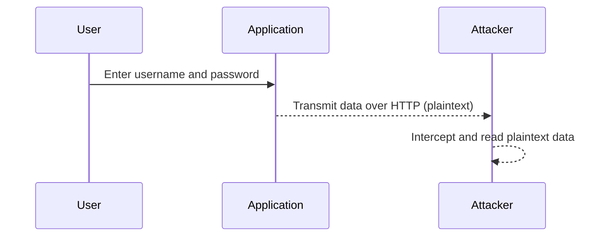
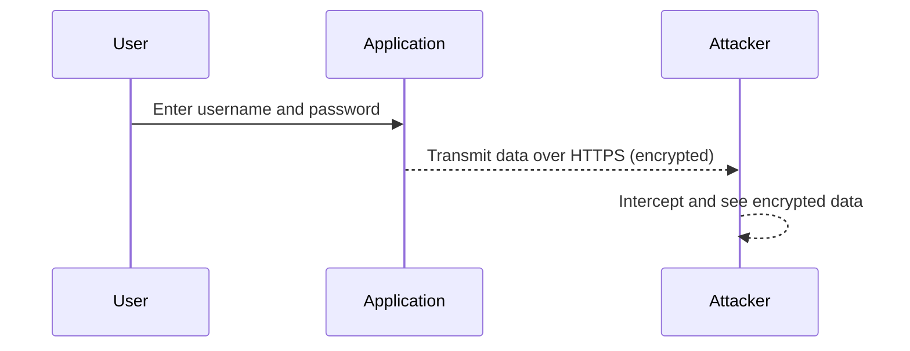

## Information Disclosure via Unencrypted Traffic

### What is Information Disclosure?

Information disclosure is a type of security vulnerability where sensitive information is unintentionally exposed to unauthorized parties. This can happen through various means, such as unencrypted network traffic, improper error handling, or insecure storage practices. In the context of web applications, information disclosure often occurs due to the transmission of sensitive data over unsecured channels, such as HTTP instead of HTTPS.

### Why Does Information Disclosure Matter?

Information disclosure poses significant risks to both individuals and organizations. When sensitive data, such as usernames, passwords, or personal information, is exposed, it can be exploited by malicious actors to gain unauthorized access to systems, steal identities, or carry out other nefarious activities. This can lead to financial losses, reputational damage, and legal consequences.

### How Does Information Disclosure Occur?

One common scenario for information disclosure is the transmission of sensitive data over unencrypted HTTP connections. Let's explore this in more detail:

#### Scenario: Logging into an Application Over HTTP

Imagine you are logging into an application that uses HTTP for communication. Here’s what happens:

1. **User Login**: You enter your username and password into the application.
2. **Traffic Interception**: An attacker intercepts the network traffic using a tool like Wireshark.
3. **Data Exposure**: The username and password are transmitted in plain text, making them easily readable by the attacker.

Here’s a detailed breakdown of the process:



In this scenario, the attacker can easily capture and read the username and password, leading to potential unauthorized access to the application.

### Example: Real-World Breach

A notable real-world example of information disclosure occurred in the Equifax breach in 2017. Hackers exploited a vulnerability in Apache Struts, which allowed them to access sensitive data, including Social Security numbers, birth dates, and addresses. This breach affected approximately 147 million people and resulted in significant financial and reputational damage.

### Secure Communication: HTTPS

To mitigate the risk of information disclosure, it is crucial to use secure communication protocols such as HTTPS. HTTPS encrypts the data being transmitted between the client and the server, ensuring that even if an attacker intercepts the traffic, they cannot read the contents.

#### Scenario: Logging into an Application Over HTTPS

Let’s revisit the previous scenario, but this time with HTTPS:

1. **User Login**: You enter your username and password into the application.
2. **Traffic Interception**: An attacker attempts to intercept the network traffic using a tool like Wireshark.
3. **Encrypted Data**: The username and password are transmitted over HTTPS, which encrypts the data. The attacker sees only encrypted gibberish.

Here’s a detailed breakdown of the process:



In this scenario, even though the attacker intercepts the traffic, they cannot read the username and password due to encryption.

### Full HTTP Request and Response Example

Let’s look at a complete HTTP request and response example to illustrate the difference between HTTP and HTTPS.

#### HTTP Request and Response

```http
GET /login HTTP/1.1
Host: example.com
User-Agent: Mozilla/5.0 (Windows NT 10.0; Win64; x64) AppleWebKit/537.36 (KHTML, like Gecko) Chrome/91.0.4472.124 Safari/537.36
Accept: text/html,application/xhtml+xml,application/xml;q=0.9,image/webp,*/*;q=0.8
Accept-Language: en-US,en;q=0.5
Accept-Encoding: gzip, deflate
Connection: keep-alive

HTTP/1.1 200 OK
Date: Mon, 27 Jul 2021 12:28:53 GMT
Server: Apache/2.4.41 (Ubuntu)
Content-Type: text/html; charset=UTF-8
Content-Length: 1234
Connection: close

<!DOCTYPE html>
<html>
<head>
<title>Login</title>
</head>
<body>
<form action="/submit_login" method="POST">
<label for="username">Username:</label>
<input type="text" id="username" name="username"><br><br>
<label for="password">Password:</label>
<input type="password" id="password" name="password"><br><br>
<input type="submit" value="Login">
</form>
</body>
</html>
```

#### HTTPS Request and Response

```http
GET /login HTTP/1.1
Host: example.com
User-Agent: Mozilla/5.0 (Windows NT 10.0; Win64; x64) AppleWebKit/537.36 (KHTML, like Gecko) Chrome/91.0.4472.124 Safari/537.36
Accept: text/html,application/xhtml+xml,application/xml;q=0.9,image/webp,*/*;q=0.8
Accept-Language: en-US,en;q=0.5
Accept-Encoding: gzip, deflate
Connection: keep-alive

HTTP/1.1 200 OK
Date: Mon, 27 Jul 2021 12:28:53 GMT
Server: Apache/2.4.41 (Ubuntu)
Content-Type: text/html; charset=UTF-8
Content-Length: 1234
Connection: close

<!DOCTYPE html>
<html>
<head>
<title>Login</title>
</head>
<body>
<form action="/submit_login" method="POST">
<label for="username">Username:</label>
<input type="text" id="username" name="username"><br><br>
<label for="password">Password:</label>
<input type="password" id="password" name="password"><br><br>
<input type="submit" value="Login">
</form>
</body>
</html>
```

### Common Pitfalls and Detection

#### Common Pitfalls

1. **Using HTTP Instead of HTTPS**: Many applications still use HTTP for communication, exposing sensitive data to interception.
2. **Improper Error Handling**: Applications that expose stack traces or detailed error messages can inadvertently disclose sensitive information.
3. **Storing Credentials in Clear Text**: Storing user credentials in clear text in databases or configuration files makes them vulnerable to exposure in case of a breach.

#### Detection

To detect information disclosure vulnerabilities, you can use tools like:

- **Wireshark**: To intercept and analyze network traffic.
- **Burp Suite**: To test for insecure communication and other web application vulnerabilities.
- **Static Code Analysis Tools**: To identify insecure coding practices that may lead to information disclosure.

### How to Prevent / Defend

#### Secure Communication

1. **Use HTTPS**: Ensure all communication between the client and the server is encrypted using HTTPS.
2. **HSTS (HTTP Strict Transport Security)**: Implement HSTS to force browsers to use HTTPS for all future connections to your site.
3. **TLS Configuration**: Use strong TLS configurations and regularly update certificates.

#### Secure Storage

1. **Hash Passwords**: Store passwords securely using strong hashing algorithms like bcrypt or Argon2.
2. **Encryption**: Encrypt sensitive data stored in databases and configuration files.
3. **Access Control**: Implement strict access controls to ensure only authorized personnel have access to sensitive data.

#### Example: Secure Storage Implementation

Here’s an example of how to securely store passwords using bcrypt in Python:

```python
import bcrypt

# Hash a password
password = b"admin123"
salt = bcrypt.gensalt()
hashed_password = bcrypt.hashpw(password, salt)

# Store the hashed password in the database
# ...

# Verify a password
input_password = b"admin123"
if bcrypt.checkpw(input_password, hashed_password):
    print("Password matches")
else:
    print("Password does not match")
```

#### Vulnerable vs. Secure Code

**Vulnerable Code**

```python
# Storing passwords in clear text
password = "admin123"
store_password_in_database(password)
```

**Secure Code**

```python
import bcrypt

# Hashing passwords before storing
password = b"admin123"
salt = bcrypt.gensalt()
hashed_password = bcrypt.hashpw(password, salt)
store_password_in_database(hashed_password)
```

### Hands-On Labs

For hands-on practice, consider the following labs:

- **PortSwigger Web Security Academy**: Offers comprehensive modules on web security, including information disclosure.
- **OWASP Juice Shop**: A deliberately insecure web application for practicing web security skills.
- **DVWA (Damn Vulnerable Web Application)**: A PHP/MySQL web application that demonstrates insecure coding practices.

These labs provide practical experience in identifying and mitigating information disclosure vulnerabilities.

### Conclusion

Information disclosure is a critical security issue that can have severe consequences. By understanding the mechanisms behind information disclosure and implementing secure communication and storage practices, you can significantly reduce the risk of sensitive data exposure. Always assume that a data breach will occur and take proactive measures to protect sensitive information.

By following the principles outlined in this guide, you can ensure that your applications are secure and resilient against information disclosure attacks.

---
<!-- nav -->
[[18-Information Disclosure in Web Applications|Information Disclosure in Web Applications]] | [[Web Security (PortSwigger)/17-Information Disclosure/01-Information Disclosure Complete Guide/00-Overview|Overview]] | [[20-Reviewing Third-Party Technology Configurations|Reviewing Third-Party Technology Configurations]]
