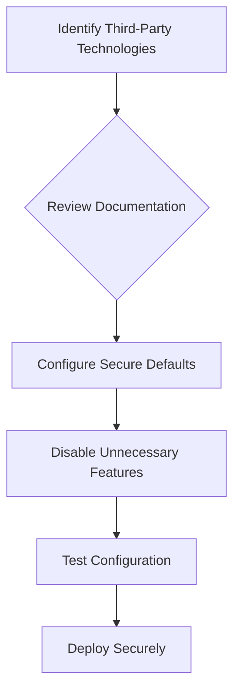

## Reviewing Third-Party Technology Configurations

### What Is Third-Party Technology?

Third-party technology refers to software components, libraries, or services provided by external vendors that are integrated into an application. These technologies can significantly enhance functionality but also introduce potential security risks if not properly configured.

### Why Review Third-Party Technology Configurations?

Reviewing third-party technology configurations is essential to ensure that only necessary features are enabled and that the application remains secure. Misconfigured third-party technologies can expose vulnerabilities that attackers can exploit.

### How to Review Configurations

Reviewing configurations involves:

- **Documentation**: Referencing the security documentation provided by the third-party vendor.
- **Default Settings**: Checking for default settings that may be insecure.
- **Unnecessary Features**: Identifying and disabling features that are not required for the application's functionality.

### Real-World Example: CVE-2020-14882

In 2020, a vulnerability (CVE-2020-14882) was discovered in the Log4j library. This vulnerability allowed attackers to execute arbitrary code by exploiting a deserialization flaw. One of the ways this vulnerability was exploited was through misconfigured Log4j settings.

#### Vulnerable Configuration Example

Consider a Log4j configuration file (`log4j.properties`) that leaves unnecessary features enabled:

```properties
log4j.rootLogger=DEBUG, stdout
log4j.appender.stdout=org.apache.log4j.ConsoleAppender
log4j.appender.stdout.Target=System.out
log4j.appender.stdout.layout=org.apache.log4j.PatternLayout
log4j.appender.stdout.layout.ConversionPattern=%d{ABSOLUTE} %5p %c{1}:%L - %m%n
```

#### Secure Configuration Example

To prevent such vulnerabilities, ensure that only necessary features are enabled:

```properties
log4j.rootLogger=WARN, stdout
log4j.appender.stdout=org.apache.log4j.ConsoleAppender
log4j.appappender.stdout.Target=System.out
log4j.appender.stdout.layout=org.apache.log4j.PatternLayout
log4j.appender.stdout.layout.ConversionPattern=%d{ABSOLUTE} %5p %c{1}:%L - %m%n
```

### How to Prevent / Defend

**Detection**:
- **Vulnerability Scanners**: Use vulnerability scanners to identify misconfigured third-party technologies.
- **Dependency Checkers**: Utilize tools like OWASP Dependency-Check to identify vulnerable dependencies.

**Prevention**:
- **Secure Defaults**: Ensure that third-party technologies are configured with secure defaults.
- **Regular Updates**: Keep third-party technologies up-to-date with the latest security patches.

### Mermaid Diagram: Secure Configuration Workflow



---
<!-- nav -->
[[19-Information Disclosure via Unencrypted Traffic|Information Disclosure via Unencrypted Traffic]] | [[Web Security (PortSwigger)/17-Information Disclosure/01-Information Disclosure Complete Guide/00-Overview|Overview]] | [[21-Transmitting Sensitive Information in Clear Text|Transmitting Sensitive Information in Clear Text]]
