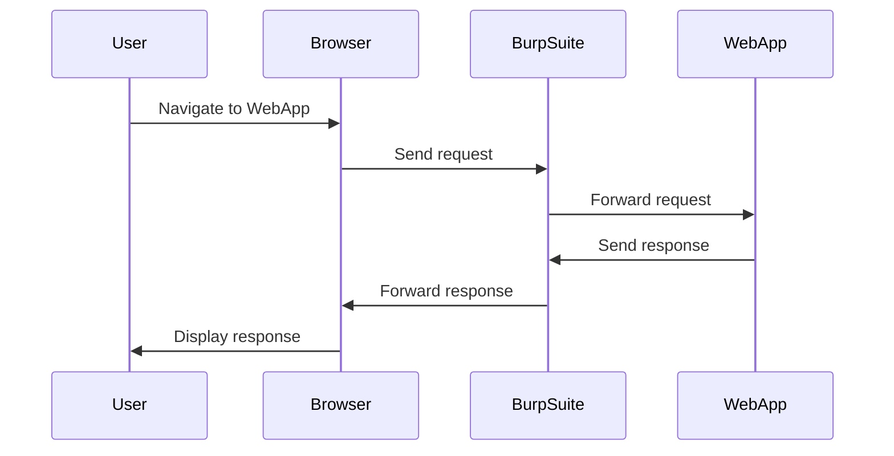

## Understanding Sensitive Data and Information Disclosure

### What is Sensitive Data?

Sensitive data refers to any information that, if disclosed, could cause harm to individuals, organizations, or systems. This includes personal identifiable information (PII), financial details, intellectual property, and other confidential data. Identifying sensitive data is crucial because unauthorized access or exposure can lead to significant consequences such as identity theft, financial loss, and reputational damage.

### Why is Recognizing Sensitive Data Important?

Recognizing sensitive data is essential for several reasons:

1. **Security**: Ensuring that sensitive data is protected helps prevent unauthorized access and misuse.
2. **Compliance**: Many regulations, such as GDPR, HIPAA, and CCPA, mandate the protection of sensitive data. Non-compliance can result in hefty fines and legal repercussions.
3. **Trust**: Protecting sensitive data builds trust between organizations and their customers, partners, and stakeholders.

### How to Identify Sensitive Data

Identifying sensitive data requires a thorough understanding of the types of data your organization handles and the context in which it is used. Here are some common categories of sensitive data:

- **Personal Identifiable Information (PII)**: Names, addresses, social security numbers, driver’s license numbers, etc.
- **Financial Information**: Credit card numbers, bank account details, transaction records, etc.
- **Health Information**: Medical records, diagnoses, treatment plans, etc.
- **Intellectual Property**: Trade secrets, patents, proprietary software, etc.
- **Internal Data**: Employee records, internal communications, strategic plans, etc.

### Real-World Examples of Information Disclosure Vulnerabilities

#### Example 1: CVE-2021-21972 (Microsoft Exchange Server)

In March 2021, Microsoft Exchange Server was found to have multiple vulnerabilities, including information disclosure. Attackers could exploit these vulnerabilities to gain access to sensitive data stored within the server. This led to widespread attacks and data breaches.

**Impact**: Organizations using Microsoft Exchange Server were at risk of having their email data exposed, leading to potential identity theft and financial losses.

#### Example 2: LinkedIn Information Disclosure

In 2019, LinkedIn suffered an information disclosure vulnerability that allowed attackers to access users’ private messages. This breach exposed sensitive personal and professional information, causing significant concern among users.

**Impact**: Users had to change their passwords and take additional security measures to protect their accounts. LinkedIn faced public scrutiny and a loss of trust from its user base.

### Mapping the Application

Mapping the application is a critical step in identifying potential information disclosure vulnerabilities. This involves visiting all the different pages in the application and going through all the workflows while intercepting and reviewing all the requests and responses in an intercepting proxy like Burp Suite.

### Using Burp Suite for Interception

Burp Suite is a popular tool used by security professionals to test web applications for vulnerabilities. Here’s how you can use it to intercept and review requests and responses:

1. **Install and Configure Burp Suite**: Download and install Burp Suite from the official website. Configure it to work as a proxy by setting up the browser to route traffic through Burp.

2. **Intercept Traffic**: Enable interception in Burp Suite. This will allow you to view and modify HTTP requests and responses.

3. **Review Requests and Responses**: As you navigate through the application, Burp Suite will capture all HTTP requests and responses. Review these to identify any patterns or anomalies that might indicate information disclosure.

### Example of Intercepting and Reviewing Traffic



### Common Patterns of Information Disclosure

Information disclosure often occurs due to design flaws or coding errors. Here are some common patterns:

1. **Error Messages**: Error messages can reveal sensitive information about the underlying system. For example, a login page might display different error messages based on whether the username or password is incorrect.

2. **Debugging Information**: Debugging information left in production code can expose sensitive data. This includes stack traces, database queries, and configuration settings.

3. **HTTP Headers**: HTTP headers can contain sensitive information such as cookies, authentication tokens, and server details.

4. **API Endpoints**: API endpoints might return more data than necessary, exposing sensitive information to unauthorized users.

### Example of Error Message Disclosure

Consider a login page that displays different error messages based on the input provided:

```http
POST /login HTTP/1.1
Host: example.com
Content-Type: application/x-www-form-urlencoded

username=admin&password=wrongpassword
```

Response:

```http
HTTP/1.1 401 Unauthorized
Content-Type: text/html

<p>Incorrect password</p>
```

This error message reveals that the username is correct but the password is incorrect, which can help an attacker customize their attack.

### How to Prevent / Defend Against Information Disclosure

#### Detection

To detect information disclosure vulnerabilities, you can use tools like Burp Suite, OWASP ZAP, and static/dynamic analysis tools. Regularly review logs and monitor network traffic for unusual patterns.

#### Prevention

1. **Secure Coding Practices**: Follow secure coding practices to avoid exposing sensitive data. Use parameterized queries, sanitize inputs, and avoid hardcoding sensitive information.

2. **Error Handling**: Implement generic error messages that do not reveal specific details about the underlying system. For example, instead of displaying "Incorrect password," display "Invalid credentials."

3. **HTTP Headers**: Secure HTTP headers by setting appropriate flags such as `X-Frame-Options`, `Content-Security-Policy`, and `Strict-Transport-Security`.

4. **Access Control**: Ensure proper access control mechanisms are in place to restrict access to sensitive data. Use role-based access control (RBAC) and least privilege principles.

#### Secure Code Fix Example

**Vulnerable Code**:

```python
@app.route('/login', methods=['POST'])
def login():
    username = request.form['username']
    password = request.form['password']
    user = User.query.filter_by(username=username).first()
    if user and user.password == password:
        return "Login successful"
    else:
        if user:
            return "Incorrect password"
        else:
            return "Incorrect username"
```

**Fixed Code**:

```python
@app.route('/login', methods=['POST'])
def login():
    username = request.form['username']
    password = request.form['password']
    user = User.query.filter_by(username=username).first()
    if user and user.password == password:
        return "Login successful"
    else:
        return "Invalid credentials"
```

### Conclusion

Understanding and identifying sensitive data is crucial for preventing information disclosure vulnerabilities. By mapping the application and using tools like Burp Suite, you can effectively detect and mitigate these risks. Following secure coding practices and implementing proper access controls are key to protecting sensitive data and maintaining the integrity of your application.

### Practice Labs

For hands-on practice in identifying and mitigating information disclosure vulnerabilities, consider the following labs:

- **PortSwigger Web Security Academy**: Offers interactive labs covering various web security topics, including information disclosure.
- **OWASP Juice Shop**: A deliberately insecure web application for practicing web security skills.
- **DVWA (Damn Vulnerable Web Application)**: A PHP/MySQL web application that demonstrates web application vulnerabilities.

These labs provide practical experience in identifying and fixing information disclosure vulnerabilities, helping you build a strong foundation in web security.

---
<!-- nav -->
[[21-Transmitting Sensitive Information in Clear Text|Transmitting Sensitive Information in Clear Text]] | [[Web Security (PortSwigger)/17-Information Disclosure/01-Information Disclosure Complete Guide/00-Overview|Overview]] | [[23-Using Insecure Hashing Algorithms|Using Insecure Hashing Algorithms]]
