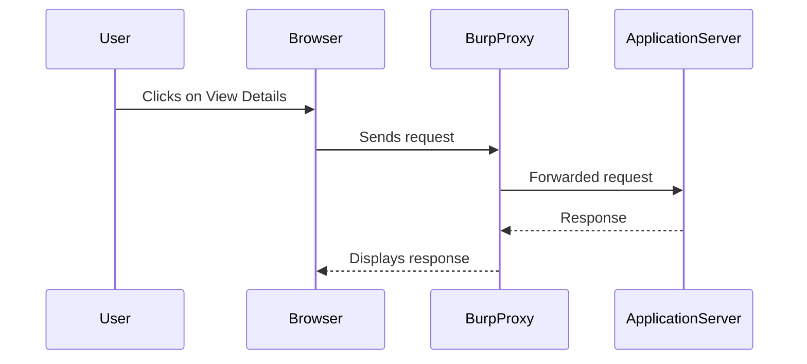

## Introduction to Information Disclosure via Error Messages

Information disclosure vulnerabilities occur when sensitive information about a system or application is inadvertently exposed to unauthorized users. One common form of information disclosure is through error messages. These errors can reveal critical details such as version numbers, file paths, database schemas, and even internal IP addresses. Such disclosures can provide attackers with valuable insights into the underlying architecture and potential vulnerabilities, making it easier for them to craft targeted attacks.

In this chapter, we will delve deep into the topic of information disclosure via error messages, focusing on a specific lab exercise from the PortSwigger Web Security Academy. We will cover the theoretical background, practical steps to identify and exploit such vulnerabilities, and most importantly, how to prevent and defend against these issues.

### Background Theory

#### What is Information Disclosure?

Information disclosure occurs when an application unintentionally reveals sensitive data that should remain confidential. This can happen due to various reasons, including:

- **Improper error handling**: Applications may expose detailed error messages that contain sensitive information.
- **Logging mechanisms**: Logs might contain sensitive data that can be accessed by unauthorized users.
- **Debugging features**: Debugging tools and features can inadvertently expose internal details.
- **Configuration files**: Misconfigured files might be accessible to unauthorized users.

#### Why Does Information Disclosure Matter?

Information disclosure can lead to several serious consequences:

- **Reconnaissance**: Attackers can gather detailed information about the system, which can help them plan more sophisticated attacks.
- **Exploitation**: Knowing the version of a framework or library used by an application can allow attackers to exploit known vulnerabilities.
- **Data leakage**: Sensitive data like user credentials, financial information, or personal details can be leaked, leading to significant privacy violations.

### Real-World Examples

#### Recent CVEs and Breaches

Several high-profile breaches have been linked to information disclosure vulnerabilities:

- **CVE-2021-21972**: A vulnerability in Microsoft Exchange Server allowed attackers to disclose sensitive information, including server configurations and internal IP addresses.
- **Equifax Data Breach (2017)**: The breach was partly due to a vulnerability in Apache Struts, which allowed attackers to gain access to sensitive data.

These examples highlight the importance of securing applications against information disclosure.

### Lab Exercise: Information Disclosure and Error Messages

In this lab, we will explore how to exploit a vulnerability in an application that exposes sensitive information through error messages. Specifically, we will focus on extracting the version number of a third-party framework used by the application.

#### Setup and Environment

To begin, ensure you have an account on the PortSwigger Web Security Academy. You can sign up at [PortSwigger.net/Web Security](https://portswigger.net/web-security).

Once logged in, navigate to the "Academy" section, select "All Labs," and search for "information disclosure labs." Select the lab titled "Information Disclosure and Error Messages."

### Identifying Parameters and Requests

The first step is to understand the application's behavior and identify any parameters that interact with the backend.



#### Analyzing the Request

When you click on "View Details," the application sends a request to the server. Let's analyze this request:

```http
GET /product?productId=1 HTTP/1.1
Host: vulnerable-app.example.com
User-Agent: Mozilla/5.0 (Windows NT 10.0; Win64; x64) AppleWebKit/537.36 (KHTML, like Gecko) Chrome/91.0.4472.124 Safari/537.36
Accept: text/html,application/xhtml+xml,application/xml;q=0.9,image/avif,image/webp,image/apng,*/*;q=0.8,application/signed-exchange;v=b3;q=0.9
Accept-Language: en-US,en;q=0.9
Cookie: session=abc123
Connection: close
```

#### Analyzing the Response

The server responds with the following:

```http
HTTP/1.1 200 OK
Date: Mon, 20 Jun 2022 14:30:00 GMT
Server: Apache/2.4.41 (Ubuntu)
Content-Type: text/html; charset=UTF-8
Content-Length: 1234
Connection: close

<!DOCTYPE html>
<html>
<head>
    <title>Product Details</title>
</head>
<body>
    <h1>Product Details</h1>
    <p>Product ID: 1</p>
    <p>Name: Example Product</p>
    <p>Description: This is an example product.</p>
</body>
</html>
```

### Exploiting the Vulnerability

Our goal is to trigger an error condition that will cause the application to output a stack trace containing the version number of the third-party framework.

#### Triggering an Error Condition

One way to trigger an error is to manipulate the `productId` parameter. Let's try setting it to a non-existent value:

```http
GET /product?productId=9999 HTTP/1.1
Host: vulnerable-app.example.com
User-Agent: Mozilla/5.0 (Windows NT 10.0; Win64; x64) AppleWebKit/537.36 (KHTML, like Gecko) Chrome/91.0.4472.124 Safari/537.36
Accept: text/html,application/xhtml+xml,application/xml;q=0.9,image/avif,image/webp,image/apng,*/*;q=0.8,application/signed-exchange;v=b3;q=0.9
Accept-Language: en-US,en;q=0.9
Cookie: session=abc123
Connection: close
```

#### Analyzing the Error Response

If the application is vulnerable, it might respond with a detailed error message:

```http
HTTP/1.1 500 Internal Server Error
Date: Mon, 20 Jun 2022 14:30:00 GMT
Server: Apache/2.4.41 (Ubuntu)
Content-Type: text/html; charset=UTF-8
Content-Length: 1234
Connection: close

<!DOCTYPE html>
<html>
<head>
    <title>Error</title>
</head>
<body>
    <h1>An error occurred</h1>
    <pre>
        Traceback (most recent call last):
          File "/usr/local/lib/python3.8/dist-packages/framework-1.2.3/lib/module.py", line 45, in get_product
            product = db.query("SELECT * FROM products WHERE id=%s", (productId,))
          File "/usr/local/lib/python3.8/dist-packages/framework-1.2.3/lib/db.py", line 123, in query
            raise DatabaseError("No such product")
        DatabaseError: No such product
    </pre>
</body>
</html>
```

Notice the stack trace includes the version number `framework-1.2.3`.

### How to Prevent / Defend

#### Detection

To detect information disclosure vulnerabilities, you can:

- **Automated scanning**: Use tools like Burp Suite, OWASP ZAP, or commercial scanners to identify potential leaks.
- **Manual testing**: Perform manual tests to check for detailed error messages, sensitive data in logs, and other potential leaks.

#### Prevention

To prevent information disclosure, follow these best practices:

- **Error handling**: Ensure that error messages are generic and do not reveal internal details.
- **Logging**: Securely configure logging to avoid exposing sensitive data.
- **Version management**: Keep all frameworks and libraries up to date to mitigate known vulnerabilities.
- **Secure coding**: Implement secure coding practices to minimize the risk of information disclosure.

#### Secure Coding Fixes

Here’s an example of how to securely handle errors:

**Vulnerable Code:**

```python
def get_product(productId):
    try:
        product = db.query("SELECT * FROM products WHERE id=%s", (productId,))
    except Exception as e:
        return str(e)
```

**Secure Code:**

```python
def get_product(productId):
    try:
        product = db.query("SELECT * FROM products WHERE id=%s", (productId,))
    except Exception as e:
        logging.error(f"Error fetching product {productId}: {str(e)}")
        return "An error occurred while fetching the product."
```

### Conclusion

Information disclosure via error messages is a critical vulnerability that can significantly compromise the security of an application. By understanding the underlying principles, identifying potential leaks, and implementing robust defensive measures, you can protect your applications from such risks.

### Practice Labs

For hands-on practice, consider the following labs:

- **PortSwigger Web Security Academy**: Offers a variety of labs related to information disclosure and error handling.
- **OWASP Juice Shop**: Provides a vulnerable web application for practicing various security techniques.
- **DVWA (Damn Vulnerable Web Application)**: Another popular platform for learning web security concepts.

By engaging with these labs, you can deepen your understanding and hone your skills in detecting and preventing information disclosure vulnerabilities.

---
<!-- nav -->
[[01-Introduction to Information Disclosure in Error Messages|Introduction to Information Disclosure in Error Messages]] | [[Web Security (PortSwigger)/17-Information Disclosure/02-Lab 1 Information disclosure in error messages/00-Overview|Overview]] | [[03-Information Disclosure in Error Messages|Information Disclosure in Error Messages]]
