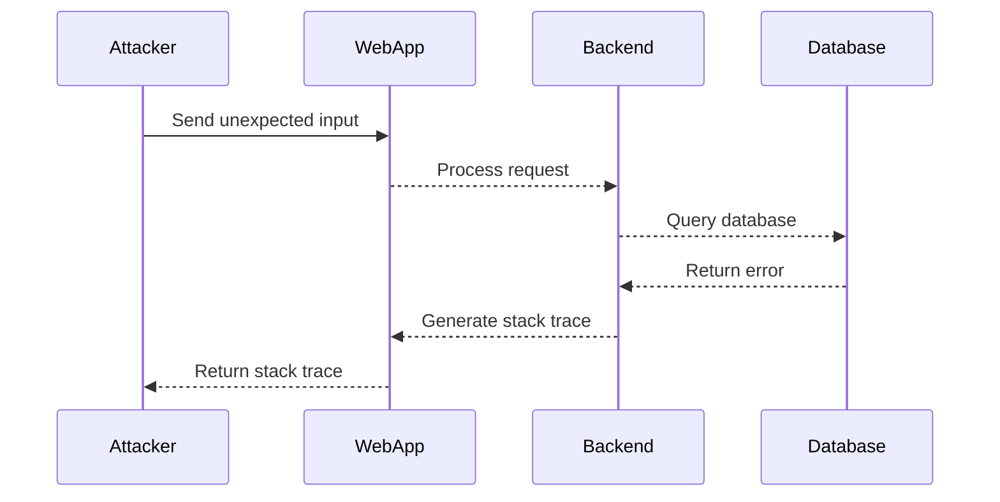
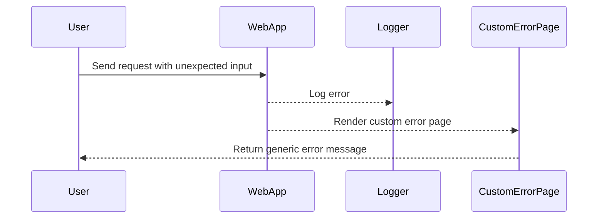

## Information Disclosure in Error Messages

### Background Theory

Information disclosure vulnerabilities occur when sensitive information is inadvertently exposed to unauthorized users. This can happen through various means, such as error messages, debug logs, or even comments in source code. In the context of web applications, one common form of information disclosure is through error messages that reveal details about the underlying technology stack or configuration.

When a web application encounters an unexpected input, it may generate an error message. If the application is not properly configured to handle errors gracefully, it might expose detailed stack traces or other sensitive information. This information can be used by attackers to tailor their attacks more effectively, as they gain insights into the specific technologies and versions being used.

### Understanding the Vulnerability

#### What is Information Disclosure?

Information disclosure occurs when sensitive data is unintentionally revealed to unauthorized parties. In the context of web applications, this can include:

- **Stack Traces**: Detailed error messages that reveal the internal workings of the application.
- **Configuration Details**: Information about the application's configuration, such as database connection strings.
- **Source Code**: Portions of the application's source code that are accidentally exposed.

#### Why Does Information Disclosure Matter?

Information disclosure can provide attackers with valuable insights into the application's architecture and technology stack. This knowledge can be used to:

- Identify specific vulnerabilities associated with certain versions of software.
- Craft targeted attacks that exploit known weaknesses.
- Gain a deeper understanding of the application's structure, making it easier to find additional vulnerabilities.

### Real-World Examples

#### CVE-2017-5638: Apache Struts 2.3.x

In 2017, a critical vulnerability was discovered in Apache Struts 2.3.x, specifically in versions up to 2.3.34. This vulnerability, known as CVE-2017-5638, allowed attackers to execute arbitrary code on the server. One of the ways this vulnerability was exploited was through information disclosure via error messages.

**Example Scenario:**

An attacker sends a specially crafted request to a web application using Apache Struts 2.3.31. The application returns a detailed stack trace, revealing the exact version of Struts being used. The attacker then uses this information to target the specific vulnerability in that version.

```http
POST /struts2-showcase/index.action HTTP/1.1
Host: vulnerable.example.com
Content-Type: application/x-www-form-urlencoded

foo=%{(#context['com.opensymphony.xwork2.dispatcher.HttpServletResponse'].addHeader('result','multipart/form-data')).(multipart/form-data)}
```

**Response:**

```http
HTTP/1.1 500 Internal Server Error
Date: Tue, 14 Mar 2017 12:34:56 GMT
Server: Apache-Coyote/1.1
Content-Type: text/html;charset=utf-8
Content-Length: 1024
Connection: close

<stacktrace>
...
Caused by: java.lang.RuntimeException: %{(#context['com.opensymphony.xwork2.dispatcher.HttpServletResponse'].addHeader('result','multipart/form-data')).(multipart/form-data)}
...
</stacktrace>
```

The stack trace reveals the exact version of Struts being used, allowing the attacker to exploit the known vulnerability.

### How to Exploit Information Disclosure

To exploit information disclosure, an attacker typically follows these steps:

1. **Identify Unexpected Input**: Find inputs that the application does not expect or handle correctly.
2. **Trigger an Error**: Send the unexpected input to the application, causing it to generate an error.
3. **Analyze the Response**: Examine the error message for any sensitive information.
4. **Tailor Attacks**: Use the disclosed information to craft targeted attacks.

### Example Exploitation

Let's walk through an example of how an attacker might exploit information disclosure in error messages.

#### Step 1: Identify Unexpected Input

Suppose we have a web application that expects an integer input but allows string input as well. We can send a string input to trigger an error.

#### Step 2: Trigger an Error

We send a request with an unexpected input to the application.

```http
GET /api/data?param="unexpected_input" HTTP/1.1
Host: vulnerable.example.com
```

#### Step 3: Analyze the Response

The application responds with an internal server error and a detailed stack trace.

```http
HTTP/1.1 500 Internal Server Error
Date: Tue, 14 Mar 2023 12:34:56 GMT
Server: Apache/2.4.41 (Ubuntu)
Content-Type: text/html; charset=UTF-8
Content-Length: 1024
Connection: close

<!DOCTYPE html>
<html lang="en">
<head>
    <meta charset="UTF-8">
    <title>Error</title>
</head>
<body>
    <h1>Internal Server Error</h1>
    <pre>
        java.lang.NumberFormatException: For input string: "unexpected_input"
            at java.lang.NumberFormatException.forInputString(NumberFormatException.java:65)
            at java.lang.Integer.parseInt(Integer.java:580)
            at java.lang.Integer.parseInt(Integer.java:615)
            at com.example.app.Controller.handleRequest(Controller.java:42)
            ...
    </pre>
</body>
</html>
```

#### Step 4: Tailor Attacks

From the stack trace, we can see that the application is using Java and the specific version of the library. We can use this information to search for known vulnerabilities in that version and tailor our attacks accordingly.

### How to Prevent / Defend Against Information Disclosure

#### Detection

To detect information disclosure vulnerabilities, you can:

- **Automated Scanning**: Use tools like Burp Suite, OWASP ZAP, or commercial scanners to identify potential information leaks.
- **Logging Analysis**: Monitor logs for unexpected error messages that might contain sensitive information.
- **Code Review**: Conduct regular code reviews to ensure that error handling is properly implemented.

#### Prevention

To prevent information disclosure, follow these best practices:

1. **Proper Error Handling**: Ensure that error messages are generic and do not reveal sensitive information.
2. **Disable Stack Traces**: Disable stack traces in production environments.
3. **Use Custom Error Pages**: Implement custom error pages that do not expose internal details.
4. **Sanitize Inputs**: Validate and sanitize all user inputs to prevent unexpected behavior.

#### Secure Coding Fixes

Here is an example of how to implement proper error handling in a Java application:

**Vulnerable Code:**

```java
public class Controller {
    public void handleRequest(String param) {
        int value = Integer.parseInt(param);
        // Further processing
    }
}
```

**Secure Code:**

```java
public class Controller {
    public void handleRequest(String param) {
        try {
            int value = Integer.parseInt(param);
            // Further processing
        } catch (NumberFormatException e) {
            // Log the error without exposing sensitive information
            logger.error("Invalid input: {}", param);
            throw new BadRequestException("Invalid input");
        }
    }
}
```

### Complete Example with HTTP Request and Response

#### Vulnerable Configuration

**HTTP Request:**

```http
GET /api/data?param="unexpected_input" HTTP/1.1
Host: vulnerable.example.com
```

**HTTP Response:**

```http
HTTP/1.1 500 Internal Server Error
Date: Tue, 14 Mar 2023 12:34:56 GMT
Server: Apache/2.4.41 (Ubuntu)
Content-Type: text/html; charset=UTF-8
Content-Length: 1024
Connection: close

<!DOCTYPE html>
<html lang="en">
<head>
    <meta charset="UTF-8">
    <title>Error</title>
</head>
<body>
    <h1>Internal Server Error</h1>
    <pre>
        java.lang.NumberFormatException: For input string: "unexpected_input"
            at java.lang.NumberFormatException.forInputString(NumberFormatException.java:65)
            at java.lang.Integer.parseInt(Integer.java:580)
            at java.lang.Integer.parseInt(Integer.java:615)
            at com.example.app.Controller.handleRequest(Controller.java:42)
            ...
    </pre>
</body>
</html>
```

#### Secure Configuration

**HTTP Request:**

```http
GET /api/data?param="unexpected_input" HTTP/1.1
Host: secure.example.com
```

**HTTP Response:**

```http
HTTP/1.1 400 Bad Request
Date: Tue, 14 Mar 2023 12:34:56 GMT
Server: Apache/2.4.41 (Ubuntu)
Content-Type: application/json
Content-Length: 56
Connection: close

{
    "error": "Bad Request",
    "message": "Invalid input"
}
```

### Mermaid Diagrams

#### Attack Chain Diagram



#### Error Handling Flow



### Practice Labs

For hands-on practice with information disclosure vulnerabilities, consider the following labs:

- **PortSwigger Web Security Academy**: Offers a variety of labs focused on different types of web security vulnerabilities, including information disclosure.
- **OWASP Juice Shop**: A deliberately insecure web application that includes several information disclosure vulnerabilities.
- **DVWA (Damn Vulnerable Web Application)**: Another intentionally vulnerable web application that can be used to practice identifying and exploiting information disclosure vulnerabilities.

By thoroughly understanding and practicing the concepts covered in this chapter, you will be better equipped to identify and mitigate information disclosure vulnerabilities in web applications.

---
<!-- nav -->
[[02-Introduction to Information Disclosure via Error Messages|Introduction to Information Disclosure via Error Messages]] | [[Web Security (PortSwigger)/17-Information Disclosure/02-Lab 1 Information disclosure in error messages/00-Overview|Overview]] | [[Web Security (PortSwigger)/17-Information Disclosure/02-Lab 1 Information disclosure in error messages/04-Practice Questions & Answers|Practice Questions & Answers]]
