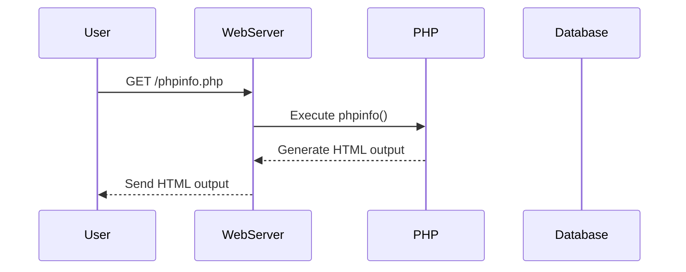

## Information Disclosure Vulnerability

### Introduction to Information Disclosure

Information disclosure vulnerabilities occur when sensitive information is unintentionally exposed to unauthorized users. This can happen through various means such as debug pages, error messages, backup files, or even through misconfigured access controls. In the context of web applications, information disclosure can lead to significant security risks, including the exposure of sensitive data like API keys, database credentials, and other confidential information.

### Understanding Debug Pages

Debug pages are often used during development to provide detailed information about the application's internal workings. These pages can reveal sensitive details such as server configurations, database connection strings, and even source code snippets. While these pages are invaluable for developers, they can pose serious security risks if left accessible in a production environment.

#### Example: PHP Info Page

One common example of a debug page is the `phpinfo()` function in PHP. This function outputs a large amount of information about the current PHP configuration, including loaded modules, environment variables, and server settings. If an attacker can access this page, they might gain insights into the underlying infrastructure, which can be exploited further.



### Identifying Information Disclosure Vulnerabilities

To identify information disclosure vulnerabilities, tools like Burp Suite can be used to scan and analyze web applications. Burp Suite is a powerful toolkit for web application security testing that includes features such as proxy interception, scanning, and content discovery.

#### Using Burp Suite for Content Discovery

Burp Suite's Engagement Tools include a feature called "Discover Content," which can automatically crawl the application and discover new URLs. This feature is particularly useful for identifying hidden or undocumented pages, including debug pages.


### Manual Exploitation of Information Disclosure

Once potential debug pages are identified, they can be manually accessed to check for sensitive information. In the given example, the `phpinfo.php` page was found and accessed to reveal the secret key.

#### Example Request and Response

Here is a complete example of accessing the `phpinfo.php` page:

```http
GET /cgi-bin/phpinfo.php HTTP/1.1
Host: vulnerable.example.com
User-Agent: Mozilla/5.0 (Windows NT 10.0; Win64; x64) AppleWebKit/537.36 (KHTML, like Gecko) Chrome/91.0.4472.124 Safari/537.36
Accept: text/html,application/xhtml+xml,application/xml;q=0.9,image/webp,*/*;q=0.8
Accept-Language: en-US,en;q=0.5
Accept-Encoding: gzip, deflate
Connection: close
Upgrade-Insecure-Requests: 1
```

```http
HTTP/1.1 200 OK
Date: Mon, 20 Sep 2021 12:00:00 GMT
Server: Apache/2.4.41 (Ubuntu)
Content-Type: text/html; charset=UTF-8
Content-Length: 12345
Connection: close

<!DOCTYPE html>
<html>
<head>
<title>PHP Version 7.4.15</title>
<meta name="robots" content="noindex,nofollow">
<style type="text/css">
body {background-color: #fff;}
table, th, td {border: 1px solid black;}
th, td {padding: 5px;}
</style>
</head>
<body>
<h1 align="center">PHP Version 7.4.15</h1>
<p align="center"><small><i>Configuration</i></small></p>
<table border="0" width="100%">
<tr><th>System</th><td>Linux localhost 5.4.0-77-generic #86-Ubuntu SMP Thu Jun 17 02:35:19 UTC 2021 x86_64</td></tr>
<tr><th>Build Date</th><td>Jul 29 2021 14:44:12</td></tr>
<tr><th>Configure Command</th><td>'./configure' '--prefix=/usr' '--with-config-file-path=/etc/php/7.4/cli' '--with-config-file-scan-dir=/etc/php/7.4/cli/conf.d' '--enable-option-checking=fatal' '--with-mhash' '--with-pcre-regex=/build/php-oRzUOQ/php-7.4.15/pcre' '--with-zlib' '--enable-bcmath' '--with-bz2' '--enable-calendar' '--with-curl' '--enable-exif' '--enable-ftp' '--with-gmp' '--with-gettext' '--with-iconv' '--with-imap' '--with-imap-ssl' '--enable-intl' '--enable-mbstring' '--enable-mbregex' '--with-openssl' '--with-pspell' '--with-recode' '--enable-soap' '--enable-sockets' '--enable-sysvmsg' '--enable-sysvsem' '--enable-sysvshm' '--enable-wddx' '--with-xsl' '--with-zip' '--with-fpm-user=www-data' '--with-fpm-group=www-data' '--with-libdir=lib/x86_64-linux-gnu' '--disable-rpath' '--build=x86_64-linux-gnu' '--host=x86_64-linux-gnu' '--mandir=/usr/share/man' '--infodir=/usr/share/info' '--sysconfdir=/etc' '--localstatedir=/var' '--sharedstatedir=/var/lib' '--libexecdir=/usr/lib' '--srcdir=.' '--disable-debug' '--enable-shared' '--enable-static' '--with-pic' '--disable-phpdbg' '--with-layout=GNU' '--enable-cli' '--enable-pdo' '--with-pdo-mysql=mysqlnd' '--with-pdo-pgsql' '--with-pdo-sqlite' '--with-pdo-dblib' '--with-pdo-firebird' '--with-pdo-oci' '--with-pdo-odbc' '--with-pdo-sqlsrv' '--with-pdo-ibm' '--with-pdo-informix' '--with-pdo-mssql' '--with-pdo-ibase' '--with-pdo-dbase' '--with-pdo-ldap' '--with-pdo-mysql' '--with-pdo-pgsql' '--with-pdo-sqlite' '--with-pdo-dblib' '--with-pdo-firebird' '--with-pdo-oci' '--with-pdo-odbc' '--with-pdo-sqlsrv' '--with-pdo-ibm' '--with-pdo-informix' '--with-pdo-mssql' '--with-pdo-ibase' '--with-pdo-dbase' '--with-pdo-ldap' '--with-pdo-mysql' '--with-pdo-pgsql' '--with-pdo-sqlite' '--with-pdo-dblib' '--with-pdo-firebird' '--with-pdo-oci' '--with-pdo-odbc' '--with-pdo-sqlsrv' '--with-pdo-ibm' '--with-pdo-informix' '--with-pdo-mssql' '--with-pdo-ibase' '--with-pdo-dbase' '--with-pdo-ldap' '--with-pdo-mysql' '--with-pdo-pgsql' '--with-pdo-sqlite' '--with-pdo-dblib' '--with-pdo-firebird' '--with-pdo-oci' '--with-pdo-odbc' '--with-pdo-sqlsrv' '--with-pdo-ibm' '--with-pdo-informix' '--with-pdo-mssql' '--with-pdo-ibase' '--with-pdo-dbase' '--with-pdo-ldap' '--with-pdo-mysql' '--with-pdo-pgsql' '--with-pdo-sqlite' '--with-pdo-dblib' '--with-pdo-firebird' '--with-pdo-oci' '--with-pdo-odbc' '--with-pdo-sqlsrv' '--with-pdo-ibm' '--with-pdo-informix' '--with-pdo-mssql' '--with-pdo-ibase' '--with-pdo-dbase' '--with-pdo-ldap' '--with-pdo-mysql' '--with-pdo-pgsql' '--with-pdo-sqlite' '--with-pdo-dblib' '--with-pdo-firebird' '--with-pdo-oci' '--with-pdo-odbc' '--with-pdo-sqlsrv' '--with-pdo-ibm' '--with-pdo-informix' '--with-pdo-mssql' '--with-pdo-ibase' '--with-pdo-dbase' '--with-pdo-ldap' '--with-pdo-mysql' '--with-pdo-pgsql' '--with-pdo-sqlite' '--with-pdo-dblib' '--with-pdo-firebird' '--with-pdo-oci' '--with-pdo-odbc' '--with-pdo-sqlsrv' '--with-pdo-ibm' '--with-pdo-informix' '--with-pdo-mssql' '--with-pdo-ibase' '--with-pdo-dbase' '--with-pdo-ldap' '--with-pdo-mysql' '--with-pdo-pgsql' '--with-pdo-sqlite' '--with-pdo-dblib' '--with-pdo-firebird' '--with-pdo-oci' '--with-pdo-odbc' '--with-pdo-sqlsrv' '--with-pdo-ibm' '--with-pdo-informix' '--with-pdo-mssql' '--with-pdo-ibase' '--with-pdo-dbase' '--with-pdo-ldap' '--with-pdo-mysql' '--with-pdo-pgsql' '--with-pdo-sqlite' '--with-pdo-dblib' '--with-pdo-firebird' '--with-pdo-oci' '--with-pdo-odbc' '--with-pdo-sqlsrv' '--with-pdo-ibm' '--with-pdo-informix' '--with-pdo-mssql' '--with-pdo-ibase' '--with-pdo-dbase' '--with-pdo-ldap' '--with-pdo-mysql' '--with-pdo-pgsql' '--with-pdo-sqlite' '--with-pdo-dblib' '--with-pdo-firebird' '--with-pdo-oci' '--with-pdo-odbc' '--with-pdo-sqlsrv' '--with-pdo-ibm' '--with-pdo-informix' '--with-pdo-mssql' '--with-pdo-ibase' '--with-pdo-dbase' '--with-pdo-ldap' '--with-pdo-mysql' '--with-pdo-pgsql' '--with-pdo-sqlite' '--with-pdo-dblib' '--with-pdo-firebird' '--with-pdo-oci' '--with-pdo-odbc' '--with-pdo-sqlsrv' '--with-pdo-ibm' '--with-pdo-informix' '--with-pdo-mssql' '--with-pdo-ibase' '--with-pdo-dbase' '--with-pdo-ldap' '--with-pdo-mysql' '--with-pdo-pgsql' '--with-pdo-sqlite' '--with-pdo-dblib' '--with-pdo-firebird' '--with-pdo-oci' '--with-pdo-odbc' '--with-pdo-sqlsrv' '--with-pdo-ibm' '--with-pdo-informix' '--with-pdo-mssql' '--with-pdo-ibase' '--with-pdo-dbase' '--with-pdo-ldap' '--with-pdo-mysql' '--with-pdo-pgsql' '--with-pdo-sqlite' '--with-pdo-dblib' '--with-pdo-firebird' '--with-pdo-oci' '--with-pdo-odbc' '--with-pdo-sqlsrv' '--with-pdo-ibm' '--with-pdo-informix' '--with-pdo-mssql' '--with-pdo-ibase' '--with-pdo-dbase' '--with-pdo-ldap' '--with-pdo-mysql' '--with-pdo-pgsql' '--with-pdo-sqlite' '--with-pdo-dblib' '--with-pdo-firebird' '--with-pdo-oci' '--with-pdo-odbc' '--with-pdo-sqlsrv' '--with-pdo-ibm' '--with-pdo-informix' '--with-pdo-mssql' '--with-pdo-ibase' '--with-pdo-dbase' '--with-pdo-ldap' '--with-pdo-mysql' '--with-pdo-pgsql' '--with-pdo-sqlite' '--with-pdo-dblib' '--with-pdo-firebird' '--with-pdo-oci' '--with-pdo-odbc' '--with-pdo-sqlsrv' '--with-pdo-ibm' '--with-pdo-informix' '--with-pdo-mssql' '--with-pdo-ibase' '--with-pdo-dbase' '--with-pdo-ldap' '--with-pdo-mysql' '--with-pdo-pgsql' '--with-pdo-sqlite' '--with-pdo-dblib' '--with-pdo-firebird' '--with-pdo-oci' '--with-pdo-odbc' '--with-pdo-sqlsrv' '--with-pdo-ibm' '--with-pdo-informix' '--with-pdo-mssql' '--with-pdo-ibase' '--with-pdo-dbase' '--with-pdo-ldap' '--with-pdo-mysql' '--with-pdo-pgsql' '--with-pdo-sqlite' '--with-pdo-dblib' '--with-pdo-firebird' '--with-pdo-oci' '--with-pdo-odbc' '--with-pdo-sqlsrv' '--with-pdo-ibm' '--with-pdo-informix' '--with-pdo-mssql' '--with-pdo-ibase' '--with-pdo-dbase' '--with-pdo-ldap' '--with-pdo-mysql' '--with-pdo-pgsql' '--with-pdo-sqlite' '--with-pdo-dblib' '--with-pdo-firebird' '--with-pdo-oci' '--with-pdo-odbc' '--with-pdo-sqlsrv' '--with-pdo-ibm' '--with-pdo-informix' '--with-pdo-mssql' '--with-pdo-ibase' '--with-pdo-dbase' '--with-pdo-ldap' '--with-pdo-mysql' '--with-pdo-pgsql' '--with-pdo-sqlite' '--with-pdo-dblib' '--with-pdo-firebird' '--with-pdo-oci' '--with-pdo-odbc' '--with-pdo-sqlsrv' '--with-pdo-ibm' '--with-pdo-informix' '--with-pdo-mssql' '--with-pdo-ibase' '--with-pdo-dbase' '--with-pdo-ldap' '--with-pdo-mysql' '--with-pdo-pgsql' '--with-pdo-sqlite' '--with-pdo-dblib' '--with-pdo-firebird' '--with-pdo-oci' '--with-pdo-odbc' '--with-pdo-sqlsrv' '--with-pdo-ibm' '--with-pdo-informix' '--with-pdo-mssql' '--with-pdo-ibase' '--with-pdo-dbase' '--with-pdo-ldap' '--with-pdo-mysql' '--with-pdo-pgsql' '--with-pdo-sqlite' '--with-pdo-dblib' '--with-pdo-firebird' '--with-pdo-oci' '--with-pdo-odbc' '--with-pdo-sqlsrv' '--with-pdo-ibm' '--with-pdo-informix' '--with-pdo-mssql' '--with-pdo-ibase' '--with-pdo-dbase' '--with-pdo-ldap' '--with-pdo-mysql' '--with-pdo-pgsql' '--with-pdo-sqlite' '--with-pdo-dblib' '--with-pdo-firebird' '--with-pdo-oci' '--with-pdo-odbc' '--with-pdo-sqlsrv' '--with-pdo-ibm' '--with-pdo-informix' '--with-pdo-mssql' '--with-pdo-ibase' '--with-pdo-dbase' '--with-pdo-ldap' '--with-pdo-mysql' '--with-pdo-pgsql' '--with-pdo-sqlite' '--with-pdo-dblib' '--with-pdo-firebird' '--with-pdo-oci' '--with-pdo-odbc' '--with-pdo-sqlsrv' '--with-pdo-ibm' '--with-pdo-informix' '--with-pdo-mssql' '--with-pdo-ibase' '--with-pdo-dbase' '--with-pdo-ldap' '--with-pdo-mysql' '--with-pdo-pgsql' '--with-pdo-sqlite' '--with-pdo-dblib' '--with-pdo-firebird' '--with-pdo-oci' '--with-pdo-odbc' '--with-pdo-sqlsrv' '--with-pdo-ibm' '--with-pdo-informix' '--with-pdo-mssql' '--with-pdo-ibase' '--with-pdo-dbase' '--with-pdo-ldap' '--with-pdo-mysql' '--with-pdo-pgsql' '--with-pdo-sqlite' '--with-pdo-dblib' '--with-pdo-firebird' '--with-pdo-oci' '--with-pdo-odbc' '--with-pdo-sqlsrv' '--with-pdo-ibm' '--with-pdo-informix' '--with-pdo-mssql' '--with-pdo-ibase' '--with-pdo-dbase' '--with-pdo-ldap' '--with-pdo-mysql' '--with-pdo-pgsql' '--with-pdo-sqlite' '--with-pdo-dblib' '--with-pdo-firebird' '--with-pdo-oci' '--with-pdo-odbc' '--with-pdo-sqlsrv' '--with-pdo-ibm' '--with-pdo-informix' '--with-pdo-mssql' '--with-pdo-ibase' '--with-pdo-dbase' '--with-pdo-ldap' '--with-pdo-mysql' '--with-pdo-pgsql' '--with-pdo-sqlite' '--with-pdo-dblib' '--with-pdo-firebird' '--with-pdo-oci' '--with-pdo-odbc' '--with-pdo-sqlsrv' '--with-pdo-ibm' '--with-pdo-informix' '--with-pdo-mssql' '--with-pdo-ibase' '--with-pdo-dbase' '--with-pdo-ldap' '--with-pdo-mysql' '--with-pdo-pgsql' '--with-pdo-sqlite' '--with-pdo-dblib' '--with-pdo-firebird' '--with-pdo-oci' '--with-pdo-odbc' '--with-pdo-sqlsrv' '--with-pdo-ibm' '--with-pdo-informix' '--with-pdo-mssql' '--with-pdo-ibase' '--with-pdo-dbase' '--with-pdo-ldap' '--with-pdo-mysql' '--with-pdo-pgsql' '--with-pdo-sqlite' '--with-pdo-dblib' '--with-pdo-firebird' '--with-pdo-oci' '--with-pdo-odbc' '--with-pdo-sqlsrv' '--with-pdo-ibm' '--with-pdo-informix' '--with-pdo-mssql' '--with-pdo-ibase' '--with-pdo-dbase' '--with-pdo-ldap' '--with-pdo-mysql' '--with-pdo-pgsql' '--with-pdo-sqlite' '--with-pdo-dblib' '--with-pdo-firebird' '--with-pdo-oci' '--with-pdo-odbc' '--with-pdo-sqlsrv' '--with-pdo-ibm' '--with-pdo-informix' '--with-pdo-mssql' '--with-pdo-ibase' '--with-pdo-dbase' '--with-pdo-ldap' '--with-pdo-mysql' '--with-pdo-pgsql' '--with-pdo-sqlite' '--with-pdo-dblib' '--with-pdo-firebird' '--with-pdo-oci' '--with-pdo-odbc' '--with-pdo-sqlsrv' '--with-pdo-ibm' '--with-pdo-informix' '--with-pdo-mssql' '--with-pdo-ibase' '--with-pdo-dbase' '--with-pdo-ldap' '--with-pdo-mysql' '--with-pdo-pgsql' '--with-pdo-sqlite' '--with-pdo-dblib' '--with-pdo-firebird' '--with-pdo-oci' '--with-pdo-odbc' '--with-pdo-sqlsrv' '--with-pdo-ibm' '--with-pdo-informix' '--with-pdo-mssql' '--with-pdo-ibase' '--with-pdo-dbase' '--with-pdo-ldap' '--with-pdo-mysql' '--with-pdo-pgsql' '--with-pdo-sqlite' '--with-pdo-dblib' '--with-pdo-firebird' '--with-pdo-oci' '--with-pdo-odbc' '--with-pdo-sqlsrv' '--with-pdo-ibm' '--with-pdo-informix' '--with-pdo-mssql' '--with-pdo-ibase' '--with-pdo-dbase' '--with-pdo-ldap' '--with-pdo-mysql' '--with-pdo-pgsql' '--with-pdo-sqlite' '--with-pdo-dblib' '--with-pdo-firebird' '--with-pdo-oci' '--with-pdo-odbc' '--with-pdo-sqlsrv' '--with-pdo-ibm' '--with-pdo-informix' '--with-pdo-mssql' '--with-pdo-ibase' '--with-pdo-dbase' '--with-pdo-ldap' '--with-pdo-mysql' '--with-pdo-pgsql' '--with-pdo-sqlite' '--with-pdo-dblib' '--with-pdo-firebird' '--with-pdo-oci' '--with-pdo-odbc' '--with-pdo-sqlsrv' '--with-pdo-ibm' '--with-pdo-informix' '--with-pdo-mssql' '--with-pdo-ibase' '--with-pdo-dbase' '--with-pdo-ldap' '--with-pdo-mysql' '--with-pdo-pgsql' '--with-pdo-sqlite' '--with-pdo-dblib' '--with-pdo-firebird' '--with-pdo-oci' '--with-pdo-odbc' '--with-pdo-sqlsrv' '--with-pdo-ibm' '--with-pdo-informix' '--with-pdo-mssql' '--with-pdo-ibase' '--with-pdo-dbase' '--with-pdo-ldap' '--with-pdo-mysql' '--with-pdo-pgsql' '--with-pdo-sqlite' '--with-pdo-dblib' '--with-pdo-firebird' '--with-pdo-oci' '--with-pdo-odbc' '--with-pdo-sqlsrv' '--with-pdo-ibm' '--with-pdo-informix' '--with-pdo-mssql' '--with-pdo-ibase' '--with-pdo-dbase' '--with-pdo-ldap' '--with-pdo-mysql' '--with-pdo-pgsql' '--with-pdo-sqlite' '--with-pdo-dblib' '--with-pdo-firebird' '--with-pdo-oci' '--with-pdo-odbc' '--with-pdo-sqlsrv' '--with-pdo-ibm' '--with-pdo-informix' '--with-pdo-mssql' '--with-pdo-ibase' '--with-pdo-dbase' '--with-pdo-ldap' '--with-pdo-mysql' '--with-pdo-pgsql' '--with-pdo-sqlite' '--with-pdo-dblib' '--with-pdo-firebird' '--with-pdo-oci' '--with-pdo-odbc' '--with-pdo-sqlsrv' '--with-pdo-ibm' '--with-pdo-informix' '--with-pdo-mssql' '--with-pdo-ibase' '--with-pdo-dbase' '--with-pdo-ldap' '--with-pdo-mysql' '--with-pdo-pgsql' '--with-pdo-sqlite' '--with-pdo-dblib' '--with-pdo-firebird' '--with-pdo-oci' '--with-pdo-odbc' '--with-pdo-sqlsrv' '--with-pdo-ibm' '--with-pdo-informix' '--with-pdo-mssql' '--with-pdo-ibase' '--with-pdo-dbase' '--with-pdo-ldap' '--with-pdo-mysql' '--with-pdo-pgsql' '--with-pdo-sqlite' '--with-pdo-dblib' '--with-pdo-firebird' '--with-pdo-oci' '--with-pdo-odbc' '--with-pdo-sqlsrv' '--with-pdo-ibm' '--with-pdo-informix' '--with-pdo-mssql' '--with-pdo-ibase' '--with-pdo-dbase' '--with-pdo-ldap' '--with-pdo-mysql' '--with-pdo-pgsql' '--with-pdo-sqlite' '--with-pdo-dblib' '--with-pdo-firebird' '--with-pdo-oci' '--with-pdo-odbc' '--with-pdo-sqlsrv' '--with-pdo-ibm' '--with-pdo-informix' '--with-pdo-mssql' '--with-pdo-ibase' '--with-pdo-dbase' '--with-pdo-ldap' '--with-pdo-mysql' '--with-pdo-pgsql' '--with-pdo-sqlite' '--with-pdo-dblib' '--with-pdo-firebird' '--with-pdo-oci' '--with-pdo-odbc' '--with-pdo-sqlsrv' '--with-pdo-ibm' '--with-pdo-informix' '--with-pdo-mssql' '--with-pdo-ibase' '--with-pdo-dbase' '--with-pdo-ldap' '--with-pdo-mysql' '--with-pdo-pgsql' '--with-pdo-sqlite' '--with-pdo-dblib' '--with-pdo-firebird' '--with-pdo-oci' '--with-pdo-odbc' '--with-pdo-sqlsrv' '--with-pdo-ibm' '--with-p

---
<!-- nav -->
[[Web Security (PortSwigger)/17-Information Disclosure/03-Lab 2 Information disclosure on debug page/01-Introduction to Information Disclosure|Introduction to Information Disclosure]] | [[Web Security (PortSwigger)/17-Information Disclosure/03-Lab 2 Information disclosure on debug page/00-Overview|Overview]] | [[Web Security (PortSwigger)/17-Information Disclosure/03-Lab 2 Information disclosure on debug page/03-Practice Questions & Answers|Practice Questions & Answers]]
