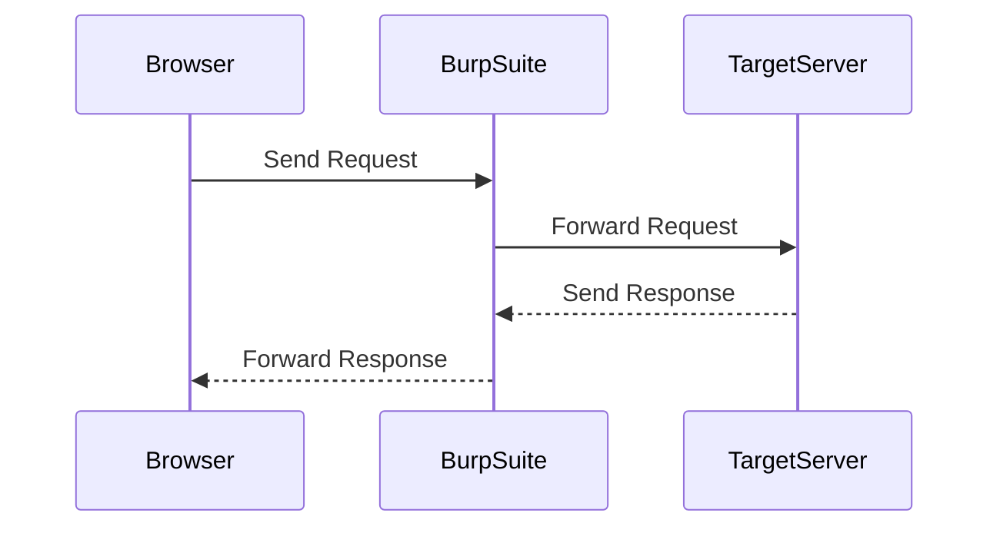
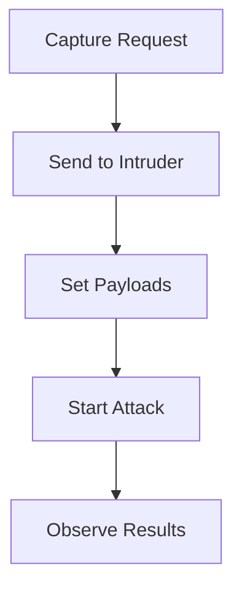

## Introduction to Information Disclosure via Backup Files

Information disclosure is a type of vulnerability that occurs when sensitive data is unintentionally exposed to unauthorized users. One common form of information disclosure is through the exposure of backup files, which often contain source code, configuration files, and other sensitive information. In this chapter, we will explore how attackers can exploit backup files to gain access to sensitive information, specifically focusing on the scenario where source code is disclosed via backup files.

### What is Information Disclosure?

Information disclosure refers to a security vulnerability where sensitive information is unintentionally revealed to unauthorized parties. This can happen due to misconfigurations, coding errors, or other security oversights. The information disclosed can range from simple metadata to highly sensitive data such as passwords, API keys, and source code.

### Why Does Information Disclosure Matter?

Information disclosure can lead to serious security risks. For instance, if an attacker gains access to source code, they can analyze it to find additional vulnerabilities, reverse-engineer business logic, or even steal intellectual property. Additionally, if sensitive credentials are disclosed, attackers can use them to gain unauthorized access to systems and services.

### How Does Information Disclosure Occur?

Information disclosure can occur in various ways, including:

- **Misconfigured servers**: Servers that are not properly configured can expose sensitive files.
- **Backup files**: Backup files, often used for recovery purposes, can contain sensitive information.
- **Error messages**: Improperly handled error messages can reveal internal details about the system.
- **Metadata**: Metadata embedded in files can sometimes contain sensitive information.

### Real-World Examples of Information Disclosure

Several high-profile breaches have occurred due to information disclosure vulnerabilities. For example:

- **CVE-2021-21972**: A vulnerability in Microsoft Exchange Server allowed attackers to disclose sensitive information, including source code and configuration files.
- **CVE-2020-14882**: A vulnerability in VMware vCenter Server allowed attackers to read sensitive files, including backup files containing source code.

### Lab Setup and Environment

To understand and practice the concepts covered in this chapter, we will use the Web Security Academy provided by PortSwigger. You can access the academy by visiting [portswigger.net/web-security](https://portswigger.net/web-security) and signing up for an account.

Once you have an account, follow these steps to access the lab:

1. Log in to your account.
2. Click on the "Academy" tab.
3. Select "All Labs".
4. Search for "information disclosure" or "source code disclosure via backup files".
5. Select the lab titled "Source Code Disclosure via Backup Files".

### Objective of the Lab

The objective of this lab is to identify and submit the database password, which is hard-coded in the leaked source code. To achieve this, you need to:

1. Identify the hidden backup file.
2. Extract the source code from the backup file.
3. Locate the database password within the source code.

### Tools and Techniques

To perform this lab, you will need to use tools such as Burp Suite, which is a popular web application security testing platform. Burp Suite includes features such as a proxy, scanner, and intruder, which can help you identify and exploit vulnerabilities.

### Using Burp Suite

Burp Suite is a powerful tool for web application security testing. It allows you to intercept and manipulate HTTP requests and responses, scan for vulnerabilities, and perform various other security tests.

#### Setting Up Burp Suite

1. **Install Burp Suite**: Download and install Burp Suite from the official website.
2. **Configure Proxy**: Set up Burp Suite as a proxy to intercept traffic between your browser and the target server.
3. **Browser Configuration**: Configure your browser to use Burp Suite as a proxy.



### Identifying Hidden Directories

One common technique for identifying hidden directories is to use a directory brute-forcing tool. Burp Suite includes a feature called "Intruder" that can be used for this purpose.

#### Using Intruder in Burp Suite

1. **Capture Request**: Capture a request to the target server using the Burp Suite proxy.
2. **Send to Intruder**: Right-click the captured request and select "Send to Intruder".
3. **Set Payloads**: Add payloads representing potential directory names.
4. **Start Attack**: Start the attack and observe the results.



### Checking for Robots.txt

Another method to identify hidden directories is to check for the presence of a `robots.txt` file. This file is often used to instruct web crawlers which parts of the site should not be indexed.

#### Accessing Robots.txt

1. **Navigate to robots.txt**: Append `/robots.txt` to the base URL of the target server.
2. **Inspect Content**: Check the content of the `robots.txt` file for any disallowed directories.

```http
GET /robots.txt HTTP/1.1
Host: targetserver.com
```

### Example of Robots.txt

Here is an example of what a `robots.txt` file might look like:

```plaintext
User-agent: *
Disallow: /backup/
Disallow: /admin/
```

In this example, the directories `/backup/` and `/admin/` are disallowed, indicating that they may contain sensitive information.

### Finding Backup Files

Once you have identified potential directories, you can attempt to access backup files within those directories. Common backup file extensions include `.bak`, `.zip`, and `.tar`.

#### Accessing Backup Files

1. **Construct URL**: Construct a URL to access the backup file, e.g., `http://targetserver.com/backup/source_code.zip`.
2. **Download File**: Download the backup file and extract its contents.

```http
GET /backup/source_code.zip HTTP/1.1
Host: targetserver.com
```

### Analyzing Source Code

After downloading and extracting the backup file, you can analyze the source code to locate the database password.

#### Searching for Passwords

1. **Search for Keywords**: Use keywords such as `password`, `db_password`, or `database_password` to search for the password.
2. **Review Code**: Review the code to understand how the password is used.

```python
# Example of a vulnerable code snippet
db_password = "secret_password"
```

### Secure Coding Practices

To prevent information disclosure via backup files, it is essential to follow secure coding practices. Here are some best practices:

1. **Avoid Hardcoding Credentials**: Do not hardcode sensitive credentials in source code. Instead, use environment variables or a secure vault.
2. **Secure Backup Files**: Ensure that backup files are stored securely and are not accessible via the web.
3. **Use Version Control**: Use version control systems to manage source code and ensure that sensitive information is not committed to the repository.

#### Secure Code Example

Here is an example of secure code that avoids hardcoding credentials:

```python
import os

db_password = os.getenv("DB_PASSWORD")
```

### Detection and Prevention

To detect and prevent information disclosure via backup files, you can implement the following measures:

1. **Regular Audits**: Regularly audit your codebase and configurations to identify and remove sensitive information.
2. **Web Application Firewalls (WAF)**: Use WAFs to monitor and block suspicious requests.
3. **Security Scanners**: Use security scanners to identify potential vulnerabilities.

#### Example of a WAF Rule

Here is an example of a WAF rule that blocks requests to backup files:

```nginx
location ~* \.(bak|zip|tar)$ {
    deny all;
}
```

### Conclusion

In this chapter, we have explored how attackers can exploit backup files to gain access to sensitive information, specifically focusing on the scenario where source code is disclosed via backup files. We have covered the tools and techniques used to identify and exploit these vulnerabilities, as well as the best practices for preventing information disclosure.

By understanding and practicing the concepts covered in this chapter, you will be better equipped to protect your applications from information disclosure vulnerabilities.

### Practice Labs

For hands-on practice, you can use the following labs:

- **PortSwigger Web Security Academy**: Offers a variety of labs related to information disclosure, including source code disclosure via backup files.
- **OWASP Juice Shop**: Provides a vulnerable web application for practicing various security techniques.
- **DVWA (Damn Vulnerable Web Application)**: Another vulnerable web application for practicing security techniques.

These labs will provide you with practical experience in identifying and exploiting information disclosure vulnerabilities, as well as implementing preventive measures.

---
<!-- nav -->
[[Web Security (PortSwigger)/17-Information Disclosure/04-Lab 3 Source code disclosure via backup files/00-Overview|Overview]] | [[02-Introduction to Information Disclosure|Introduction to Information Disclosure]]
