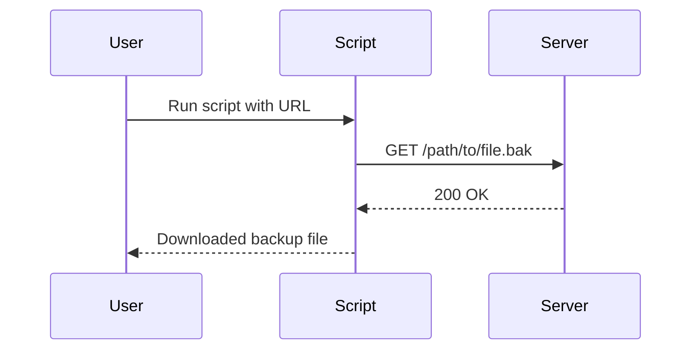

## Introduction to Information Disclosure

Information disclosure vulnerabilities occur when sensitive information is inadvertently exposed to unauthorized users. This can happen through various means, such as backup files, error messages, or misconfigured server settings. One common form of information disclosure is the exposure of source code through backup files. This chapter will delve into the details of how such vulnerabilities arise, their potential impacts, and how to prevent them.

### Background Theory

#### What is Information Disclosure?

Information disclosure occurs when sensitive data is unintentionally revealed to unauthorized parties. This can include source code, configuration files, database credentials, or other critical information that should remain confidential. Such disclosures can lead to serious security breaches, including unauthorized access, data theft, and even full system compromise.

#### Why Does Information Disclosure Matter?

Information disclosure is a significant security concern because it can provide attackers with valuable insights into the internal workings of a system. By gaining access to source code or configuration files, attackers can identify vulnerabilities, understand system architecture, and craft targeted attacks. This can result in financial losses, reputational damage, and legal consequences for the affected organization.

### Real-World Examples

#### Recent CVEs and Breaches

One notable example of information disclosure occurred in the Apache Struts framework. In 2017, a vulnerability (CVE-2017-5638) allowed attackers to execute arbitrary commands on servers running certain versions of Apache Struts. This vulnerability was exploited in several high-profile breaches, including the Equifax data breach, which resulted in the exposure of sensitive personal information of millions of individuals.

Another example is the exposure of source code through backup files. In 2019, a major e-commerce platform accidentally exposed its source code through a publicly accessible backup file. This incident highlighted the importance of securing backup files and ensuring that sensitive information is not inadvertently disclosed.

### Detailed Explanation of the Lab Exercise

The lab exercise focuses on identifying and exploiting information disclosure vulnerabilities through backup files. Specifically, the exercise involves using Python to automate the process of searching for and downloading backup files that may contain sensitive information.

#### Setting Up the Environment

To begin, we need to import the necessary libraries and configure our environment. The following code snippet demonstrates how to set up the environment:

```python
import requests
from requests.packages.urllib3.exceptions import InsecureRequestWarning
requests.packages.urllib3.disable_warnings(InsecureRequestWarning)

proxies = {
    'http': 'http://127.0.0.1:8080',
    'https': 'http://127.0.0.1:8080'
}
```

Here, we import the `requests` library, which is used for making HTTP requests. We also import `InsecureRequestWarning` from `urllib3` to disable warnings related to insecure requests. Additionally, we set up proxies to route all HTTP and HTTPS traffic through Burp Suite, a popular tool for debugging and testing web applications.

#### Defining the Main Method

Next, we define the main method that will handle the execution of the script. The main method checks if the correct number of command-line arguments is provided and prints usage instructions if not.

```python
def main():
    if len(sys.argv) != 2:
        print(f"Usage: {sys.argv[0]} <URL>")
        print(f"Example: {sys.argv[0]} http://www.example.com")
        sys.exit(1)
    
    url = sys.argv[1]
    session = requests.Session()
    session.proxies = proxies
    
    # Further logic to search for and download backup files
```

Here, we check if the length of `sys.argv` is not equal to 2, indicating that the user has not provided the required URL. If the condition is met, we print the usage instructions and exit the program. Otherwise, we proceed to create a session object and set the proxies.

### Searching for Backup Files

Once the environment is set up, we can start searching for backup files. Backup files often have specific extensions, such as `.bak`, `.old`, or `.backup`. We can use these extensions to search for potential backup files.

```python
def search_backup_files(url):
    extensions = ['.bak', '.old', '.backup']
    found_files = []
    
    for ext in extensions:
        backup_url = f"{url}{ext}"
        response = session.get(backup_url, verify=False)
        
        if response.status_code == 200:
            found_files.append(backup_url)
    
    return found_files
```

In this function, we iterate over a list of common backup file extensions and construct the URL for each extension. We then make an HTTP GET request to the constructed URL and check if the response status code is 200, indicating a successful request. If a backup file is found, we add its URL to the `found_files` list.

### Downloading Backup Files

After identifying potential backup files, we can download them for further analysis.

```python
def download_backup_files(found_files):
    for file_url in found_files:
        response = session.get(file_url, verify=False)
        filename = file_url.split('/')[-1]
        
        with open(filename, 'wb') as file:
            file.write(response.content)
```

This function iterates over the list of found backup files and makes an HTTP GET request to download each file. The content of the response is then written to a file with the same name as the backup file.

### Putting It All Together

Finally, we combine all the functions into the main method and execute the script.

```python
if __name__ == "__main__":
    main()
```

### Mermaid Diagrams

#### Request/Response Flow



This sequence diagram illustrates the flow of requests and responses between the user, the script, and the server.

### Common Pitfalls and Detection

#### Common Pitfalls

1. **Incorrect Usage**: Failing to provide the correct number of command-line arguments can cause the script to terminate prematurely.
2. **Proxy Configuration**: Incorrectly configuring the proxy settings can result in failed requests.
3. **Backup File Extensions**: Using incomplete or incorrect lists of backup file extensions can miss potential vulnerabilities.

#### Detection

To detect information disclosure vulnerabilities, organizations can use automated tools such as web application scanners. These tools can scan for common patterns associated with information disclosure, such as backup files or sensitive data in error messages.

### How to Prevent / Defend

#### Secure Coding Practices

1. **Validate Input**: Ensure that all input is properly validated to prevent injection attacks.
2. **Use Secure Libraries**: Utilize well-maintained and secure libraries to minimize the risk of vulnerabilities.
3. **Error Handling**: Implement proper error handling to avoid exposing sensitive information in error messages.

#### Configuration Hardening

1. **Disable Directory Listing**: Disable directory listing on web servers to prevent unauthorized access to files.
2. **Secure Backup Files**: Store backup files in a secure location and restrict access to authorized personnel only.
3. **Regular Audits**: Conduct regular security audits to identify and remediate potential vulnerabilities.

#### Secure Code Example

**Vulnerable Code**

```python
import requests

url = "http://example.com/path/to/file.bak"
response = requests.get(url)
print(response.text)
```

**Secure Code**

```python
import requests
from requests.packages.urllib3.exceptions import InsecureRequestWarning

requests.packages.urllib3.disable_warnings(InsecureRequestWarning)

proxies = {
    'http': 'http://127.0.0.1:8080',
    'https': 'http://127.0.0.1:8080'
}

session = requests.Session()
session.proxies = proxies

url = "http://example.com/path/to/file.bak"
response = session.get(url, verify=False)

if response.status_code == 200:
    print(response.text)
else:
    print("Failed to retrieve file")
```

### Conclusion

Information disclosure vulnerabilities can have severe consequences for organizations. By understanding the underlying mechanisms and implementing robust security measures, organizations can significantly reduce the risk of such vulnerabilities. Regular security audits, secure coding practices, and proper configuration hardening are essential steps in preventing information disclosure.

### Hands-On Labs

For hands-on practice, consider the following labs:

- **PortSwigger Web Security Academy**: Offers interactive labs on various web security topics, including information disclosure.
- **OWASP Juice Shop**: A deliberately insecure web application for practicing web security skills.
- **DVWA (Damn Vulnerable Web Application)**: A PHP/MySQL web application that contains numerous security vulnerabilities.

These labs provide practical experience in identifying and mitigating information disclosure vulnerabilities.

---
<!-- nav -->
[[01-Introduction to Information Disclosure via Backup Files|Introduction to Information Disclosure via Backup Files]] | [[Web Security (PortSwigger)/17-Information Disclosure/04-Lab 3 Source code disclosure via backup files/00-Overview|Overview]] | [[03-Information Disclosure via Backup Files|Information Disclosure via Backup Files]]
