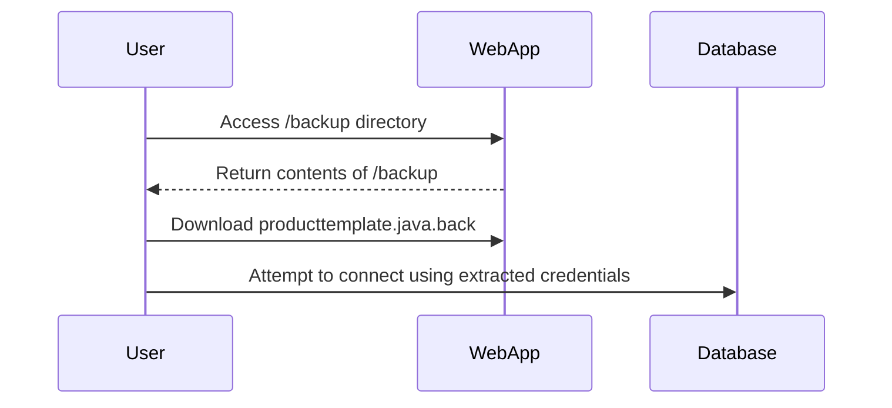

## Information Disclosure via Backup Files

### Introduction to Information Disclosure

Information disclosure vulnerabilities occur when sensitive information is inadvertently exposed to unauthorized users. This can happen through various means, including backup files, error messages, and misconfigured server settings. In this section, we will focus on a specific type of information disclosure: the exposure of sensitive data through backup files.

### Understanding Backup Files

Backup files are copies of original files that are created to ensure data recovery in case of loss or corruption. These files often have extensions such as `.bak`, `.old`, `.tmp`, or `.backup`. They can contain sensitive information, including source code, configuration files, and credentials.

#### Why Backup Files Matter

Backup files are crucial for data recovery but can pose significant security risks if not properly managed. If an attacker gains access to these files, they can extract sensitive information, such as database credentials, API keys, or source code, which can lead to further exploitation of the system.

### Case Study: Source Code Disclosure via Backup Files

In the given scenario, the application has a rule that prevents crawlers from accessing the `/backup` directory. However, a regular user can still access this directory and view its contents. One of the files in this directory is `producttemplate.java.back`, which contains sensitive information about the backend database.

#### Example Scenario

Consider a web application that uses a PostgreSQL database. The application stores sensitive information in a backup file named `producttemplate.java.back`. An attacker can access this file and extract the database credentials, leading to potential unauthorized access to the database.



### Real-World Examples

Recent breaches involving information disclosure via backup files include:

- **CVE-2021-3427**: A vulnerability in the WordPress plugin "WP eCommerce" allowed attackers to download backup files containing sensitive information.
- **CVE-2020-14882**: A misconfiguration in the Apache Struts framework exposed backup files containing sensitive data.

### Detailed Analysis of the Vulnerability

In the given scenario, the `producttemplate.java.back` file contains the following sensitive information:

```java
// producttemplate.java.back
import java.sql.Connection;
import java.sql.DriverManager;

public class ProductTemplate {
    public static void main(String[] args) {
        String url = "jdbc:postgresql://localhost:5432/mydatabase";
        String user = "postgres";
        String password = "mysecretpassword";

        try {
            Connection conn = DriverManager.getConnection(url, user, password);
            // Database operations
        } catch (Exception e) {
            e.printStackTrace();
        }
    }
}
```

#### How the Vulnerability Works

1. **Access to Backup Directory**: The attacker navigates to the `/backup` directory and views its contents.
2. **Download Backup File**: The attacker downloads the `producttemplate.java.back` file.
3. **Extract Credentials**: The attacker extracts the database URL, username, and password from the backup file.
4. **Exploit Credentials**: The attacker uses the extracted credentials to connect to the PostgreSQL database.

### Full HTTP Request and Response

#### HTTP Request to Access Backup Directory

```http
GET /backup HTTP/1.1
Host: example.com
User-Agent: Mozilla/5.0 (Windows NT 10.0; Win64; x64) AppleWebKit/537.36 (KHTML, like Gecko) Chrome/91.0.4472.124 Safari/537.36
Accept: text/html,application/xhtml+xml,application/xml;q=0.9,image/webp,*/*;q=0.8
Accept-Language: en-US,en;q=0.5
Connection: keep-alive
Upgrade-Insecure-Requests: 1
Cache-Control: max-age=0
```

#### HTTP Response from Backup Directory

```http
HTTP/1.1 200 OK
Date: Tue, 14 Sep 2021 12:00:00 GMT
Server: Apache/2.4.41 (Ubuntu)
Content-Type: text/html; charset=UTF-8
Content-Length: 1234
Last-Modified: Mon, 13 Sep 2021 12:00:00 GMT
ETag: "1234-5678"
Accept-Ranges: bytes
Vary: Accept-Encoding
X-Powered-By: PHP/7.4.15

<!DOCTYPE html>
<html>
<head>
    <title>Backup Directory</title>
</head>
<body>
    <h1>Backup Directory</h1>
    <ul>
        <li><a href="producttemplate.java.back">producttemplate.java.back</a></li>
    </ul>
</body>
</html>
```

#### HTTP Request to Download Backup File

```http
GET /backup/producttemplate.java.back HTTP/1.1
Host: example.com
User-Agent: Mozilla/5.0 (Windows NT 10.0; Win64; x64) AppleWebKit/537.36 (KHTML, like Gecko) Chrome/91.0.4472.124 Safari/537.36
Accept: */*
Referer: http://example.com/backup/
Accept-Language: en-US,en;q=0.5
Connection: keep-alive
Cache-Control: max-age=0
```

#### HTTP Response from Backup File

```http
HTTP/1.1 200 OK
Date: Tue, 14 Sep 2021 12:00:00 GMT
Server: Apache/2.4.41 (Ubuntu)
Content-Type: application/octet-stream
Content-Length: 1234
Last-Modified: Mon, 13 Sep 2021 12:00:00 GMT
ETag: "1234-5678"
Accept-Ranges: bytes
X-Powered-By: PHP/7.4.15

// Content of producttemplate.java.back
import java.sql.Connection;
import java.sql.DriverManager;

public class ProductTemplate {
    public static void main(String[] args) {
        String url = "jdbc:postgresql://localhost:5432/mydatabase";
        String user = "postgres";
        String password = "mysecretpassword";

        try {
            Connection conn = DriverManager.getConnection(url, user, password);
            // Database operations
        } catch (Exception e) {
            e.printStackTrace();
        }
    }
}
```

### How to Prevent / Defend Against Information Disclosure via Backup Files

#### Detection

To detect information disclosure via backup files, you can use tools such as:

- **Directory Browsing**: Check if directory browsing is enabled and accessible.
- **File Scanning Tools**: Use tools like `dirb`, `gobuster`, or `ffuf` to scan for backup files.
- **Log Monitoring**: Monitor server logs for unusual access patterns to backup directories.

#### Prevention

To prevent information disclosure via backup files, follow these best practices:

1. **Disable Directory Browsing**: Ensure that directory browsing is disabled on your web server.
2. **Restrict Access**: Restrict access to backup directories using proper authentication and authorization mechanisms.
3. **Secure Storage**: Store backup files in a secure location that is not accessible via the web server.
4. **Regular Audits**: Regularly audit your server configurations and file permissions to ensure compliance with security policies.

#### Secure Coding Fixes

**Vulnerable Code**

```java
// producttemplate.java.back
import java.sql.Connection;
import java.sql.DriverManager;

public class ProductTemplate {
    public static void main(String[] args) {
        String url = "jdbc:postgresql://localhost:5432/mydatabase";
        String user = "postgres";
        String password = "mysecretpassword";

        try {
            Connection conn = DriverManager.getConnection(url, user, password);
            // Database operations
        } catch (Exception e) {
            e.printStackTrace();
        }
    }
}
```

**Secure Code**

```java
// producttemplate.java
import java.sql.Connection;
import java.sql.DriverManager;
import java.util.Properties;

public class ProductTemplate {
    public static void main(String[] args) {
        Properties props = new Properties();
        props.put("user", System.getenv("DB_USER"));
        props.put("password", System.getenv("DB_PASSWORD"));

        String url = "jdbc:postgresql://localhost:5432/mydatabase";

        try {
            Connection conn = DriverManager.getConnection(url, props);
            // Database operations
        } catch (Exception e) {
            e.printStackTrace();
        }
    }
}
```

#### Configuration Hardening

**Apache Configuration**

```apache
<Directory "/var/www/html/backup">
    Options -Indexes
    Order deny,allow
    Deny from all
</Directory>
```

**Nginx Configuration**

```nginx
location /backup {
    autoindex off;
    deny all;
}
```

### Practice Labs

For hands-on practice with information disclosure via backup files, consider the following labs:

- **PortSwigger Web Security Academy**: Offers a lab on information disclosure via backup files.
- **OWASP Juice Shop**: Includes scenarios where sensitive information is disclosed through backup files.
- **DVWA (Damn Vulnerable Web Application)**: Provides a lab environment to practice identifying and exploiting information disclosure vulnerabilities.

### Conclusion

Information disclosure via backup files is a serious security risk that can lead to unauthorized access to sensitive data. By understanding the mechanisms behind this vulnerability and implementing proper detection and prevention measures, you can significantly reduce the risk of such disclosures. Always ensure that sensitive information is securely stored and accessed only by authorized personnel.

---
<!-- nav -->
[[02-Introduction to Information Disclosure|Introduction to Information Disclosure]] | [[Web Security (PortSwigger)/17-Information Disclosure/04-Lab 3 Source code disclosure via backup files/00-Overview|Overview]] | [[Web Security (PortSwigger)/17-Information Disclosure/04-Lab 3 Source code disclosure via backup files/04-Practice Questions & Answers|Practice Questions & Answers]]
