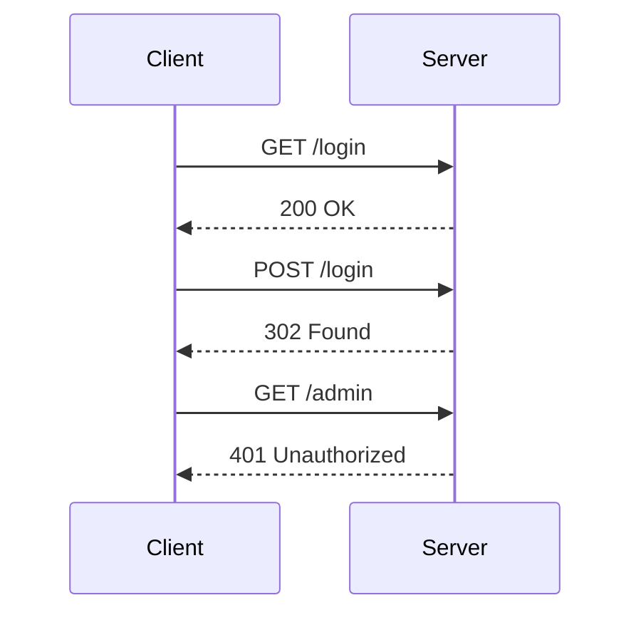

## Identifying the Custom HTTP Header

To solve the lab, the first step is to identify the custom HTTP header used by the front-end of the application. This can be done by analyzing the traffic between the client and the server using tools like Burp Suite.

### Using Burp Suite

Burp Suite is a popular web application security testing tool that allows you to intercept and analyze HTTP traffic. Here’s how to set it up:

1. Install and start Burp Suite.
2. Configure your browser to use Burp Suite as a proxy.
3. Access the lab through your browser.

### Analyzing HTTP Traffic

Once the traffic is being intercepted by Burp Suite, you can analyze the HTTP requests and responses to identify the custom HTTP header.



By examining the HTTP requests and responses, you can look for any unusual headers that might be used by the front-end of the application. For example, you might see a custom header like `X-Custom-Token`.

### Example HTTP Request and Response

Here is an example of an HTTP request and response that includes the custom header:

```http
GET /admin HTTP/1.1
Host: vulnerable-app.com
User-Agent: Mozilla/5.0
Accept: */*
X-Custom-Token: abc123
```

```http
HTTP/1.1 200 OK
Date: Mon, 23 May 2023 12:00:00 GMT
Content-Type: text/html; charset=UTF-8
Content-Length: 1234
X-Powered-By: Express

<!DOCTYPE html>
<html>
<head>
    <title>Admin Interface</title>
</head>
<body>
    <h1>Welcome to the Admin Interface</h1>
</body>
</html>
```

### Identifying the Custom Header

By analyzing the HTTP traffic, you can identify the custom header `X-Custom-Token`. This header is likely used by the front-end of the application to authenticate requests.

---
<!-- nav -->
[[03-How to Prevent  Defend Against Information Disclosure Leading to Authentication Bypass|How to Prevent  Defend Against Information Disclosure Leading to Authentication Bypass]] | [[Web Security (PortSwigger)/17-Information Disclosure/05-Lab 4 Authentication bypass via information disclosure/00-Overview|Overview]] | [[05-Information Disclosure Vulnerabilities|Information Disclosure Vulnerabilities]]
