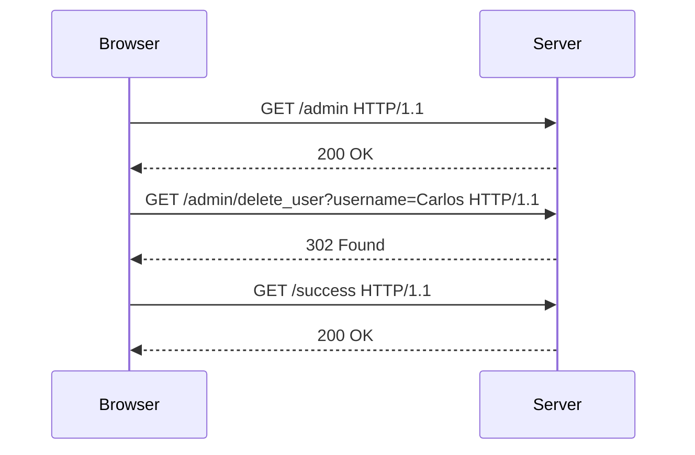

## Information Disclosure Vulnerability

### Background Theory

Information disclosure vulnerabilities occur when sensitive information is inadvertently exposed to unauthorized users. This can happen through various means, such as misconfigured servers, improper error handling, or insecure coding practices. In the context of web applications, information disclosure can lead to serious security issues, including authentication bypasses, data leakage, and unauthorized access to administrative panels.

In the given scenario, an attacker gains unauthorized access to the admin panel by exploiting a customized header. This header is assumed to be known only to the server, but due to a vulnerability, it can be manipulated by an attacker. This type of vulnerability is particularly dangerous because it does not require the attacker to authenticate using valid credentials, thus completely bypassing the application’s authentication mechanism.

### Detailed Explanation

#### Customized Header Exploitation

The core issue in this scenario is the reliance on a customized header for access control decisions. This header is likely intended to verify that the request originates from a trusted source, such as the local server where the application is installed. However, if this header can be spoofed or manipulated by an attacker, it effectively becomes a backdoor into the application.

Let's break down the steps involved:

1. **Identify the Customized Header**: The first step is to identify which header is being used for access control. This can often be done through trial and error, or by analyzing the application’s behavior when different headers are present or absent.

2. **Spoof the Header**: Once the header is identified, the attacker can craft a request that includes this header with the appropriate value. This value might be a specific string, a token, or some other identifier that the server expects to see.

3. **Access the Admin Panel**: With the spoofed header in place, the attacker can navigate to the admin panel and perform actions that would normally require authentication. In this case, the attacker can delete users, including the `Carlos` user.

Here is a detailed breakdown of the HTTP request and response involved in this process:

```http
GET /admin HTTP/1.1
Host: vulnerable-app.com
X-Custom-Header: TrustedValue

HTTP/1.1 200 OK
Date: Mon, 23 Jan 2023 12:00:00 GMT
Server: Apache/2.4.41 (Ubuntu)
Content-Type: text/html; charset=UTF-8
Content-Length: 1234

<!DOCTYPE html>
<html>
<head>
    <title>Admin Panel</title>
</head>
<body>
    <h1>Welcome to the Admin Panel</h1>
    <ul>
        <li><a href="/admin/delete_user?username=Carlos">Delete User Carlos</a></li>
    </ul>
</body>
</html>
```

In this example, the `X-Custom-Header` is set to `TrustedValue`, which is the value the server expects to see for the request to be considered trusted. The server responds with a 200 OK status, indicating that the request was successful, and returns the HTML content of the admin panel.

#### Deleting a User

To delete the `Carlos` user, the attacker would follow the link provided in the admin panel:

```http
GET /admin/delete_user?username=Carlos HTTP/1.1
Host: vulnerable-app.com
X-Custom-Header: TrustedValue

HTTP/1.1 302 Found
Date: Mon, 23 Jan 2023 12:01:00 GMT
Server: Apache/2.4.41 (Ubuntu)
Location: /success
Content-Length: 0

HTTP/1.1 200 OK
Date: Mon, 23 Jan 2023 12:01:01 GMT
Server: Apache/2.4.41 (Ubuntu)
Content-Type: text/html; charset=UTF-8
Content-Length: 123

<!DOCTYPE html>
<html>
<head>
    <title>Success</title>
</head>
<body>
    <h1>Congratulations, you solved the exercise!</h1>
</body>
</html>
```

The first request to `/admin/delete_user` results in a 302 Found status, redirecting the attacker to the `/success` page. The second request to `/success` returns a 200 OK status, confirming that the user deletion was successful.

### Real-World Examples

#### Recent CVEs and Breaches

One notable example of an information disclosure vulnerability leading to authentication bypass is the CVE-2021-21972, which affected the Microsoft Exchange Server. This vulnerability allowed attackers to bypass authentication and gain unauthorized access to the server. By manipulating certain headers, attackers could execute arbitrary commands and take control of the server.

Another example is the CVE-2022-22963, which affected the VMware vCenter Server. This vulnerability allowed attackers to bypass authentication and gain unauthorized access to the server. By manipulating certain headers, attackers could execute arbitrary commands and take control of the server.

These examples highlight the severity of information disclosure vulnerabilities and the importance of securing access control mechanisms.

### How to Prevent / Defend

#### Detection

To detect information disclosure vulnerabilities, organizations should implement comprehensive logging and monitoring systems. Logs should capture all incoming requests, including headers, and any suspicious activity should be flagged for further investigation. Additionally, regular security audits and penetration testing can help identify and mitigate these vulnerabilities.

#### Prevention

To prevent information disclosure vulnerabilities, organizations should follow these best practices:

1. **Do Not Trust Client-Side Input**: Access control decisions should not rely on client-side input, such as headers or cookies. Instead, use server-side mechanisms to verify the authenticity and authorization of requests.

2. **Use Secure Headers**: Implement secure headers such as `Content-Security-Policy`, `Strict-Transport-Security`, and `X-Frame-Options` to protect against common attacks.

3. **Implement Proper Error Handling**: Ensure that error messages do not disclose sensitive information about the application’s internal workings. Use generic error messages and log detailed errors separately.

4. **Regularly Update and Patch**: Keep all software and dependencies up to date with the latest security patches. Regularly review and update configurations to ensure they are secure.

#### Secure Coding Fixes

Here is an example of how to securely handle access control decisions in Python:

**Vulnerable Code:**

```python
from flask import Flask, request

app = Flask(__name__)

@app.route('/admin')
def admin_panel():
    if request.headers.get('X-Custom-Header') == 'TrustedValue':
        return "Welcome to the Admin Panel"
    else:
        return "Unauthorized", 401

if __name__ == '__main__':
    app.run()
```

**Secure Code:**

```python
from flask import Flask, request
import os

app = Flask(__name__)

@app.route('/admin')
def admin_panel():
    if request.headers.get('Authorization') == os.environ.get('AUTH_TOKEN'):
        return "Welcome to the Admin Panel"
    else:
        return "Unauthorized", 401

if __name__ == '__main__':
    app.run()
```

In the secure code, the `Authorization` header is checked against an environment variable `AUTH_TOKEN`. This ensures that the access control decision is based on a server-side secret rather than a client-side header.

### Mermaid Diagrams

#### Request/Response Flow



This diagram illustrates the sequence of requests and responses involved in the exploitation of the information disclosure vulnerability.

### Practice Labs

For hands-on practice with information disclosure vulnerabilities, consider the following labs:

- **PortSwigger Web Security Academy**: Offers a series of labs focused on web security, including information disclosure vulnerabilities.
- **OWASP Juice Shop**: A deliberately insecure web application designed for security training purposes.
- **DVWA (Damn Vulnerable Web Application)**: A PHP/MySQL web application that is riddled with vulnerabilities for educational purposes.

These labs provide a controlled environment to practice identifying and exploiting information disclosure vulnerabilities, as well as implementing secure coding practices to prevent them.

By thoroughly understanding the concepts, mechanisms, and preventive measures associated with information disclosure vulnerabilities, you can significantly enhance the security of your web applications.

---
<!-- nav -->
[[05-Information Disclosure Vulnerabilities|Information Disclosure Vulnerabilities]] | [[Web Security (PortSwigger)/17-Information Disclosure/05-Lab 4 Authentication bypass via information disclosure/00-Overview|Overview]] | [[07-Information Disclosure and Authentication Bypass|Information Disclosure and Authentication Bypass]]
